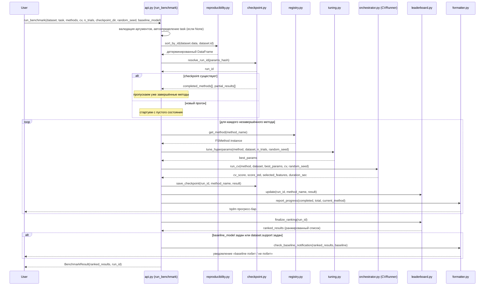

# ARCHITECTURE.md — feature_selection_benchmark

> **Edit log:**
> - 2026-05-16 · v0.3.0 · architecture-interviewer · создан

## 1. Stack

**Тип проекта: Python (Data Research / ML-инструмент)**

> Примечание: scaffolder v1 поддерживает автоматическое создание структуры файлов только для KMP-проектов. Для Python-проекта шаг scaffolder пропустит создание файлов — структуру директорий нужно создать вручную или отдельным скриптом.

| Элемент | Выбор |
|---|---|
| Язык | Python ≥ 3.10 |
| Пакет размещён в | `experiments/feature_selection_benchmark/` (монорепо DmDSLab) |
| Имя пакета | `feature_selection_benchmark` |
| Сборка / зависимости | `pyproject.toml` (PEP 517/518), установка через `pip` |
| Ядро ML | `numpy`, `pandas`, `scikit-learn` |
| FS-методы | `shap`, `catboost`, `boruta` (`BorutaShap`), `mrmr-selection`, `target-permutation-importances` и др. — по группе методов |
| Хранилище | SQLite через стандартный модуль `sqlite3` — глобальный лидерборд и checkpoint-данные; атомарные транзакции |
| Параллелизм | `joblib` (входит в `scikit-learn`; механизм, запускающий несколько задач одновременно на разных ядрах CPU), параметр `n_jobs` |
| Прогресс | `tqdm` (библиотека для отображения прогресс-бара в терминале) + `tqdm_joblib` для параллельного режима; `asyncio` не используется (CPU-bound ML-задачи от него не выигрывают) |
| Тестирование | `pytest` — unit-тесты + integration-тесты; интеграционный тест воспроизводимости с допуском `1e-6` (критерий К2) |
| Интерфейсы | **Must:** Python API (`run_benchmark(...)`); **Could:** CLI (интерфейс командной строки — запуск без написания кода); **Should:** GUI (графический интерфейс, Dear PyGui) |

## 2. Module Map

Архитектурный паттерн: **Layered + Registry** (многоуровневая архитектура с реестром методов).

- **Layered** (многоуровневая): API → core (оркестрация) → methods (FS-методы) → storage (SQLite) → reporting. Каждый слой знает только о слое ниже — это упрощает замену отдельных компонентов и тестирование.
- **Registry** (реестр): FS-методы регистрируются в центральном словаре. Добавить новый метод = один файл + одна строка регистрации; ядро (`orchestrator.py`) не трогается. Критично для Персоны 2 — разработчик AutoML.

```
experiments/feature_selection_benchmark/
├── pyproject.toml                        # метаданные пакета, зависимости
├── README.md
├── feature_selection_benchmark/          # Python-пакет
│   ├── __init__.py                       # публичный API: run_benchmark, get_leaderboard, list_methods, register_method
│   ├── api.py                            # точка входа, валидация аргументов, Dataset dataclass
│   ├── core/
│   │   ├── orchestrator.py               # прогон методов, кросс-валидация, checkpointing
│   │   ├── tuning.py                     # подбор гиперпараметров FS-методов
│   │   └── reproducibility.py            # фиксация random_seed, детерминированная сортировка по id
│   ├── methods/
│   │   ├── registry.py                   # реестр FS-методов: name → (callable, group, supported_tasks)
│   │   ├── base.py                       # базовый класс FSMethod — интерфейс для всех методов
│   │   ├── filter_methods.py             # VarianceThreshold, Pearson/Spearman, MI, mRMR, IV/WoE и др.
│   │   ├── wrapper_methods.py             # RFE/RFECV, SequentialFeatureSelector, Boruta, BorutaShap, Stability Selection
│   │   ├── embedded_methods.py            # Lasso/ElasticNet, CatBoost.select_features, tree gain importance
│   │   └── shap_methods.py                # SHAP-importance, Permutation importance, Null importance
│   ├── storage/
│   │   ├── db.py                          # SQLite-соединение, миграции схемы
│   │   ├── leaderboard.py                 # локальный + глобальный лидерборд: чтение/запись/ранжирование
│   │   └── checkpoint.py                  # сохранение / загрузка состояния прогона
│   └── reporting/
│       └── formatter.py                   # форматирование вывода, ранжирование, tqdm-прогресс, уведомление о baseline
│   gui/                                   # Should-уровень, отдельный слой поверх storage и core
│       └── app.py                         # десктопный GUI на Dear PyGui: таблица лидерборда, графики метрик, живой прогресс
└── tests/
    ├── test_api.py
    ├── test_orchestrator.py
    ├── test_tuning.py
    ├── test_reproducibility.py            # автотест воспроизводимости с допуском 1e-6
    ├── test_leaderboard.py
    └── test_methods/
        ├── test_filter.py
        ├── test_wrapper.py
        ├── test_embedded.py
        └── test_shap.py
```

## 3. Data Flow

Основной поток — вызов `run_benchmark`.



## 4. API Structure

Внешнего HTTP/REST API (Application Programming Interface через сеть) нет. Всё взаимодействие — через Python API.

### Датакласс Dataset

```python
from dataclasses import dataclass, field
import pandas as pd

@dataclass
class Dataset:
    data: pd.DataFrame           # полная таблица (признаки + целевая переменная)
    features_list: list[str]     # список имён признаков
    target: str                  # имя целевой колонки
    id: str | None = None        # колонка-идентификатор строки для детерминированной
                                 # сортировки (обеспечивает воспроизводимость, критерий К2)
    support: list[str] | None = None  # предотобранный набор признаков пользователя —
                                      # точка сравнения в локальном лидерборде
```

### Основные публичные функции

```python
from typing import Literal
from pathlib import Path

def run_benchmark(
    dataset: Dataset,
    task: Literal["classification", "regression"] | None = None,
    # None → автоопределение по типу и кардинальности (числу уникальных значений) target
    methods: list[str] | None = None,
    # None → все зарегистрированные методы для данной задачи
    cv: int = 5,
    # кросс-валидация (CV) — разбиение данных на cv частей для оценки качества
    n_trials: int = 20,
    # число итераций подбора гиперпараметров каждого метода
    checkpoint_dir: str | Path | None = None,
    # директория для сохранения промежуточных результатов; None → временная папка
    random_seed: int | None = None,
    # фиксированное зерно случайности для воспроизводимости; None → нефиксированный
    baseline_model=None,
    # опциональная пользовательская модель — точка сравнения в лидерборде
) -> BenchmarkResult:
    ...

def get_leaderboard(
    run_id: str | None = None,   # None → глобальный лидерборд по всем прогонам
    top_n: int | None = None,    # None → полный список
) -> pd.DataFrame:
    ...

def list_methods(
    task: str | None = None,     # None → все зарегистрированные методы
) -> list[MethodInfo]:
    ...

def register_method(
    name: str,                   # уникальное имя метода
    method,                      # callable или экземпляр класса-наследника FSMethod
    group: str,                  # "filter" | "wrapper" | "embedded" | "shap" | "permutation"
) -> None:
    ...
```

### Базовый класс FS-метода (интерфейс для Персоны 2)

```python
from abc import ABC, abstractmethod
import pandas as pd

class FSMethod(ABC):
    name: str
    group: str  # "filter" | "wrapper" | "embedded" | "shap" | "permutation"
    supported_tasks: list[str]  # ["classification"] | ["regression"] | ["classification", "regression"]

    @abstractmethod
    def fit_select(
        self,
        X_train: pd.DataFrame,
        y_train: pd.Series,
        **hyperparams,
    ) -> list[str]:
        """Возвращает список отобранных имён признаков."""
        ...
```

### Структура результата

```python
@dataclass
class BenchmarkResult:
    run_id: str
    ranked_results: pd.DataFrame
    # колонки: method_name, group, selected_features (list[str]),
    #          cv_score, score_std, rank, duration_sec
    baseline_beaten: bool | None  # None если baseline не был передан
```

## 5. Data Model

Хранилище — SQLite (стандартная встроенная база данных Python, хранящаяся в одном файле). `Dataset.data` (сырые данные) хранится **только в оперативной памяти** и на диск не записывается.

### Схема таблиц

```sql
-- Прогоны бенчмарка
CREATE TABLE runs (
    id           TEXT PRIMARY KEY,   -- хэш параметров прогона
    dataset_id   TEXT NOT NULL,      -- хэш или имя датасета
    task         TEXT NOT NULL,      -- "classification" | "regression"
    cv           INTEGER NOT NULL,
    n_trials     INTEGER NOT NULL,
    random_seed  INTEGER,            -- NULL если не фиксировался
    created_at   TEXT NOT NULL,      -- ISO 8601 timestamp
    status       TEXT NOT NULL       -- "running" | "done" | "interrupted"
);

-- Результаты каждого метода в рамках прогона (локальный лидерборд)
CREATE TABLE method_results (
    id               INTEGER PRIMARY KEY AUTOINCREMENT,
    run_id           TEXT NOT NULL REFERENCES runs(id),
    method_name      TEXT NOT NULL,
    "group"          TEXT NOT NULL,  -- "filter" | "wrapper" | "embedded" | "shap" | "permutation"
    selected_features TEXT NOT NULL, -- JSON-массив строк: ["feature_a", "feature_b", ...]
    cv_score         REAL NOT NULL,
    score_std        REAL NOT NULL,
    rank             INTEGER,        -- заполняется после finalize_ranking
    duration_sec     REAL
);

-- Состояния checkpoints (сохранённые промежуточные результаты)
CREATE TABLE checkpoints (
    run_id            TEXT PRIMARY KEY REFERENCES runs(id),
    completed_methods TEXT NOT NULL,  -- JSON-массив имён завершённых методов
    saved_at          TEXT NOT NULL,  -- ISO 8601 timestamp
    checkpoint_path   TEXT NOT NULL   -- путь к файлу checkpoint на диске
);

-- Глобальный лидерборд (лучшие результаты по всем прогонам)
CREATE TABLE leaderboard (
    id               INTEGER PRIMARY KEY AUTOINCREMENT,
    run_id           TEXT NOT NULL REFERENCES runs(id),
    method_name      TEXT NOT NULL,
    dataset_id       TEXT NOT NULL,
    cv_score         REAL NOT NULL,
    rank             INTEGER,
    is_baseline      INTEGER NOT NULL DEFAULT 0,  -- 0 = обычный метод, 1 = baseline пользователя
    selected_features TEXT NOT NULL               -- JSON-массив строк
);
```

### Сущности в памяти (не персистируются в БД)

- **MethodRegistry** — словарь `name → (callable, group, supported_tasks)`. Инициализируется при импорте пакета и пополняется через `register_method(...)`.
- **Dataset** — датакласс с `data: pd.DataFrame` в RAM. На диск не пишется никогда.

## 6. Configuration

Конфигурация только через аргументы функции `run_benchmark`. Конфиг-файла (`.yaml`, `.ini`, `.env` и аналогов) нет. Все значения по умолчанию (дефолты) прописаны прямо в сигнатуре функции.

| Параметр | Дефолт | Описание |
|---|---|---|
| `task` | `None` | Автоопределение по типу/кардинальности `target` |
| `methods` | `None` | Все зарегистрированные методы для задачи |
| `cv` | `5` | Число разбиений при кросс-валидации |
| `n_trials` | `20` | Число итераций подбора гиперпараметров |
| `checkpoint_dir` | `None` | Временная системная папка |
| `random_seed` | `None` | Не фиксируется (нефиксированный порядок) |
| `baseline_model` | `None` | Без точки сравнения |

## 7. Security

Модель угроз: **локальный исследовательский инструмент**. Нет сети, нет аутентификации, нет аккаунтов.

**Что защищаем:**

| Актив | Где хранится | Меры |
|---|---|---|
| `Dataset.data` (сырые данные пользователя) | Только в RAM | На диск не пишется — ни в checkpoint, ни в БД. Контроль — архитектурный (storage-слой принимает только метрики и имена признаков) |
| SQLite-файл лидерборда (имена признаков, метрики, `selected_features`) | Локальный диск пользователя | Физическая защита файла — на ответственности пользователя |
| Зависимости (`pyproject.toml` / `pip`) | Локальная Python-среда | Верификация целостности (hash-pinning) не требуется — приемлемо для локального инструмента |

**Чего нет в системе намеренно:**
- сетевых вызовов и HTTP-эндпоинтов;
- хранения сырых данных на диске;
- секретов, токенов, учётных данных.

## 8. Constraints

Технические ограничения проекта (из раздела 8 OVERVIEW.md):

1. **Только табличные данные.** Входные данные — `numpy`-массивы или `pandas.DataFrame`. Нетабличные форматы (изображения, текст, временные ряды) не поддерживаются.
2. **Задачи — только классификация и регрессия.** Кластеризация, ранжирование и другие типы задач не входят в скоуп.
3. **Производительность зависит от железа пользователя.** Жёстких лимитов на размер датасета нет; предельный масштаб определяется доступной памятью и CPU.
4. **Качество входных данных — ответственность пользователя.** Приложение не занимается предобработкой: пропущенные значения, кодирование категориальных переменных, нормализация — всё это пользователь делает до передачи данных в `run_benchmark`.
5. **Среда запуска — локальная Python-среда.** Облачный деплой и контейнеризация (например, Docker) не предусмотрены.
6. **Python ≥ 3.10** — минимальная версия (используется `match`/`case` и `X | Y` для типов).
7. **GUI (Dear PyGui) — Should-уровень.** Ядро не зависит от GUI; gui-слой не является блокером для v1.

## 9. Tech Debt

Для нового проекта известного техдолга пока нет. Обновлять после каждой задачи, оставившей временное решение. Каждая запись — с обязательным префиксом приоритета:

- `[High]` — блокирует новый функционал, security-проблема или ломающее изменение (breaking change)
- `[Medium]` — замедляет разработку, но не блокер
- `[Low]` — почистить при следующем рефакторинге

Формат записи: `- [Priority] <описание> — <обоснование почему такой приоритет>`.

_Примеры будущих записей:_

- `[High] Миграции схемы SQLite не версионируются — при изменении таблиц старые БД пользователей ломаются без предупреждения.`
- `[Medium] MethodRegistry не thread-safe — при параллельном register_method возможны гонки данных.`
- `[Low] formatter.py смешивает логику ранжирования и форматирования вывода — стоит разделить на два модуля.`

## 10. Code Hotspots

Для нового проекта hotspot-ов пока нет. Обновлять после первого цикла разработки. Каждая запись — с обязательным префиксом приоритета (те же `[High]` / `[Medium]` / `[Low]`, что и в Tech Debt).

Формат записи: `- [Priority] <файл/модуль> — <чем проблемен>`.

_Ожидаемые hotspot-ы после первого цикла:_

- `[High] core/orchestrator.py` — центральный модуль оркестрации; любое изменение логики CV или checkpointing затрагивает все методы и тесты воспроизводимости.
- `[High] methods/registry.py` — точка расширения для Персоны 2; API реестра должен быть стабильным и хорошо задокументированным.
- `[Medium] storage/db.py` — миграции схемы SQLite; изменения затрагивают все таблицы и могут сломать существующие БД пользователей.
- `[Medium] methods/shap_methods.py` — зависит от нескольких внешних пакетов (shap, catboost, target-permutation-importances); версионные конфликты наиболее вероятны здесь.
