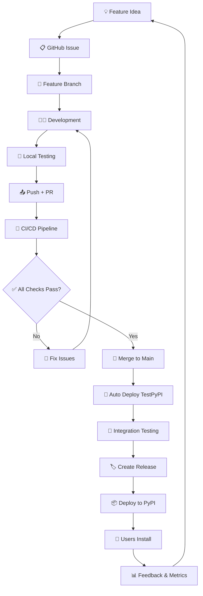

# 🌟 CI/CD в контексте DmDSLab проекта

## 🎯 Общая картина: от идеи до пользователя

```
💡 ИДЕЯ → 👨‍💻 КОД → 🤖 CI/CD → 📦 PyPI → 👥 ПОЛЬЗОВАТЕЛИ
```

### 🔄 Полный жизненный цикл функции



## 🏗️ Архитектура: где CI/CD в проекте

### Файловая структура с CI/CD
```
DmDSLab/
├── 🤖 CI/CD Infrastructure
│   ├── .github/
│   │   ├── workflows/ci.yml        # 🎯 Основной pipeline
│   │   ├── ISSUE_TEMPLATE/         # 📋 Шаблоны
│   │   └── pull_request_template.md
│   ├── .pre-commit-config.yaml     # 🔧 Локальные хуки
│   └── Makefile                    # 🛠️ Dev команды
│
├── 📦 Package Code
│   ├── dmdslab/                    # 🏗️ Основной код
│   ├── tests/                      # 🧪 Тесты (90% покрытие)
│   └── scripts/                    # 🗄️ CLI инструменты
│
├── 📚 Documentation  
│   ├── README.md                   # 📖 Главная документация
│   ├── CONTRIBUTING.md             # 👥 Гайд для разработчиков
│   ├── CHANGELOG.md                # 📝 История изменений
│   └── examples/                   # 💡 Примеры использования
│
└── ⚙️ Configuration
    ├── pyproject.toml              # 🔧 Современная конфигурация
    ├── requirements.txt            # 📋 Зависимости (legacy)
    └── publish_to_pypi.*           # 🚀 Скрипты публикации
```

## 🎭 Роли участников в CI/CD

### 👨‍💻 **Developer (Разработчик)**
```bash
Ответственность:
├── 📝 Написание качественного кода
├── 🧪 Локальное тестирование (make test)
├── 📋 Создание понятных PR
├── 🔧 Исправление CI/CD ошибок
└── 📖 Документирование изменений

Инструменты:
├── make dev-check     # Проверка перед коммитом
├── git push           # Триггер CI/CD
└── GitHub UI          # Мониторинг результатов
```

### 🤖 **CI/CD System (GitHub Actions)**
```yaml
Ответственность:
├── ✅ Автоматическое тестирование (15 комбинаций)
├── 🔍 Проверка качества кода (lint, types)  
├── 📦 Сборка дистрибутивов (.whl, .tar.gz)
├── 🚀 Деплой на PyPI/TestPyPI
└── 📊 Отчеты о покрытии и результатах

Триггеры:
├── Push to main/develop  # Основная разработка
├── Pull Request         # Код-ревью
└── Release tag          # Публикация
```
