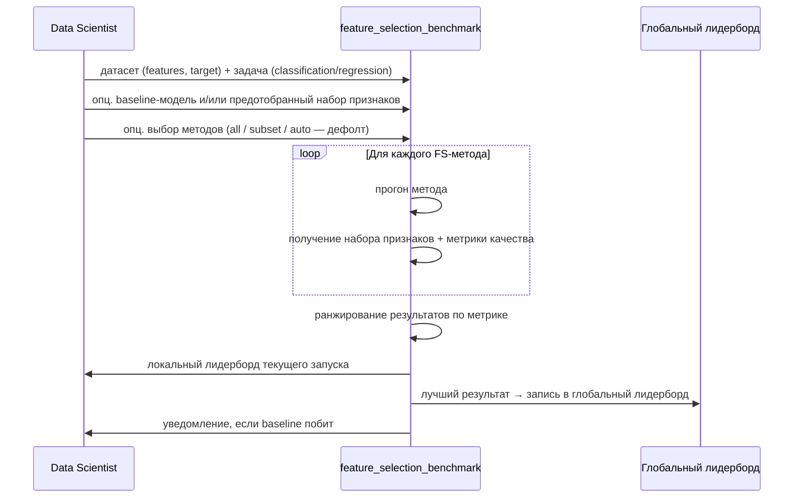

# OVERVIEW.md — feature_selection_benchmark

> **Edit log:**
> - 2026-05-17 · v0.3.0 · E-003 · Q2 (стратегия подбора гиперпараметров) resolved → ADR 0002
> - 2026-05-17 · v0.3.0 · E-002 · Q1 (идентификация записи лидерборда) resolved → ADR 0001
> - 2026-05-16 · v0.3.0 · overview-interviewer · создан

## 1. Обзор и цель

`feature_selection_benchmark` — отдельное приложение для автоматического сравнения методов отбора признаков (filter, wrapper, embedded и гибридных) на табличных данных. Пользователь передаёт датасет и описание задачи, приложение прогоняет методы и возвращает ранжированный лидерборд лучших наборов признаков — локально для текущего запуска и глобально по всем запускам.

## 2. Описание проблемы

1. **Ручной несистематичный перебор.** Data scientist вручную выбирает и запускает FS-методы без единой системы — результаты сравниваются «на глаз».
2. **Нет единой точки сравнения.** Нет инструмента, который прогоняет несколько методов в одном месте и сразу ранжирует их по метрике качества.
3. **Нет учёта baseline пользователя.** Непонятно, даёт ли отбор признаков реальный прирост по сравнению с тем, что уже есть у пользователя.
4. **Методы разрозненны по библиотекам.** Filter, wrapper, embedded и SHAP-методы живут в разных пакетах с разными API — нет единого интерфейса.
5. **Нет зафиксированных best practices.** Разработчик, который хочет добавить новый FS-метод, не имеет стандарта: как его оформить, какой интерфейс соблюдать, как встроить в общий пайплайн.

## 3. Целевые пользователи

**Персона 1 — Data Scientist**
Решает прикладную задачу (классификация или регрессия на табличных данных). Хочет быстро понять, какой набор признаков даёт лучшее качество модели, не тратя время на ручную настройку и сравнение методов. Использует бенчмарк как инструмент: передал данные — получил лидерборд.

**Персона 2 — Разработчик AutoML / ML-библиотеки**
Разрабатывает или расширяет систему автоматического машинного обучения (AutoML — система, которая автоматически строит ML-пайплайны). Нуждается в едином интерфейсе и зафиксированных best practices для добавления новых FS-методов. Использует бенчмарк как стандарт качества и точку интеграции.

## 4. Клиентский путь

## 5. Цели и метрики успеха

**К1 — Полное покрытие методов.**
v1 включает все методы отбора признаков из `feature_selection_guide.md`: filter-методы, wrapper-методы, embedded-методы, SHAP-based, permutation importance, null importance и прочие методы из гида. Критерий: ни один класс методов из гида не пропущен.

**К2 — Воспроизводимость.**
При одинаковых данных, задаче и `random_seed` лидерборд должен быть идентичным от запуска к запуску. Проверяется автотестом с допуском 1e-6 по метрикам. `random_seed` фиксируется явно; порядок обработки признаков стабилизируется сортировкой по id.

**К3 — Единый API.**
Точка входа: `run_benchmark(features, target, task, methods=..., baseline=...)`. Каждый аргумент документирован. Разработчик AutoML может добавить новый метод, следуя единому интерфейсу без изменения ядра.

**К4 — Масштабируемость без жёстких лимитов.**
Приложение работает на пользовательском датасете любого размера. Предельная производительность определяется железом пользователя — жёсткого числового лимита на размер данных нет.

## 6. Скоуп и ключевые фичи

> **MoSCoW** — метод приоритизации фич. Каждому требованию присваивается уровень:
> - **Must** — обязательно для v1; без этого продукт не работает.
> - **Should** — важно и нужно, но v1 запустится без этого.
> - **Could** — приятный бонус, если останется время и ресурсы.
> - **Won't** — осознанно откладываем; не сейчас, но возможно в будущих версиях.

### Must (обязательно для v1)

- Единая точка входа `run_benchmark(features, target, task, methods, baseline)`.
- Реализация всех четырёх групп методов: filter, wrapper, embedded, гибридные (SHAP, permutation, null importance и прочие из гида).
- Ранжирование результатов по метрике качества.
- Локальный лидерборд текущего запуска.
- Глобальный лидерборд с персистентностью (сохранение между запусками).
- Воспроизводимость: фиксированный `random_seed`, стабилизация порядка через сортировку по id.
- Уведомление пользователя, если результат превзошёл переданный baseline.
- Подбор гиперпараметров FS-методов.
- Кросс-валидация (оценка качества набора признаков на нескольких разбивках данных, чтобы результат не зависел от одного конкретного разбиения).
- Прерываемый и возобновляемый прогон (checkpointing — сохранение промежуточных результатов, чтобы можно было продолжить с места остановки).
- Прозрачный прогресс: текущий метод, количество завершённых и оставшихся.

### Should (важно, но v1 выживет без этого)

- Параллельный прогон методов (запуск нескольких методов одновременно для ускорения).
- Экспорт результатов в CSV, JSON, HTML.
- GUI (графический интерфейс) и интерактивный дашборд (визуальная панель с графиками).
- Автоматический отчёт в HTML.

### Could (приятный бонус)

- CLI-интерфейс (запуск из командной строки без написания Python-кода).
- Автоматический отчёт в PDF или Markdown.

### Won't (не сейчас, возможно в будущих версиях)

- Интеграция с облачными ML-платформами (MLflow, Weights & Biases и аналогами).
- Поддержка нетабличных данных (изображения, текст, временные ряды).
- Real-time мониторинг дрейфа признаков (автоматическое отслеживание изменения важности признаков в продакшене).
- Публичный веб-сервис с общим лидербордом, доступным всем пользователям.

## 7. Non-goals

> **Non-goals** — это то, что мы не делаем принципиально, ни в какой версии. В отличие от Won't (раздел 6), это не отложенные фичи, а фундаментальные границы проекта.

1. **Не замена ML-пайплайна.** Приложение не обучает финальную модель и не делает предсказания. Его задача — отобрать признаки, а не решить задачу целиком.
2. **Не AutoML целевой модели.** Мы не подбираем алгоритм и гиперпараметры финальной модели — только сравниваем методы отбора признаков.
3. **Не управление данными / data catalog.** Приложение не хранит, не версионирует и не каталогизирует пользовательские датасеты.
4. **Не XAI (Explainable AI — объяснимый ИИ).** Мы не объясняем, почему модель приняла то или иное решение. SHAP используется только как метод отбора признаков, а не как инструмент объяснимости.

## 8. Допущения и ограничения

1. **Только табличные данные.** Входные данные — numpy-массивы или pandas DataFrame. Нетабличные форматы не поддерживаются.
2. **Задачи — только классификация и регрессия.** Кластеризация, ранжирование и другие типы задач не входят в скоуп.
3. **Производительность зависит от железа пользователя.** Жёстких лимитов на размер датасета нет; предельный масштаб определяется доступной памятью и вычислительными ресурсами.
4. **Качество входных данных — ответственность пользователя.** Приложение не занимается предобработкой: пропущенные значения, кодирование категориальных переменных, нормализация — всё это пользователь делает до передачи данных.
5. **Среда запуска — локальная Python-среда.** Облачный деплой и контейнеризация не предусмотрены.

## 9. Открытые вопросы

1. **Формат и механизм персистентности глобального лидерборда.** Какой storage использовать (SQLite, JSON-файл, другое)? Как однозначно идентифицировать запись — по хэшу датасета, пользовательскому имени задачи или их комбинации?
   - _[resolved 2026-05-17, эпик E-002]_ Идентификация записи: `dataset_id` = пользовательское имя + структурный fingerprint схемы датасета. См. `docs/adr/0001-dataset-id-strategy.md`. Storage — SQLite (ARCHITECTURE §1).
2. **Стратегия подбора гиперпараметров FS-методов.** Встроенный поиск (grid search или random search) внутри бенчмарка, ручная передача параметров пользователем, или фиксированные defaults из `feature_selection_guide.md`?
   - _[resolved 2026-05-17, эпик E-003]_ Встроенный подбор через Optuna (TPE-сэмплер), бюджет — `n_trials`; при `n_trials=0` — fallback на фиксированные дефолты из гида. См. `docs/adr/0002-hyperparameter-tuning-strategy.md`.
