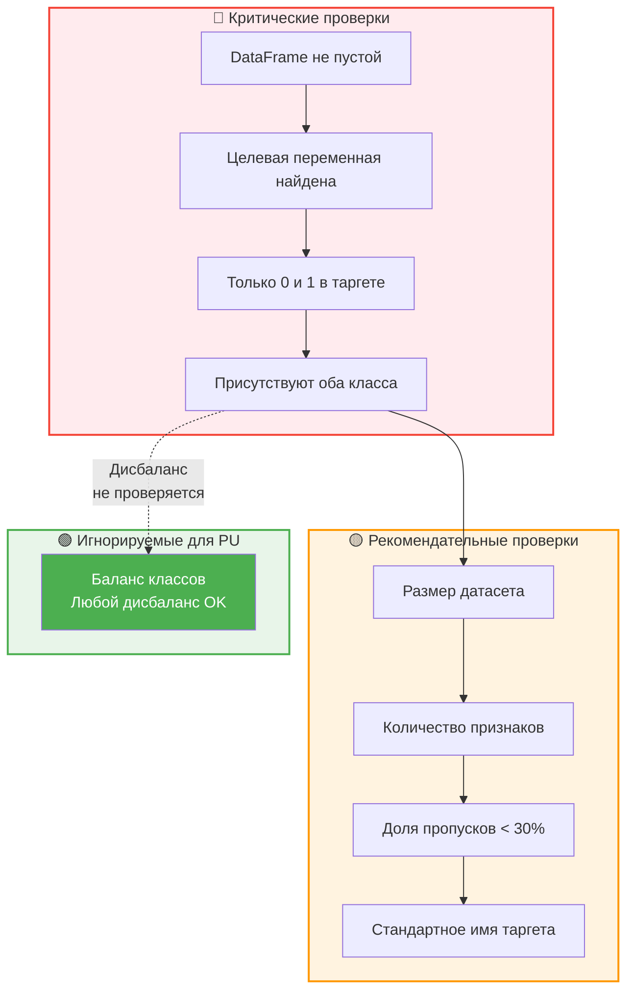
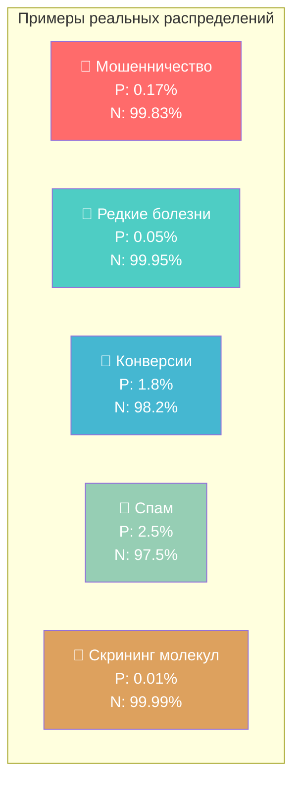
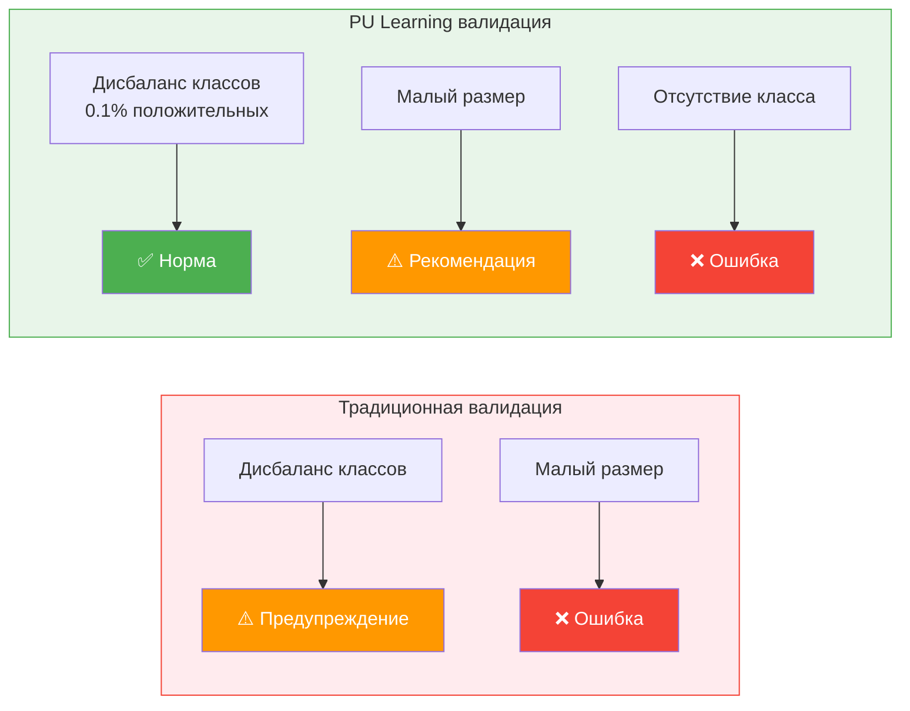
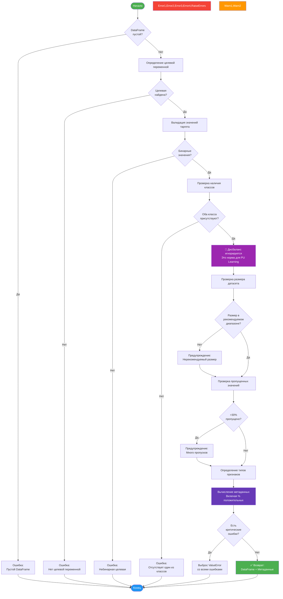
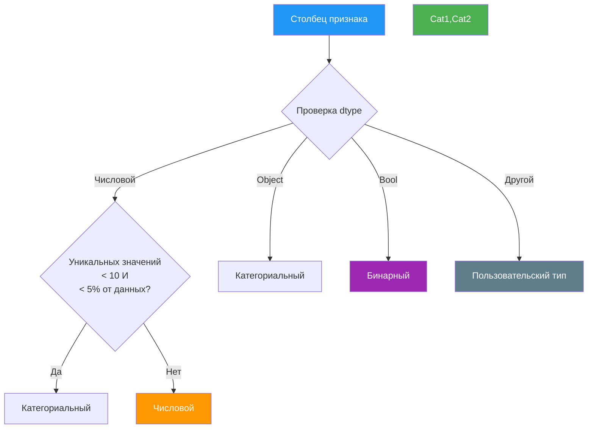

### Поток валидационных проверок





**Ключевой принцип**: В PU Learning экстремальный дисбаланс - это не баг, а фича. Методы специально разработаны для таких сценариев.# Эксперимент PU Learning - Шаг 1: Загрузка и валидация данных

## 📋 Обзор

Первый шаг в нашем конвейере экспериментов PU Learning - это **Загрузка и валидация данных**. Этот модуль гарантирует, что входные данные соответствуют базовым требованиям для экспериментов PU Learning, при этом сохраняя максимальную гибкость для исследователей.

### Ключевые особенности:
- ✅ **Принимает экстремальный дисбаланс классов** - естественная характеристика PU Learning
- ✅ **Гибкие размеры датасетов** - от десятков до сотен тысяч примеров
- ✅ **Информативные предупреждения** - не блокируют эксперимент
- ✅ **Автоматическое определение типов признаков**

## 🏗️ Архитектура

### Философия валидации для PU Learning



Модуль валидации специально адаптирован для задач PU Learning:

1. **Гибкость в размерах**: Датасеты любого размера принимаются, так как PU Learning может работать как с малыми, так и с большими объемами данных
2. **Естественный дисбаланс**: Экстремальный дисбаланс классов (например, 0.5% положительных примеров) считается нормой, а не проблемой
3. **Фокус на критичном**: Проверяются только действительно важные аспекты - наличие обоих классов, бинарность целевой переменной

### Структура модуля

```mermaid
graph TB
    subgraph Step1["Шаг 1: Модуль валидации данных"]
        Input[/"📊 Входной DataFrame"/]
        Config[/"⚙️ Конфигурация"/]
        
        subgraph Validator["Класс DataValidator"]
            V1["🔍 Проверка на пустоту"]
            V2["🎯 Определение целевой переменной"]
            V3["✅ Валидация значений таргета"]
            V4["⚖️ Проверка наличия обоих классов<br/>Дисбаланс игнорируется"]
            V5["📏 Валидация размера датасета<br/>Только рекомендации"]
            V6["❓ Проверка пропущенных значений"]
            V7["🏷️ Определение типов признаков"]
        end
        
        subgraph Outputs["Выходные данные"]
            ValidDF["✅ Валидированный DataFrame"]
            Metadata["📋 Метаданные датасета<br/>Включая распределение классов"]
        end
        
        Errors[/"❌ Ошибки валидации"/]
        Warnings[/"⚠️ Предупреждения<br/>Размер и пропуски"/]
    end
    
    Input --> Validator
    Config --> Validator
    V1 --> V2 --> V3 --> V4 --> V5 --> V6 --> V7
    
    V3 -.-> Errors
    V4 -.-> Errors
    V5 -.-> Warnings
    V6 -.-> Warnings
    
    V7 --> ValidDF
    V7 --> Metadata
    
    style Step1 fill:#1E3A5F,stroke:#4A90E2,stroke-width:3px,color:#fff
    style Validator fill:#2C5282,stroke:#5BA0E5,stroke-width:2px,color:#fff
    style Outputs fill:#1B4332,stroke:#4CAF50,stroke-width:2px,color:#fff
    style V4 fill:#9C27B0,stroke:#7B1FA2,color:#fff
    
    classDef inputStyle fill:#E8F4FD,stroke:#2196F3,stroke-width:2px,color:#1565C0
    classDef errorStyle fill:#FFEBEE,stroke:#F44336,stroke-width:2px,color:#C62828
    classDef warningStyle fill:#FFF3E0,stroke:#FF9800,stroke-width:2px,color:#E65100
    
    class Input,Config inputStyle
    class Errors errorStyle
    class Warnings warningStyle
```



### Интеграция с конвейером

```mermaid
graph LR
    subgraph Current["🎯 Текущий шаг"]
        style Current fill:#FFF3E0,stroke:#FF9800,stroke-width:3px
        S1["Шаг 1: Валидация данных"]
        style S1 fill:#FF9800,color:#fff,stroke:#E65100,stroke-width:2px
    end
    
    subgraph Next["Будущие шаги"]
        style Next fill:#f9f9f9,stroke:#ddd,stroke-width:1px
        S2["Шаг 2: Предобработка"]
        S3["Шаг 3: Симуляция PU"]
        S4["Шаг 4: Инициализация методов"]
        S5["Шаг 5: Обучение"]
        S6["Шаг 6: Метрики"]
        S7["Шаг 7: Визуализация"]
        S8["Шаг 8: Отчёт"]
    end
    
    Data[/"Сырые данные"/] --> S1
    S1 --> S2
    S2 --> S3
    S3 --> S4
    S4 --> S5
    S5 --> S6
    S6 --> S7
    S7 --> S8
    S8 --> Report[/"HTML отчёт"/]
    
    S1 -.->|"Валидированные данные"| S2
    S1 -.->|"Метаданные"| S8
```



## 🔧 Детали реализации

### Основные компоненты

#### 1. **Класс DatasetMetadata**
Датакласс, хранящий исчерпывающую информацию о валидированном наборе данных:
- Количество примеров и признаков
- Распределение классов (соотношение положительных/отрицательных)
- Статистика пропущенных значений
- Классификация типов признаков
- Идентификация целевой переменной

#### 2. **Класс DataValidator**
Основной механизм валидации с настраиваемыми параметрами:

| Параметр | По умолчанию | Описание |
|-----------|---------|-------------|
| `min_samples` | 1,000 | Рекомендуемое минимальное количество примеров |
| `max_samples` | 100,000 | Рекомендуемое максимальное количество примеров |
| `min_features` | 1 | Рекомендуемое минимальное количество признаков |
| `max_features` | 500 | Рекомендуемое максимальное количество признаков |
| `target_column` | 'target' | Ожидаемое имя целевой переменной |

**Примечание**: Нарушение рекомендуемых размеров датасета генерирует только предупреждения, не останавливая эксперимент.

### Рабочий процесс валидации



## 📊 Проверки валидации

### Критические валидации (Ошибки)
Эти проверки остановят эксперимент в случае неудачи:

1. **Непустой DataFrame**: Данные должны существовать
2. **Наличие целевой переменной**: Требуется целевая переменная для бинарной классификации
3. **Только бинарные значения**: Целевая переменная должна содержать только 0 и 1
4. **Наличие обоих классов**: Нужны положительные и отрицательные примеры

### Некритические валидации (Предупреждения)
Эти проверки генерируют предупреждения, но позволяют продолжить работу:

1. **Размер датасета**: 
   - Менее 1,000 примеров (рекомендуемый минимум)
   - Более 100,000 примеров (рекомендуемый максимум)
2. **Количество признаков**:
   - Менее 1 признака (рекомендуемый минимум)
   - Более 500 признаков (рекомендуемый максимум)
3. **Высокая доля пропусков**: Более 30% пропущенных значений
4. **Именование целевой переменной**: Нестандартное имя столбца

### Примечание о балансе классов
Дисбаланс классов **НЕ генерирует предупреждений**, так как это естественная характеристика задач PU Learning. Методы PU Learning специально разработаны для работы с малым количеством размеченных положительных примеров.

#### Типичные сценарии PU Learning с экстремальным дисбалансом:
- 🏦 **Детекция мошенничества**: < 1% мошеннических транзакций
- 🏥 **Диагностика редких заболеваний**: < 0.1% случаев
- 📧 **Детекция спама**: 1-5% спама в корпоративной почте
- 🛒 **Прогнозирование конверсий**: < 2% покупок после клика
- 🔬 **Поиск активных молекул**: < 0.01% в скрининге лекарств

Модуль валидации принимает любое соотношение классов, предоставляя информацию о распределении без генерации предупреждений.

## 🎯 Определение типов признаков

Модуль автоматически классифицирует признаки по категориям:



## 💻 Примеры использования

### Базовое использование
```python
from data_validator import load_and_validate_data
import pandas as pd

# Загрузка данных
df = pd.read_csv('your_dataset.csv')

# Валидация с настройками по умолчанию
validated_df, metadata = load_and_validate_data(df)

print(metadata)  # Просмотр характеристик датасета
```

### Пользовательская конфигурация
```python
config = {
    'min_samples': 500,      # Пониженная рекомендация (не требование)
    'max_samples': 50000,    # Повышенная рекомендация
    'target_column': 'label' # Пользовательское имя таргета
}

validated_df, metadata = load_and_validate_data(df, config)
# Теперь датасеты любого размера будут приняты, но с предупреждениями
```

### Обработка ошибок валидации
```python
from data_validator import DataValidator

validator = DataValidator()

try:
    validated_df, metadata = validator.validate(df)
    print("✅ Валидация успешна!")
except ValueError as e:
    print(f"❌ Валидация не удалась: {e}")
    # Обработать ошибку соответствующим образом
```

## 📈 Структура выходных метаданных

Процесс валидации создаёт подробные метаданные:

```python
DatasetMetadata(
    n_samples=2000,           # Общее количество примеров
    n_features=15,            # Количество признаков
    n_positive=800,           # Количество положительных классов
    n_negative=1200,          # Количество отрицательных классов  
    positive_ratio=0.4,       # Доля положительных примеров
    has_missing=True,         # Наличие пропущенных значений
    missing_ratio=0.05,       # Доля пропущенных значений
    feature_types={           # Тип каждого признака
        'feature_0': 'numerical',
        'feature_1': 'categorical',
        ...
    },
    target_column='target'    # Идентифицированная целевая переменная
)
```

**Важно**: Модуль предоставляет информацию о распределении классов (`positive_ratio`), но не считает дисбаланс проблемой, так как это естественная характеристика задач PU Learning. Даже экстремальный дисбаланс (например, 0.5% положительных примеров) является нормальным для PU Learning сценариев.

## 🔄 Точки интеграции

Этот модуль предоставляет два ключевых выхода для следующих шагов:

1. **Валидированный DataFrame**: Чистые, проверенные данные, готовые для предобработки
2. **Метаданные датасета**: Подробная информация для:
   - Решений по предобработке (обработка пропусков, кодирование)
   - Параметров симуляции PU (соотношения классов)
   - Генерации отчётов (характеристики датасета)
   - Выбора методов (на основе размера и сложности датасета)

## ✅ Контрольный список выполнения

- [x] **Основная логика валидации**: Все правила валидации реализованы
- [x] **Обработка ошибок**: Исчерпывающие сообщения об ошибках
- [x] **Система предупреждений**: Только реальные проблемы отмечены
- [x] **Гибкая валидация размера**: Любой размер датасета принимается с предупреждениями
- [x] **Обработка дисбаланса**: Дисбаланс классов принимается как норма для PU Learning
- [x] **Генерация метаданных**: Полное профилирование датасета
- [x] **Определение типов признаков**: Автоматическая классификация
- [x] **Поддержка конфигурации**: Настраиваемые рекомендации
- [x] **Документация**: Полная с примерами
- [x] **Демонстрационные скрипты**: Покрыты различные сценарии

## 📁 Созданные файлы

- `data_validator.py` - Основной модуль валидации
- `demo_validation.py` - Демонстрационный скрипт
- `step1_documentation.md` - Этот файл документации

---

*Следующий шаг: [Шаг 2 - Предобработка данных →](step2_preprocessing.md)*