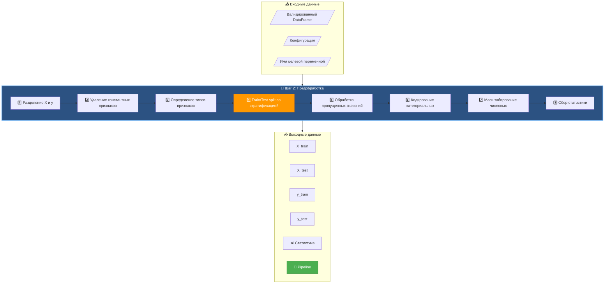
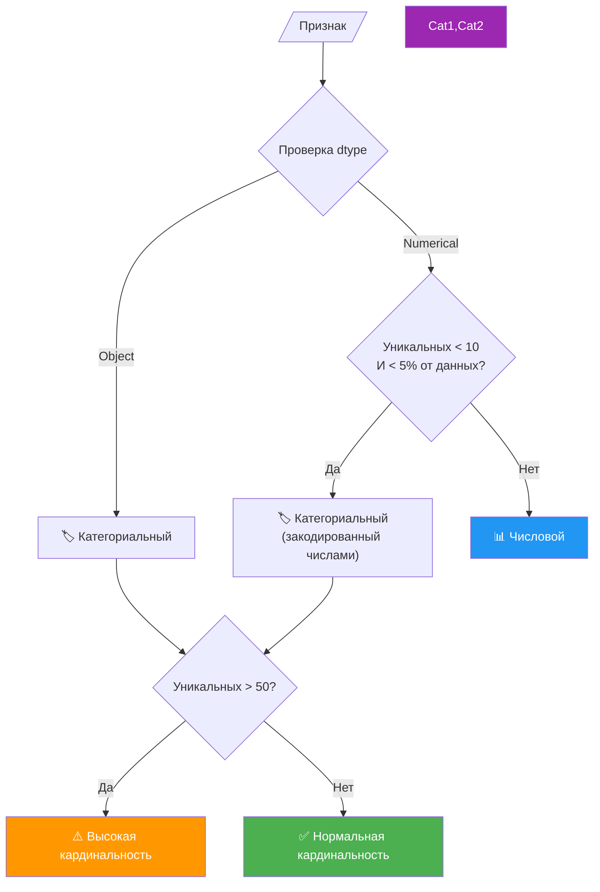
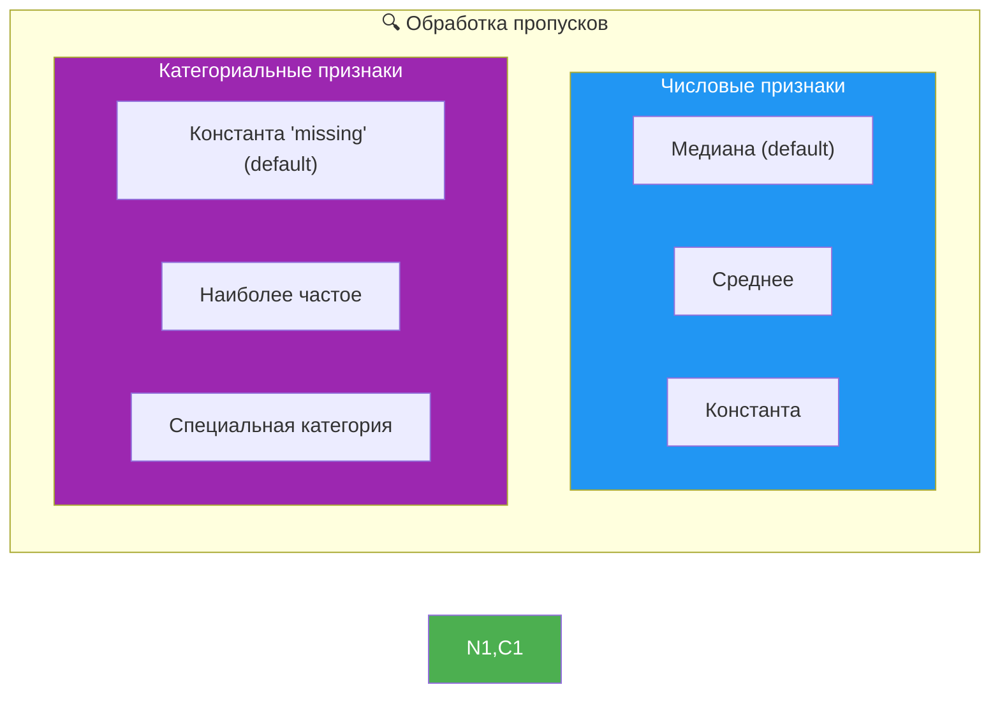
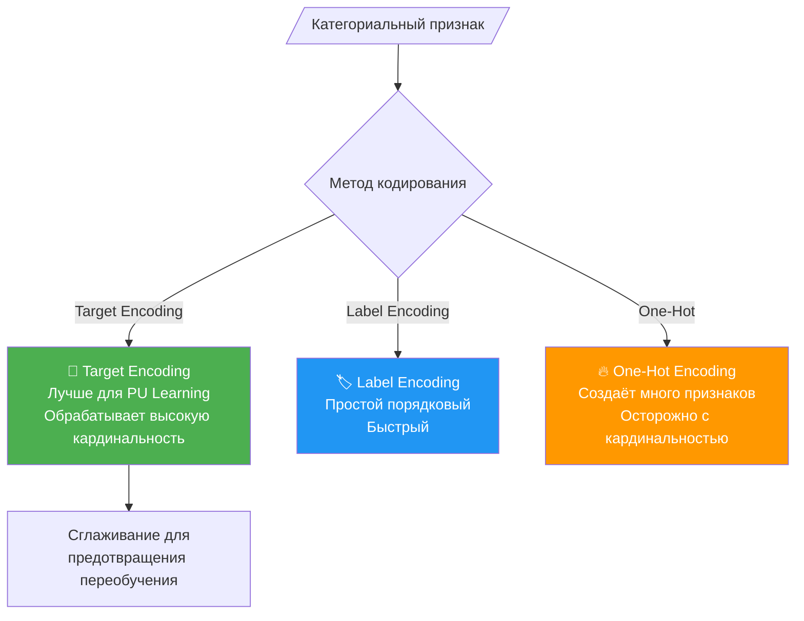
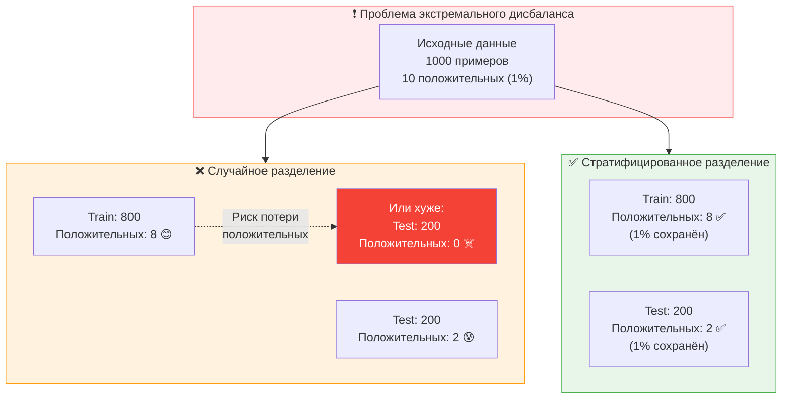
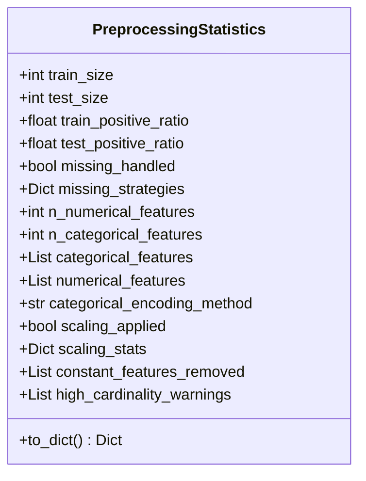
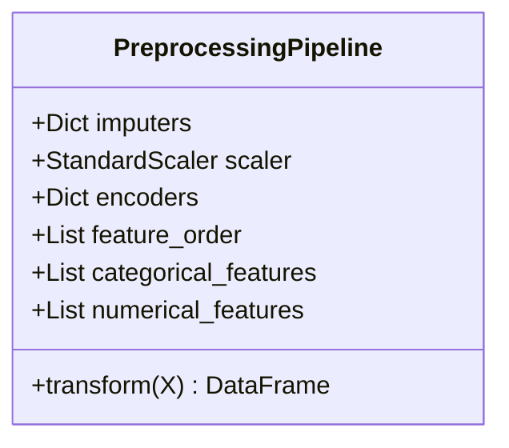
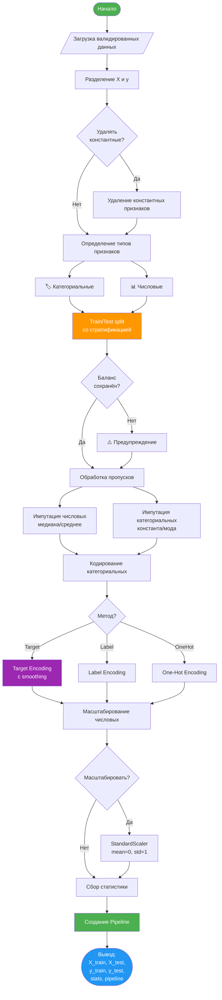
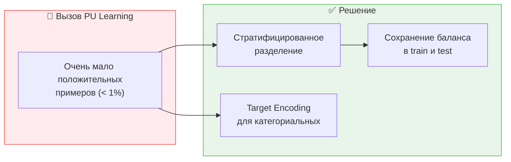

# Эксперимент PU Learning - Шаг 2: Предобработка данных

## 📋 Обзор

Второй шаг в конвейере экспериментов PU Learning - **Предобработка данных**. Этот модуль преобразует валидированные данные в формат, готовый для машинного обучения, с особым вниманием к специфике PU Learning задач.

### Ключевые особенности:
- 🎯 **Стратифицированное разделение** - сохранение редких положительных примеров
- 🔧 **Интеллектуальная обработка пропусков** - разные стратегии для разных типов
- 🏷️ **Автоматическое определение типов признаков** - численные vs категориальные
- 📦 **Создание переиспользуемого пайплайна** - для применения к новым данным

## 🏗️ Архитектура модуля

### Общая схема работы



### Интеграция с конвейером экспериментов

```mermaid
graph LR
    subgraph Previous["✅ Завершённые шаги"]
        style Previous fill:#E8F5E9,stroke:#4CAF50,stroke-width:2px
        S1["Шаг 1: Валидация"]
        style S1 fill:#4CAF50,color:#fff
    end
    
    subgraph Current["🎯 Текущий шаг"]
        style Current fill:#FFF3E0,stroke:#FF9800,stroke-width:3px
        S2["Шаг 2: Предобработка"]
        style S2 fill:#FF9800,color:#fff
    end
    
    subgraph Future["⏳ Будущие шаги"]
        style Future fill:#f9f9f9,stroke:#ddd,stroke-width:1px
        S3["Шаг 3: Симуляция PU"]
        S4["Шаг 4: Методы"]
        S5["Шаг 5: Обучение"]
        S6["Шаг 6: Метрики"]
        S7["Шаг 7: Визуализация"]
        S8["Шаг 8: Отчёт"]
    end
    
    Data[/"Данные"/] --> S1
    S1 -.->|"Валидированные<br/>данные"| S2
    S2 -.->|"X_train, X_test<br/>y_train, y_test"| S3
    S3 --> S4 --> S5 --> S6 --> S7 --> S8
    S8 --> Report[/"HTML отчёт"/]
```



## 🔧 Детали реализации

### 1. Определение типов признаков



### 2. Стратегия обработки пропущенных значений



### 3. Методы кодирования категориальных признаков



### 4. Стратифицированное разделение для PU Learning



## 📊 Структуры данных

### PreprocessingStatistics
Содержит полную информацию о процессе предобработки:



### PreprocessingPipeline
Переиспользуемый пайплайн для новых данных:



## 🔄 Workflow предобработки



## 💻 Примеры использования

### Базовое использование
```python
from pu_data_preprocessor import preprocess_data

# После валидации данных
X_train, X_test, y_train, y_test, stats, pipeline = preprocess_data(
    validated_df, 
    target_column='target'
)

print(stats)  # Просмотр статистики предобработки
```

### Пользовательская конфигурация
```python
config = {
    'test_size': 0.3,  # 30% на тест
    'scale_features': True,  # Масштабирование
    'encoding_method': 'target',  # Target encoding для PU
    'numerical_impute_strategy': 'median',
    'high_cardinality_threshold': 100
}

X_train, X_test, y_train, y_test, stats, pipeline = preprocess_data(
    validated_df, 'target', config
)
```

### Применение пайплайна к новым данным
```python
# Сохранённый пайплайн можно применить к новым данным
new_data = pd.read_csv('new_batch.csv')
X_new = new_data.drop(columns=['target'])

# Применение того же преобразования
X_new_transformed = pipeline.transform(X_new)
```

## 🎯 Особенности для PU Learning

### 1. Сохранение редких положительных примеров



### 2. Обработка высокой кардинальности

PU Learning датасеты часто имеют категориальные признаки с высокой кардинальностью (ID пользователей, продуктов и т.д.):

- **Target Encoding** - рекомендуется для PU Learning
- **Сглаживание** - предотвращает переобучение на редких категориях
- **Предупреждения** - для признаков с > 50 уникальными значениями

## ✅ Контрольный список

### Основная функциональность
- [x] Разделение признаков и целевой переменной
- [x] Автоматическое определение типов признаков
- [x] Стратифицированное train/test разделение
- [x] Обработка пропущенных значений
- [x] Кодирование категориальных признаков
- [x] Масштабирование числовых признаков
- [x] Удаление константных признаков

### Специфика PU Learning
- [x] Сохранение редких положительных примеров
- [x] Target encoding для высокой кардинальности
- [x] Проверка сохранения баланса классов
- [x] Предупреждения о потенциальных проблемах

### Инфраструктура
- [x] Сохранение пайплайна для новых данных
- [x] Детальная статистика предобработки
- [x] Конфигурируемые параметры
- [x] Обработка ошибок и предупреждений

### Демонстрация
- [x] Базовая предобработка
- [x] Пользовательская конфигурация
- [x] Обработка высокой кардинальности
- [x] Применение пайплайна
- [x] Экстремальные PU сценарии
- [x] Определение типов признаков

## 📁 Созданные файлы

- `researches/PU/experiment/pu_data_preprocessor.py` - Основной модуль предобработки
- `researches/PU/experiment/demo/pu_demo_preprocessing.py` - Демонстрационный скрипт
- `researches/PU/experiment/docs/pu_step2_docs.md` - Этот файл документации

---

*Следующий шаг: [Шаг 3 - Симуляция PU сценария →](step3_pu_simulation.md)*