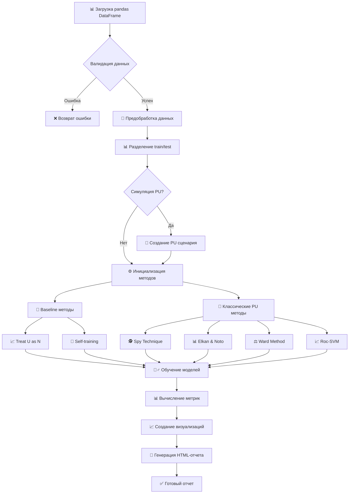

# Техническое задание: Простой эксперимент PU Learning

## 📋 Описание проекта

Разработка системы для проведения экспериментов с методами Positive-Unlabeled Learning на произвольных бинарных датасетах с автоматическим созданием HTML-отчета с результатами и визуализацией.

---

## 🔄 Описание последовательности действий

### Шаг 1: Загрузка и валидация данных
**Входные данные:**
- `pandas.DataFrame` с признаками и целевой переменной
- Конфигурационный словарь с параметрами эксперимента

**Назначение:**
Проверить корректность входных данных и подготовить их для дальнейшей обработки

**Выполнение:**
- Проверить, что целевая переменная содержит только 0 и 1
- Убедиться, что есть как положительные (1), так и неразмеченные (0) примеры
- Проверить наличие пропущенных значений
- Валидировать размер датасета (1,000 — 100,000 примеров)

**Выходные артефакты:**
- Валидированный DataFrame
- Словарь метаданных датасета (размер, количество признаков, баланс классов)

### Шаг 2: Предобработка данных
**Входные данные:**
- Валидированный DataFrame
- Параметры предобработки из конфигурации

**Назначение:**
Привести данные к стандартному виду для машинного обучения

**Выполнение:**
- Разделить на признаки (X) и целевую переменную (y)
- Обработать пропущенные значения (медиана для числовых, константа для категориальных)
- Кодировать категориальные признаки (CatBoostEncoder)
- Стандартизировать числовые признаки (StandardScaler)
- Разделить на train/test (80/20) с сохранением стратификации

**Выходные артефакты:**
- X_train, X_test, y_train, y_test
- Обученные трансформеры (scaler, encoder)
- Словарь со статистиками предобработки

### Шаг 3: Симуляция PU сценария (опционально)
**Входные данные:**
- Обработанные данные
- Параметр имитации PU (alpha) из конфигурации

**Назначение:**
Создать realistic PU сценарий из полностью размеченных данных для тестирования

**Выполнение:**
- Если параметр `simulate_pu=True`, то скрыть часть положительных примеров
- Применить SCAR стратегию с заданным alpha
- Сохранить ground truth для последующего сравнения

**Выходные артефакты:**
- PU версии y_train, y_test
- Ground truth labels для оценки качества
- Метрики искажения распределения

### Шаг 4: Инициализация методов обучения
**Входные данные:**
- Конфигурация методов и их гиперпараметров

**Назначение:**
Подготовить все алгоритмы для эксперимента с оптимальными параметрами

**Выполнение:**
- Инициализировать бейзлайн методы:
  - Treat U as N: Logistic Regression, Random Forest, XGBoost, SVM, MLP, CatBoost
  - Self-training с различными базовыми классификаторами
- Инициализировать классические PU методы:
  - Spy Technique
  - Elkan & Noto
  - Ward Method  
  - Roc-SVM
- Настроить гиперпараметры через random search

**Выходные артефакты:**
- Словарь инициализированных моделей
- Конфигурация гиперпараметров для каждого метода

### Шаг 5: Обучение и предсказание моделей
**Входные данные:**
- Подготовленные данные (X_train, y_train, X_test)
- Инициализированные модели

**Назначение:**
Обучить все модели и получить предсказания для сравнения

**Выполнение:**
- Последовательно обучить каждую модель на тренировочных данных
- Получить предсказания (классы и вероятности) на тестовых данных
- Логировать время обучения и предсказания для каждой модели
- Отображать прогресс выполнения с помощью прогресс-бара

**Выходные артефакты:**
- Словарь предсказаний для каждого метода
- Словарь вероятностей предсказаний
- Метрики времени выполнения

### Шаг 6: Вычисление метрик
**Входные данные:**
- Предсказания всех моделей
- Истинные метки (y_test или ground truth)

**Назначение:**
Получить количественную оценку качества каждого метода

**Выполнение:**
- Вычислить для каждого метода:
  - F1-score
  - Precision
  - Recall
  - AUC-ROC
  - Balanced Accuracy
  - Specificity
- Вычислить метрики сравнения с истинным распределением:
  - KL-дивергенция
  - Wasserstein distance
  - Оценка истинной доли положительных примеров

**Выходные артефакты:**
- DataFrame с метриками для всех методов
- Статистическая значимость различий (если включена)

### Шаг 7: Создание визуализаций
**Входные данные:**
- Метрики производительности
- Предсказания моделей
- Исходные данные

**Назначение:**
Создать наглядное представление результатов эксперимента

**Выполнение:**
- Создать Radar Chart сравнения методов по метрикам
- Построить Heatmap производительности
- Создать ROC-кривые для всех методов
- Построить PR-кривые
- Создать Box plots времени выполнения
- Визуализировать распределение предсказанных вероятностей
- t-SNE/UMAP визуализация с предсказанными метками

**Выходные артефакты:**
- Набор matplotlib/plotly графиков
- Интерактивные визуализации для HTML

### Шаг 8: Генерация HTML-отчета
**Входные данные:**
- Все метрики и визуализации
- Метаданные эксперимента

**Назначение:**
Создать comprehensive отчет с результатами эксперимента

**Выполнение:**
- Создать HTML-шаблон с разделами:
  - Executive Summary
  - Описание данных и эксперимента
  - Результаты по методам
  - Сравнительный анализ с пояснениями для интерпретации
  - Визуализации с отображением метрик
  - Выводы и рекомендации
- Встроить все графики и таблицы

**Выходные артефакты:**
- HTML-файл с полным отчетом
- Папка с ассетами (изображения, CSS, JS)

---

## 🔄 Схема действий (Mermaid)



---

## ✅ Чеклист выполнения

### 🔧 Подготовка и валидация
- [ ] Реализована валидация входного DataFrame
- [ ] Проверка корректности целевой переменной (только 0 и 1)
- [ ] Проверка размера датасета (1K-100K примеров)
- [ ] Валидация наличия положительных и отрицательных примеров

### 📊 Предобработка данных
- [ ] Обработка пропущенных значений
- [ ] Кодирование категориальных признаков
- [ ] Стандартизация числовых признаков  
- [ ] Разделение на train/test с стратификацией
- [ ] Опциональная симуляция PU сценария

### 🤖 Baseline методы
- [ ] Treat U as N с Logistic Regression
- [ ] Treat U as N с Random Forest
- [ ] Treat U as N с XGBoost
- [ ] Treat U as N с SVM
- [ ] Treat U as N с MLP
- [ ] Self-training алгоритм

### 🔬 Классические PU методы
- [ ] Spy Technique реализация
- [ ] Elkan & Noto метод
- [ ] Ward Method
- [ ] Roc-SVM

### 📊 Метрики и оценка
- [ ] F1-score вычисление
- [ ] Precision вычисление
- [ ] Recall вычисление
- [ ] AUC-ROC вычисление
- [ ] Balanced Accuracy вычисление
- [ ] Specificity вычисление
- [ ] Метрики сравнения распределений (KL-дивергенция)
- [ ] Оценка времени выполнения

### 📈 Визуализация
- [ ] Radar Chart сравнения методов
- [ ] Heatmap производительности
- [ ] ROC-кривые для всех методов
- [ ] Precision-Recall кривые
- [ ] Box plots времени выполнения
- [ ] Распределение предсказанных вероятностей
- [ ] t-SNE/UMAP визуализация

### 📄 Отчетность
- [ ] HTML-шаблон отчета
- [ ] Executive Summary секция
- [ ] Описание данных и методологии
- [ ] Таблицы результатов
- [ ] Встроенные визуализации
- [ ] Выводы и рекомендации
- [ ] Экспорт в HTML файл

### ⚙️ Техническая реализация
- [ ] Логирование с прогресс-баром
- [ ] Конфигурируемые параметры
- [ ] Обработка ошибок
- [ ] Документация API
- [ ] Примеры использования

### 🎬 Демонстрация
- [ ] Создание демо-скрипта с примером использования
- [ ] Подготовка тестового датасета для демонстрации

---

## 🛠️ Технические требования

### Архитектура
```python
class PUExperiment:
    def __init__(self, config: dict)
    def load_data(self, df: pd.DataFrame) -> dict
    def preprocess_data(self, data: dict) -> dict
    def initialize_methods(self) -> dict
    def run_experiments(self, data: dict, methods: dict) -> dict
    def calculate_metrics(self, predictions: dict, y_true: np.ndarray) -> pd.DataFrame
    def create_visualizations(self, metrics: pd.DataFrame, predictions: dict) -> dict
    def generate_report(self, results: dict) -> str

def run_pu_experiment(df: pd.DataFrame, config: dict = None) -> str:
    """Основная функция для запуска эксперимента"""
```

### Конфигурация по умолчанию
```python
DEFAULT_CONFIG = {
    'test_size': 0.2,
    'random_state': 42,
    'simulate_pu': False,
    'pu_alpha': 0.3,
    'statistical_tests': False,
    'output_dir': './pu_experiment_results',
    'methods': {
        'baseline': ['logistic', 'rf', 'xgb', 'svm', 'mlp', 'self_training'],
        'classical_pu': ['spy', 'elkan_noto', 'ward', 'roc_svm']
    },
    'hyperparameter_tuning': True,
    'n_trials': 50  # для Optuna
}
```

### Зависимости
```python
requirements = [
    'pandas>=1.3.0',
    'numpy>=1.21.0',
    'scikit-learn>=1.0.0',
    'xgboost>=1.5.0',
    'matplotlib>=3.5.0',
    'seaborn>=0.11.0',
    'plotly>=5.0.0',
    'tqdm>=4.62.0',
    'jinja2>=3.0.0',
    'optuna>=3.0.0',
    'umap-learn>=0.5.0'
]
```

---

## 📋 Пример использования

```python
import pandas as pd
from pu_experiment import run_pu_experiment

# Загрузка данных
df = pd.read_csv('your_dataset.csv')

# Конфигурация эксперимента
config = {
    'test_size': 0.2,
    'random_state': 42,
    'simulate_pu': True,
    'pu_alpha': 0.3,
    'statistical_tests': True,
    'output_dir': './results'
}

# Запуск эксперимента
report_path = run_pu_experiment(df, config)
print(f"Отчет сохранен в: {report_path}")
```

---

## 📊 Ожидаемые результаты

1. **HTML-отчет** с полным анализом всех методов
2. **Сравнительная таблица** производительности методов
3. **Визуализации** для интерпретации результатов
4. **Рекомендации** по выбору оптимального метода
5. **Воспроизводимые результаты** с фиксированным random_state

---
