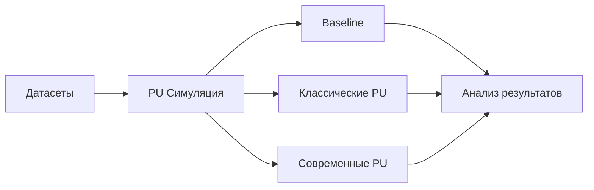

# 📊 План исследования PU Learning (Positive-Unlabeled Learning)

> **Версия**: 1.0  
> **Дата**: 2024  
> **Библиотека**: DmDSLab

---

## 📌 Оглавление

1. [Введение](#введение)
2. [Подготовка и обзор данных](#1-подготовка-и-обзор-данных)
3. [Описание методов анализа](#2-описание-методов-анализа)
4. [Бейзлайн исследование](#3-бейзлайн-исследование-без-pu-методов)
5. [Классические методы PU](#4-классические-методы-pu-learning)
6. [Современные методы PU](#5-современные-и-нестандартные-методы-pu)
7. [План экспериментов](#6-план-экспериментов)
8. [Ожидаемые результаты](#7-ожидаемые-результаты-и-выводы)
9. [Инструменты и реализация](#8-инструменты-и-реализация)

---

## 🎯 Введение

### Что такое PU Learning?

**PU Learning** — это парадигма машинного обучения, где классификатор обучается только на:
- ✅ **P** (Positive) — размеченные положительные примеры
- ❓ **U** (Unlabeled) — неразмеченные примеры (содержат как положительные, так и отрицательные)

### Где это применяется?

- 🏦 **Финансы**: детекция мошенничества (известны только подтвержденные случаи)
- 🏥 **Медицина**: диагностика редких заболеваний 
- 🛒 **E-commerce**: рекомендательные системы
- 🔒 **Кибербезопасность**: обнаружение вредоносного ПО

### Цель исследования

> **Провести комплексный анализ методов PU Learning, сравнить их эффективность на различных датасетах и выявить оптимальные подходы для разных типов задач.**

---

## 1. 📁 Подготовка и обзор данных

### 1.1 Источники данных

- 🗄️ **UCI Dataset Manager** из библиотеки DmDSLab
- 📊 Автоматизированная загрузка и предобработка
- 🔄 Версионирование экспериментов

### 1.2 Критерии отбора датасетов

| Параметр | Диапазон |
|----------|----------|
| 📏 **Размер** | 1,000 — 100,000 примеров |
| 🔢 **Признаки** | 10 — 500 |
| 🎯 **Тип задачи** | Бинарная классификация |
| 🌈 **Разнообразие** | Максимальное покрытие характеристик |

### 1.3 Симуляция PU сценария

#### 🎲 Стратегии создания PU данных:

1. **Случайный отбор** (SCAR — Selected Completely At Random)
   - Вероятность разметки: `P(s=1|y=1) = α`
   - Варианты α: `[0.1, 0.3, 0.5, 0.7]`

2. **Отбор с смещением** (SAR — Selected At Random)
   - Вероятность зависит от признаков: `P(s=1|x,y=1)`
   - Моделирование реалистичных сценариев

### 1.4 Подготовка данных

```
Pipeline:
├── 📊 Стандартизация признаков
├── 🔧 Обработка пропущенных значений
├── ✂️ Создание разбиений (60/20/20)
└── 💾 Сохранение метаданных
```

---

## 2. 📈 Описание методов анализа

### 2.1 Визуализация данных

#### 2.1.1 📊 Распределение классов

- **График**: Гистограмма истинного vs PU распределения
- **Метрика**: `KL(P_true || P_observed)` — KL-дивергенция
- **Интерпретация**: 
  - KL < 0.1 — минимальное искажение
  - KL > 0.5 — существенное искажение распределения

#### 2.1.2 🗺️ t-SNE/UMAP визуализация

- **График**: 2D проекция с цветовой кодировкой
  - 🟢 P (размеченные положительные)
  - 🟡 U (неразмеченные)
  - 🔴 Скрытые N (ground truth)
- **Метрики**: 
  - Silhouette score ∈ [-1, 1]
  - Davies-Bouldin index (чем меньше, тем лучше)
- **Интерпретация**: Оценка разделимости классов в латентном пространстве

#### 2.1.3 📊 Анализ признаков

- **График**: Box plots топ-10 признаков
- **Метрики**: 
  - Information Gain
  - Gini importance
- **Интерпретация**: Выявление наиболее информативных признаков

### 2.2 Метрики оценки

#### 2.2.1 📐 Стандартные метрики

| Метрика | Формула | Описание | Применение в PU |
|---------|---------|----------|-----------------|
| **Accuracy** | `(TP+TN)/(TP+TN+FP+FN)` | Общая точность | ⚠️ Может быть обманчива при дисбалансе |
| **Balanced Accuracy** | `(TPR+TNR)/2` | Средняя точность по классам | ✅ Устойчива к дисбалансу |
| **Precision** | `TP/(TP+FP)` | Точность положительных предсказаний | 🎯 Критична, когда важны false positives |
| **Recall (TPR)** | `TP/(TP+FN)` | Полнота поиска положительных | 🔍 Важна для поиска всех P |
| **Specificity (TNR)** | `TN/(TN+FP)` | Точность отрицательных | ⭐ Ключевая для PU |
| **F1-score** | `2×(P×R)/(P+R)` | Гармоническое среднее P и R | ⚖️ Баланс точности и полноты |
| **AUC-ROC** | Площадь под ROC | Качество ранжирования | 📊 Независима от порога |
| **AUC-PR** | Площадь под PR | Для несбалансированных данных | 🎯 Более информативна при дисбалансе |

#### 2.2.2 🎯 PU-специфичные метрики

- **PU-F1**: Адаптированная F1 для PU сценария
- **π̂ (Estimated class prior)**: Оценка истинной доли положительных
- **MAP@k, NDCG@k**: Метрики ранжирования

### 2.3 Методология сравнения

#### 2.3.1 📊 Статистическая значимость

```python
# Процедура тестирования
1. 5-fold кросс-валидация
2. Friedman test (p < 0.05)
3. Nemenyi post-hoc test
4. 95% доверительные интервалы
```

#### 2.3.2 📊 Визуализация результатов

##### 🎯 **Radar Chart**
- **Вершины**: F1, Balanced Accuracy, AUC-ROC, Specificity, Recall
- **Многоугольники**: различные методы
- **Данные**: средневзвешенные метрики

##### 🔥 **Heatmap производительности**
- **Строки**: методы
- **Столбцы**: метрики
- **Значения**: средневзвешенные показатели

##### 📊 **Методология взвешивания**

```python
# Вес датасета
w_i = (log(n_samples_i) × imbalance_ratio_i × sqrt(n_features_i)) / Σw_j

# Средневзвешенная метрика
M_method = Σ(w_i × m_i)
```

##### 📈 **Дополнительные визуализации**
- **Box plots**: вариативность метрик по датасетам
- **Scatter plots**: детальный анализ (метод × датасет)
- **Critical difference диаграммы**: статистическое ранжирование

#### 2.3.3 ⚡ Анализ вычислительной эффективности

- ⏱️ Время обучения
- 🚀 Время предсказания
- 💾 Потребление памяти
- 📈 Масштабируемость

---

## 3. 🏁 Бейзлайн исследование (без PU методов)

### 3.1 Наивный подход (Treat U as N)

> **Идея**: Все неразмеченные примеры считаются отрицательными

#### 🛠️ Алгоритмы:

| Тип | Алгоритмы | Особенности |
|-----|-----------|-------------|
| **Линейные** | Logistic Regression | Интерпретируемость |
| **Ансамбли деревьев** | Random Forest, ExtraTrees | Устойчивость к шуму |
| **Градиентный бустинг** | XGBoost, LightGBM, CatBoost | Высокая точность |
| **SVM** | RBF/Linear kernel | Нелинейные границы |
| **Нейросети** | MLP | Сложные зависимости |

### 3.2 Полу-контролируемое обучение

#### 🔄 **Self-training**
```python
while confidence > threshold:
    1. Обучить на P ∪ pseudo_N
    2. Предсказать на U
    3. Добавить уверенные предсказания в pseudo_N
```

#### 👥 **Co-training**
- Использование multiple views данных
- Консенсус между представлениями

#### 🌐 **Label propagation**
- Построение графа схожести
- Распространение меток по графу

### 3.3 Анализ ошибок бейзлайна

- 📊 Confusion matrix для каждого α
- 📈 Кривые зависимости ошибок от α
- 🎯 Выявление систематических паттернов

---

## 4. 🔧 Классические методы PU Learning

### 4.1 Two-step методы

#### 4.1.1 🕵️ **Spy technique**

```python
Algorithm:
1. Внедрить "шпионов" (10% от P) в U
2. Обучить классификатор на P vs (U ∪ Spies)
3. Найти порог для выделения надёжных N
4. Финальное обучение на P vs reliable_N
```

**Параметры**:
- 📊 Доля шпионов: 5-15%
- 🎯 Порог надёжности: 15-й процентиль scores шпионов

#### 4.1.2 🔍 **1-DNF (1-Disjunctive Normal Form)**

- Поиск признаков, встречающихся **только** в P
- Итеративное построение DNF правил
- ⚠️ Ограничение: требует дискретных признаков

#### 4.1.3 📈 **Roc-SVM**

- Использование ROC-кривой для оптимизации
- Адаптивный выбор порога
- Сравнение с baseline SVM

### 4.2 Методы на основе оценки вероятностей

#### 4.2.1 📊 **Elkan & Noto**

**Ключевое предположение**: SCAR (Selected Completely At Random)

```python
# Оценка вероятностей
P(y=1|x) = P(s=1|x) / c
где c = P(s=1|y=1) — константа
```

#### 4.2.2 ⚖️ **Ward метод**

- Взвешенная функция потерь
- Оценка class prior через EM-алгоритм
- Корректировка финальных предсказаний

### 4.3 🌲 Bagging-based методы

- **Bagging PU**: Bootstrap из P и подвыборки из U
- **PU Random Forest**: Модификация критерия расщепления
- **Анализ**: out-of-bag оценки для выбора гиперпараметров

---

## 5. 🚀 Современные и нестандартные методы PU

### 5.1 📉 Методы на основе функций риска

#### 5.1.1 **uPU (unbiased PU)**

**Ключевая идея**: Несмещённая оценка риска

```python
R_pu = π_p × R_p + R_u - π_p × R_p^u
где:
- π_p — истинная доля положительных
- R_p — риск на положительных
- R_u — риск на неразмеченных
```

#### 5.1.2 **nnPU (non-negative PU)**

- Решение проблемы отрицательного риска
- `R_nn = max(0, R_pu)`
- Теоретические гарантии сходимости

### 5.2 🧠 Глубокое обучение для PU

#### 5.2.1 **PU-Net архитектуры**

```python
Architecture:
├── Input Layer
├── Feature Extraction (CNN/Dense)
├── PU-specific Layer
│   ├── Instance weighting
│   └── Adaptive thresholding
├── Classification Head
└── PU Loss Function
```

#### 5.2.2 **Self-Attention PU**

- Transformer-based архитектуры
- Attention механизмы для взвешивания примеров
- Интерпретация через attention maps

### 5.3 🎨 Генеративные подходы

#### 5.3.1 **PU-GAN**

```python
Components:
- Generator: G(z) → synthetic negatives
- Discriminator: D(x) → real/fake
- PU Classifier: C(x) → positive/negative
```

#### 5.3.2 **VAE-PU**

- Моделирование P и N распределений в latent space
- Разделение пространства на области
- Генерация с контролем неопределенности

### 5.4 📏 Методы на основе метрического обучения

#### 5.4.1 **PU Metric Learning**

- Обучение embedding: `f(x) → ℝ^d`
- Contrastive loss для PU:
  ```python
  L = Σ[d(f(x_p), f(x_p'))² + max(0, m - d(f(x_p), f(x_u)))²]
  ```

#### 5.4.2 **Prototype Networks для PU**

- Прототипы для P класса
- Динамическое определение N прототипов
- Few-shot learning адаптация

### 5.5 🎭 Ensemble и гибридные методы

#### 5.5.1 **Multi-view PU Learning**

- Различные представления данных
- Консенсус между views
- Co-regularization: `L = L_view1 + L_view2 + λ×consistency`

#### 5.5.2 **Cost-sensitive PU Learning**

- Адаптивные веса ошибок
- Оптимизация бизнес-метрик
- ROI-driven подход

---

## 6. 🧪 План экспериментов

### 6.1 Структура экспериментов



### 6.2 🎛️ Гиперпараметры

#### **Optuna** для автоматического поиска:

```python
study = optuna.create_study(
    directions=["maximize", "minimize"],  # F1-score, время
    sampler=TPESampler(),
    pruner=MedianPruner()
)

study.optimize(
    objective,
    n_trials=100,
    timeout=7200,  # 2 часа
    n_jobs=-1  # Все CPU
)
```

**Особенности**:
- 🎯 Multi-objective оптимизация
- ⏱️ Контроль времени через timeout
- 🔄 Warm start с похожих датасетов
- 🌱 Fixed random seeds

---

## 📚 Литература

1. **Elkan & Noto (2008)**: "Learning classifiers from only positive and unlabeled data"
2. **du Plessis et al. (2015)**: "Analysis of learning from positive and unlabeled data"
3. **Kiryo et al. (2017)**: "Positive-unlabeled learning with non-negative risk estimator"
4. **Bekker & Davis (2020)**: "Learning from positive and unlabeled data: a survey"

---

> 📧 **Контакты**: [dmatryus.sqrt49@yandex.ru]  
> 🔗 **GitHub**: [[Ссылка на репозиторий](https://github.com/Dmatryus/DmDSLab)]  
> 📅 **Последнее обновление**: 2025