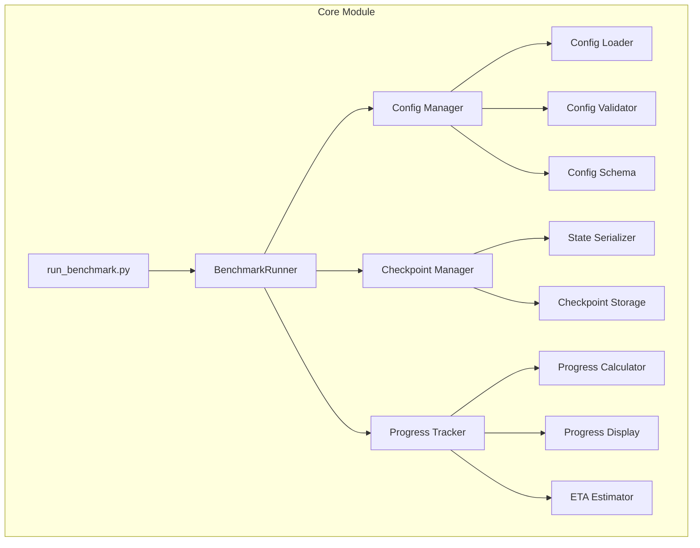
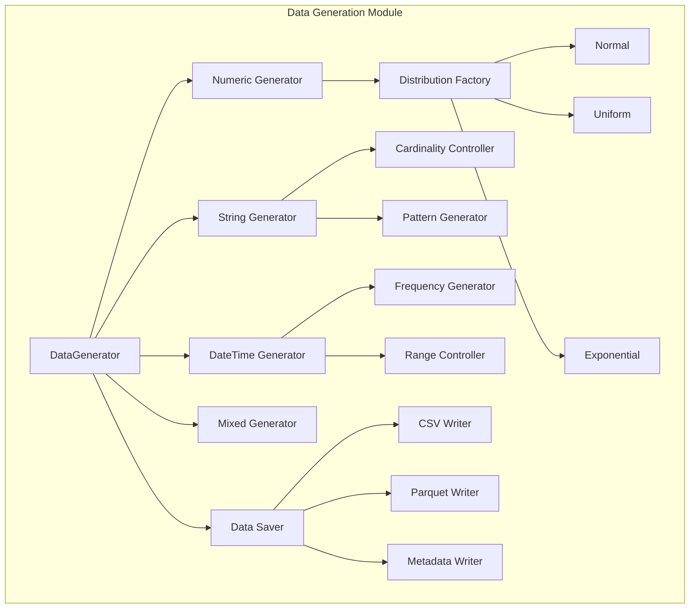
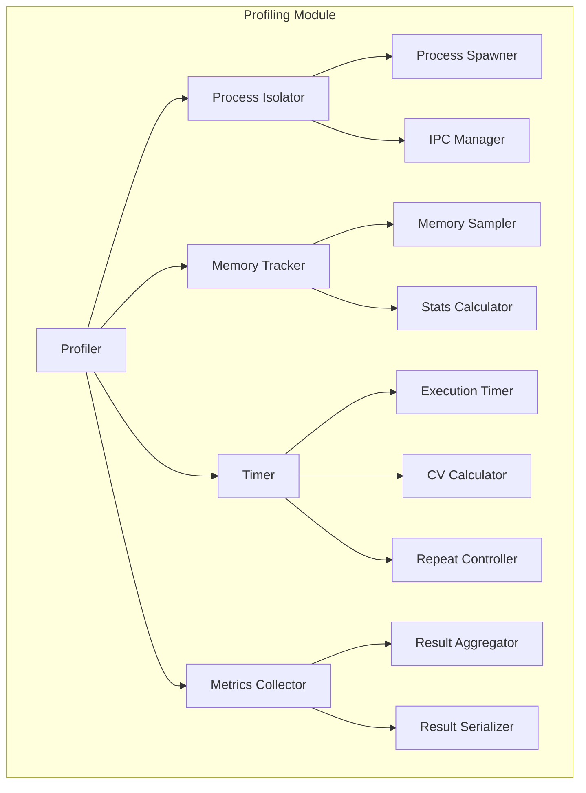
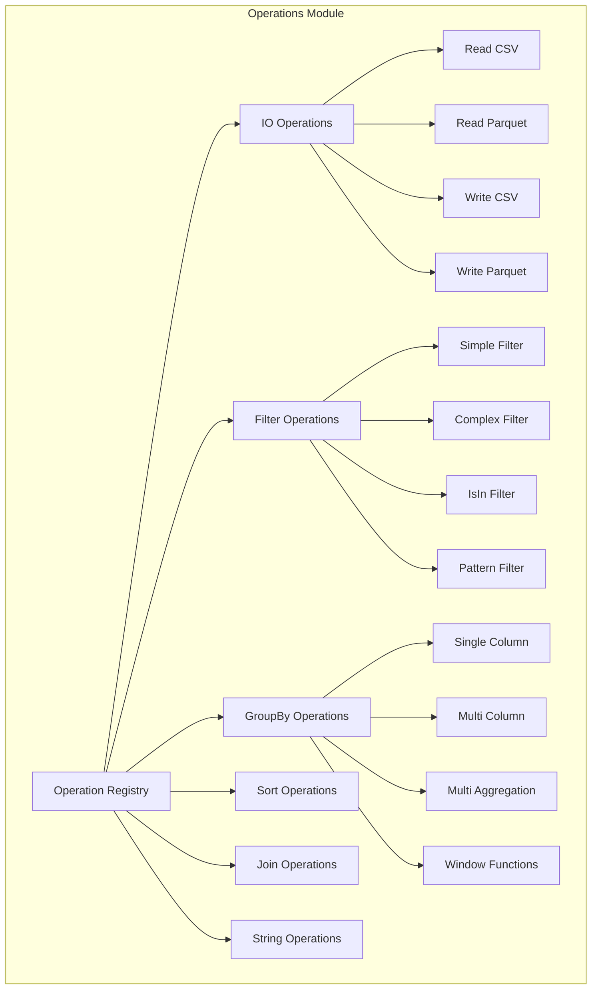
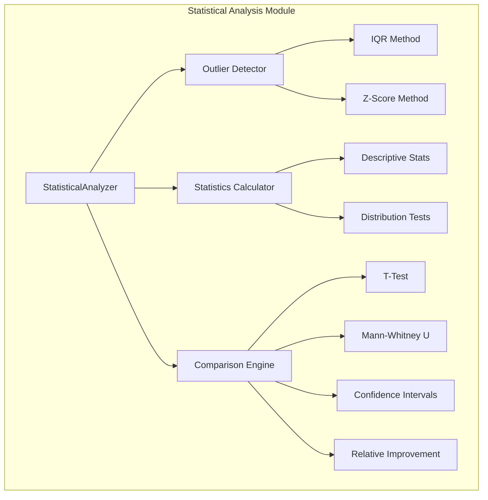
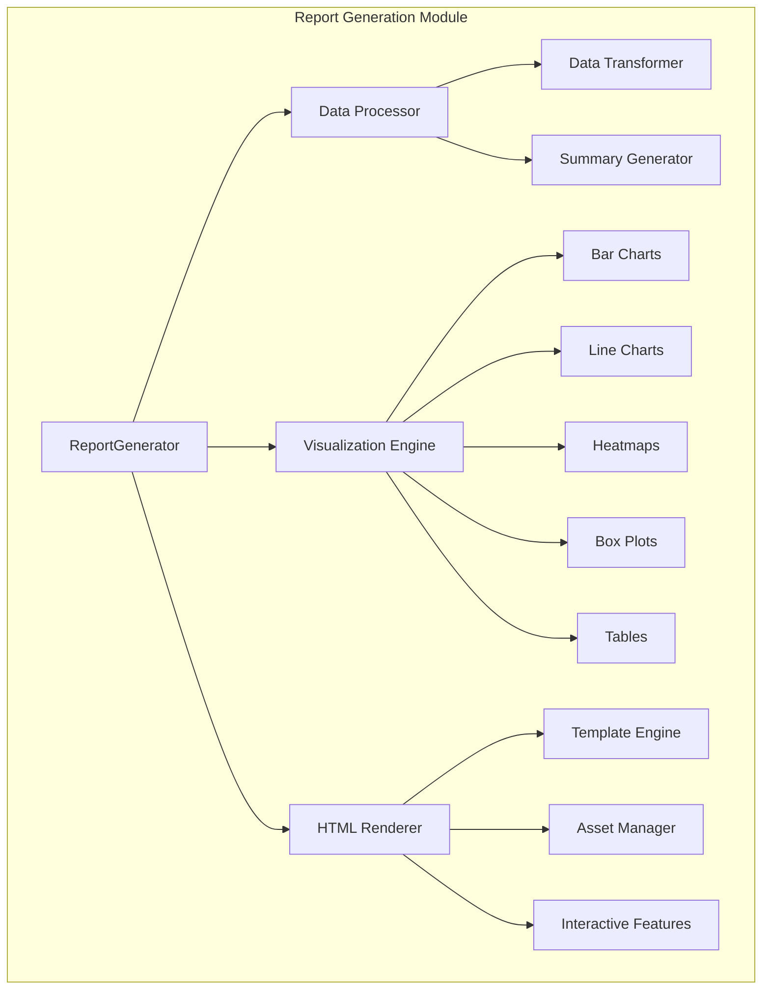
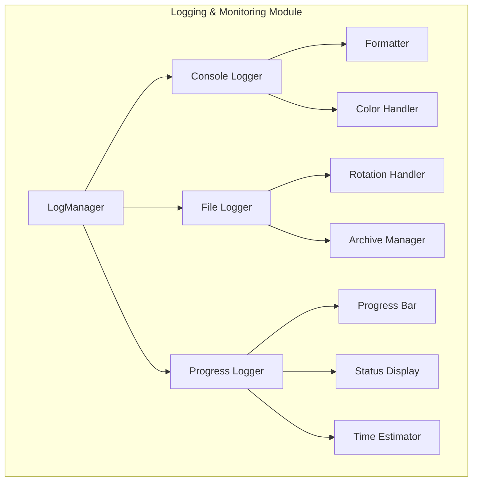
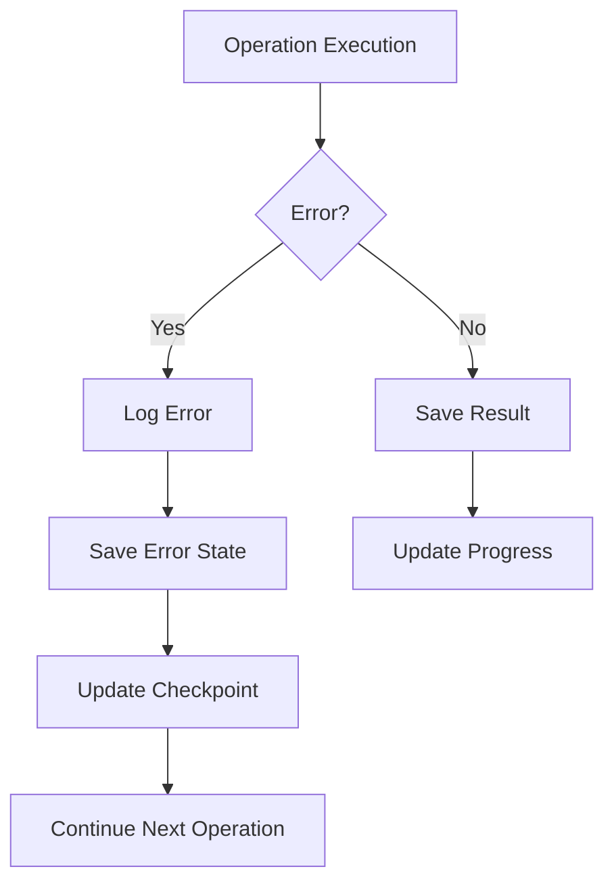

# План разработки системы бенчмаркинга Pandas vs Polars

## 1. Архитектура системы

### 1.1. Схема классов

```mermaid
classDiagram
    class BenchmarkRunner {
        -config: Config
        -logger: Logger
        -progress_tracker: ProgressTracker
        -checkpoint_manager: CheckpointManager
        +run() bool
        +resume_from_checkpoint() bool
        -validate_environment() bool
    }
    
    class Config {
        -config_data: dict
        -schema: ConfigSchema
        +load_from_file(path: str) bool
        +validate() list~ValidationError~
        +get_section(name: str) dict
    }
    
    class ConfigSchema {
        +validate_structure(data: dict) list~ValidationError~
        +validate_values(data: dict) list~ValidationError~
        -check_required_fields() bool
        -check_data_types() bool
    }
    
    class DataGenerator {
        -config: dict
        -random_seed: int
        +generate_all_datasets() list~DatasetInfo~
        +generate_numeric_data(size: int) DataFrame
        +generate_string_data(size: int) DataFrame
        +generate_datetime_data(size: int) DataFrame
        +generate_mixed_data(size: int) DataFrame
        -save_dataset(data: DataFrame, info: DatasetInfo) bool
    }
    
    class DatasetInfo {
        +name: str
        +size: int
        +type: str
        +columns: list
        +file_paths: dict
        +metadata: dict
    }
    
    class Profiler {
        -memory_tracker: MemoryTracker
        -timer: Timer
        -logger: Logger
        +profile_operation(operation: Operation, data: DataFrame) ProfileResult
        -run_isolated_process(func: callable) ProcessResult
        -collect_metrics() dict
    }
    
    class Operation {
        <<abstract>>
        +name: str
        +category: str
        +execute(data: DataFrame) any
        +get_params() dict
    }
    
    class IOOperation {
        +execute(data: DataFrame) any
    }
    
    class FilterOperation {
        +execute(data: DataFrame) any
    }
    
    class GroupByOperation {
        +execute(data: DataFrame) any
    }
    
    class ProfileResult {
        +operation_name: str
        +library: str
        +backend: str
        +execution_time: list~float~
        +memory_peak: float
        +memory_avg: float
        +success: bool
        +error_message: str
    }
    
    class MemoryTracker {
        -sampling_interval: float
        -process: Process
        +start_tracking() void
        +stop_tracking() MemoryStats
        -sample_memory() float
    }
    
    class Timer {
        -min_runs: int
        -max_runs: int
        -target_cv: float
        +time_execution(func: callable) TimingResult
        -calculate_cv(times: list) float
    }
    
    class CheckpointManager {
        -checkpoint_dir: str
        -current_state: dict
        +save_checkpoint(state: dict) bool
        +load_checkpoint() dict
        +clear_checkpoint() void
        -get_checkpoint_path() str
    }
    
    class ProgressTracker {
        -total_operations: int
        -completed_operations: int
        -start_time: datetime
        +update_progress(operation: str) void
        +get_progress_info() dict
        +display_progress() void
    }
    
    class StatisticalAnalyzer {
        -confidence_level: float
        +analyze_results(results: list~ProfileResult~) AnalysisResult
        +remove_outliers(data: list) list
        +calculate_statistics(data: list) dict
        +perform_comparisons(groups: dict) ComparisonMatrix
    }
    
    class ReportGenerator {
        -template_path: str
        -output_dir: str
        +generate_report(analysis: AnalysisResult) str
        +create_visualizations(data: dict) list~Figure~
        +render_html(context: dict) str
    }
    
    class Logger {
        -log_level: str
        -log_file: str
        -console_handler: Handler
        -file_handler: Handler
        +debug(msg: str) void
        +info(msg: str) void
        +warning(msg: str) void
        +error(msg: str, exc_info: bool) void
    }
    
    BenchmarkRunner --> Config
    BenchmarkRunner --> DataGenerator
    BenchmarkRunner --> Profiler
    BenchmarkRunner --> CheckpointManager
    BenchmarkRunner --> ProgressTracker
    BenchmarkRunner --> StatisticalAnalyzer
    BenchmarkRunner --> ReportGenerator
    BenchmarkRunner --> Logger
    
    Config --> ConfigSchema
    DataGenerator --> DatasetInfo
    Profiler --> MemoryTracker
    Profiler --> Timer
    Profiler --> ProfileResult
    Profiler --> Operation
    
    Operation <|-- IOOperation
    Operation <|-- FilterOperation
    Operation <|-- GroupByOperation
    
    StatisticalAnalyzer --> ProfileResult
    ReportGenerator --> StatisticalAnalyzer
```



### 1.2. Workflow системы

```mermaid
stateDiagram-v2
    [*] --> Initialization
    
    state Initialization {
        [*] --> LoadConfig
        LoadConfig --> ValidateConfig
        ValidateConfig --> CheckEnvironment
        CheckEnvironment --> CheckCheckpoint
        
        state CheckCheckpoint {
            [*] --> HasCheckpoint
            HasCheckpoint --> LoadCheckpoint: Yes
            HasCheckpoint --> FreshStart: No
        }
    }
    
    Initialization --> DataGeneration: Fresh Start
    Initialization --> ResumeFromCheckpoint: Resume
    
    state DataGeneration {
        [*] --> CheckExistingData
        CheckExistingData --> GenerateData: Missing
        CheckExistingData --> SkipGeneration: Exists
        GenerateData --> SaveDatasets
        SaveDatasets --> [*]
        SkipGeneration --> [*]
    }
    
    DataGeneration --> Profiling
    ResumeFromCheckpoint --> Profiling
    
    state Profiling {
        [*] --> LoadDataset
        
        state ProfileLoop {
            LoadDataset --> SelectLibrary
            SelectLibrary --> SelectOperation
            SelectOperation --> RunProfile
            
            state RunProfile {
                [*] --> StartMemoryTracking
                StartMemoryTracking --> ExecuteOperation
                ExecuteOperation --> StopMemoryTracking
                StopMemoryTracking --> SaveResult
                SaveResult --> UpdateCheckpoint
            }
            
            RunProfile --> CheckProgress
            CheckProgress --> SelectOperation: More Operations
            CheckProgress --> SelectLibrary: More Libraries
            CheckProgress --> LoadDataset: More Datasets
            CheckProgress --> [*]: Complete
        }
        
        state ErrorHandling {
            ExecuteOperation --> LogError: Error
            LogError --> SaveErrorState
            SaveErrorState --> SelectOperation: Continue
        }
    }
    
    Profiling --> Analysis
    
    state Analysis {
        [*] --> LoadResults
        LoadResults --> RemoveOutliers
        RemoveOutliers --> CalculateStatistics
        CalculateStatistics --> PerformComparisons
        PerformComparisons --> SaveAnalysis
        SaveAnalysis --> [*]
    }
    
    Analysis --> Reporting
    
    state Reporting {
        [*] --> PrepareData
        PrepareData --> GenerateVisualizations
        GenerateVisualizations --> RenderHTML
        RenderHTML --> SaveReport
        SaveReport --> [*]
    }
    
    Reporting --> Cleanup
    
    state Cleanup {
        [*] --> ClearCheckpoint
        ClearCheckpoint --> ArchiveLogs
        ArchiveLogs --> [*]
    }
    
    Cleanup --> [*]
```



## 2. Модульная структура

### 2.1. Модуль Core (Ядро системы)



**Элементарные задачи:**
1. Реализовать загрузку и парсинг YAML конфигурации
2. Создать схему валидации конфигурации
3. Реализовать механизм сохранения/загрузки чекпоинтов
4. Создать систему отслеживания прогресса с real-time обновлением
5. Реализовать основной цикл выполнения с обработкой ошибок

### 2.2. Модуль Data Generation



**Элементарные задачи:**
1. Реализовать генератор числовых данных с различными распределениями
2. Создать генератор строковых данных с контролем кардинальности
3. Реализовать генератор временных рядов
4. Создать механизм добавления пропущенных значений
5. Реализовать сохранение в CSV и Parquet форматы
6. Создать систему записи метаданных о датасетах

### 2.3. Модуль Profiling



**Элементарные задачи:**
1. Реализовать изолированное выполнение операций в отдельном процессе
2. Создать трекер памяти с настраиваемым интервалом
3. Реализовать таймер с автоматическим повтором до достижения CV
4. Создать коллектор метрик
5. Реализовать сериализацию результатов профилирования

### 2.4. Модуль Operations



**Элементарные задачи:**
1. Создать базовый класс Operation
2. Реализовать все IO операции для Pandas и Polars
3. Реализовать операции фильтрации
4. Реализовать операции группировки и агрегации
5. Реализовать операции сортировки
6. Реализовать операции соединения
7. Реализовать строковые операции

### 2.5. Модуль Statistical Analysis



**Элементарные задачи:**
1. Реализовать детекцию выбросов методом IQR
2. Создать калькулятор описательных статистик
3. Реализовать тесты на нормальность распределения
4. Создать механизм парных сравнений
5. Реализовать расчет доверительных интервалов

### 2.6. Модуль Report Generation



**Элементарные задачи:**
1. Создать процессор данных для подготовки к визуализации
2. Реализовать генератор всех типов графиков с Plotly
3. Создать шаблон HTML отчета
4. Реализовать интерактивные элементы управления
5. Создать генератор таблиц с результатами
6. Реализовать экспорт графиков в PNG/SVG

### 2.7. Модуль Logging & Monitoring



**Элементарные задачи:**
1. Настроить многоуровневое логирование
2. Реализовать цветной вывод в консоль
3. Создать ротацию лог-файлов
4. Реализовать progress bar с ETA
5. Создать real-time отображение статуса

## 3. Последовательность разработки

### Фаза 1: Базовая инфраструктура
1. **Настройка проекта**
   - Создание структуры директорий
   - Настройка виртуального окружения
   - Создание requirements.txt

2. **Система конфигурации**
   - Реализация Config и ConfigSchema классов
   - Создание валидатора конфигурации
   - Написание тестов для конфигурации

3. **Логирование**
   - Настройка многоуровневого логирования
   - Реализация цветного вывода
   - Создание ротации логов

### Фаза 2: Генерация данных
1. **Базовый генератор**
   - Реализация DataGenerator класса
   - Создание DatasetInfo структуры

2. **Специализированные генераторы**
   - Числовые данные
   - Строковые данные
   - Временные ряды
   - Смешанные типы

3. **Сохранение данных**
   - CSV writer
   - Parquet writer
   - Metadata writer

### Фаза 3: Система профилирования
1. **Основные компоненты**
   - Process Isolator
   - Memory Tracker
   - Timer

2. **Checkpoint система**
   - CheckpointManager
   - State serialization

3. **Progress tracking**
   - ProgressTracker
   - Real-time display

### Фаза 4: Операции
1. **Базовая структура**
   - Operation abstract class
   - Operation registry

2. **Реализация операций**
   - IO операции
   - Фильтрация
   - Группировка
   - Сортировка
   - Соединения
   - Строковые операции

### Фаза 5: Анализ и отчетность
1. **Статистический анализ**
   - Outlier detection
   - Statistics calculation
   - Comparison engine

2. **Генерация отчетов**
   - Data processor
   - Visualization engine
   - HTML renderer

### Фаза 6: Интеграция и тестирование
1. **Интеграция модулей**
   - BenchmarkRunner
   - End-to-end workflow

2. **Тестирование**
   - Unit tests
   - Integration tests
   - Performance validation

## 4. Критические точки разработки

### 4.1. Обработка ошибок


### 4.2. Управление памятью
- Изоляция процессов для каждой операции
- Очистка памяти между операциями
- Мониторинг утечек памяти

### 4.3. Валидация результатов
- Проверка корректности метрик
- Детекция аномальных результатов
- Валидация статистической значимости

## 5. Интерфейсы взаимодействия

### 5.1. CLI интерфейс
```bash
python run_benchmark.py --config config.yaml
python run_benchmark.py --resume
python run_benchmark.py --validate-only
```

### 5.2. Конфигурационный интерфейс
- YAML файл с полной спецификацией
- Валидация перед запуском
- Поддержка комментариев и примеров

### 5.3. Выходные интерфейсы
- HTML отчет с интерактивными элементами
- CSV/JSON с raw данными
- Логи выполнения

## 6. Метрики качества

1. **Корректность измерений**
   - Валидация на эталонных операциях
   - Сравнение с baseline метриками

2. **Воспроизводимость**
   - CV < 5% для всех метрик
   - Детерминированная генерация данных

3. **Производительность**
   - Время выполнения полного бенчмарка
   - Использование ресурсов системы

4. **Надежность**
   - Успешное восстановление после сбоев
   - Корректная обработка всех ошибок