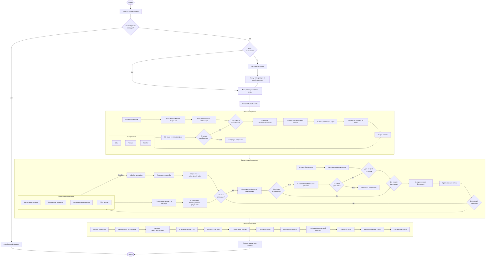
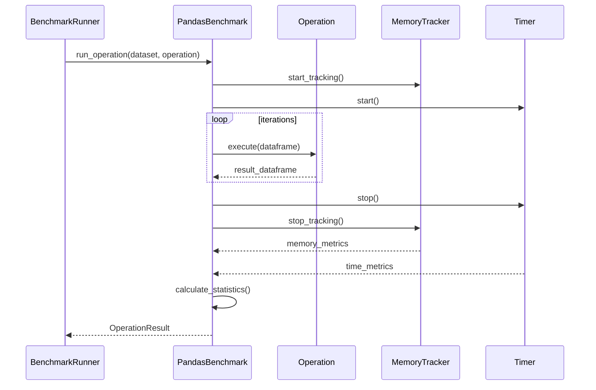
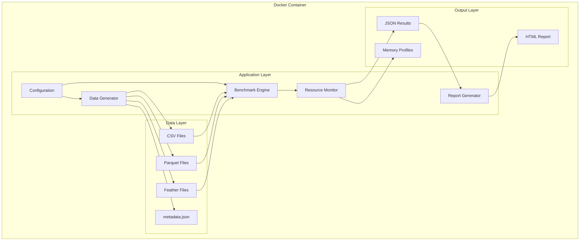

# План разработки: Эксперимент по сравнению производительности Pandas и Polars

## 1. Архитектура решения

### 1.1. Схема классов

```mermaid
classDiagram
    %% Базовые интерфейсы и абстракции
    class IDataGenerator {
        <<interface>>
        +generate_column(spec: ColumnSpec) DataFrame
        +calculate_row_count(target_size: int) int
    }
    
    class IBenchmark {
        <<interface>>
        +run(dataset: Dataset) BenchmarkResult
        +get_operations() List[Operation]
    }
    
    class IReporter {
        <<interface>>
        +generate_report(results: List[BenchmarkResult]) void
    }
    
    %% Логирование
    class Logger {
        +level: LogLevel
        +handlers: List[Handler]
        +debug(message: str) void
        +info(message: str) void
        +warning(message: str) void
        +error(message: str, exc_info: bool) void
    }
    
    class LogLevel {
        <<enumeration>>
        DEBUG
        INFO
        WARNING
        ERROR
    }
    
    %% Модуль генерации данных
    class DataGenerator {
        -seed: int
        -rng: RandomGenerator
        +generate_numeric_column(params) Series
        +generate_string_column(params) Series
        +generate_categorical_column(params) Series
        +generate_temporal_column(params) Series
        +generate_boolean_column(params) Series
    }
    
    class DatasetBuilder {
        -generator: DataGenerator
        -config: GeneratorConfig
        +build(spec: DatasetSpecification) Dataset
        -calculate_column_distribution() Dict
        -estimate_row_count() int
    }
    
    class DatasetSpecification {
        +size_name: str
        +shape_name: str
        +type_mix_name: str
        +target_size_mb: int
        +calculate_column_distribution() Dict
        +estimate_row_count() int
        +generate_column_names() List
    }
    
    class Dataset {
        +data: DataFrame
        +metadata: DatasetMetadata
        +save_csv() void
        +save_parquet() void
        +save_feather() void
    }
    
    class DatasetMetadata {
        +filename: str
        +size_bytes: int
        +rows: int
        +columns: int
        +column_info: Dict
        +generation_params: Dict
    }
    
    %% Модуль бенчмарков
    class BaseBenchmark {
        <<abstract>>
        #memory_tracker: MemoryTracker
        #timer: Timer
        +run(dataset: Dataset) BenchmarkResult
        #execute_operation(op: Operation) OperationResult
        #measure_memory() MemoryMetrics
        #measure_time() TimeMetrics
    }
    
    class PandasNumpyBenchmark {
        +read_file(path: str) DataFrame
        +filter_data(df: DataFrame) DataFrame
        +group_aggregate(df: DataFrame) DataFrame
        +sort_data(df: DataFrame) DataFrame
        +join_data(df1: DataFrame, df2: DataFrame) DataFrame
        +string_operations(df: DataFrame) DataFrame
    }
    
    class PandasPyArrowBenchmark {
        +convert_to_pyarrow(df: DataFrame) DataFrame
        +read_file(path: str) DataFrame
        +filter_data(df: DataFrame) DataFrame
        +group_aggregate(df: DataFrame) DataFrame
    }
    
    class PolarsEagerBenchmark {
        +read_file(path: str) DataFrame
        +filter_data(df: DataFrame) DataFrame
        +group_aggregate(df: DataFrame) DataFrame
        +sort_data(df: DataFrame) DataFrame
    }
    
    class PolarsLazyBenchmark {
        +build_query_plan(operations: List) LazyFrame
        +execute_plan(plan: LazyFrame) DataFrame
        +optimize_plan(plan: LazyFrame) LazyFrame
    }
    
    class Operation {
        +name: str
        +type: OperationType
        +params: Dict
        +execute(df: DataFrame) DataFrame
    }
    
    class BenchmarkResult {
        +dataset_name: str
        +framework: str
        +operations: List[OperationResult]
        +summary: BenchmarkSummary
    }
    
    class OperationResult {
        +operation_name: str
        +time_seconds: float
        +peak_memory_mb: float
        +iterations: int
        +std_dev: float
    }
    
    %% Модуль мониторинга
    class MemoryTracker {
        -profiler: MemoryProfiler
        +start_tracking() void
        +stop_tracking() MemoryMetrics
        +get_peak_memory() float
        +get_current_memory() float
    }
    
    class Timer {
        -start_time: float
        -end_time: float
        +start() void
        +stop() float
        +elapsed() float
    }
    
    class ResourceMonitor {
        -memory_tracker: MemoryTracker
        -cpu_monitor: CPUMonitor
        +monitor(func: Callable) ResourceMetrics
    }
    
    %% Модуль отчетности
    class HTMLReporter {
        -template_engine: Jinja2
        -chart_builder: PlotlyChartBuilder
        +generate_report(results: List[BenchmarkResult]) void
        -create_comparison_tables() str
        -create_performance_charts() str
        -generate_summary() str
    }
    
    class ResultAggregator {
        +aggregate(results: List[BenchmarkResult]) AggregatedResults
        +calculate_statistics() Statistics
        +find_best_performers() Dict
    }
    
    %% Управление результатами и ошибками
    class ResultManager {
        -results_dir: Path
        +save_intermediate(result: OperationResult) void
        +save_checkpoint(state: ExperimentState) void
        +load_checkpoint() ExperimentState
        +version_results() str
    }
    
    class FailedBenchmark {
        +dataset_name: str
        +framework: str
        +operation: str
        +error_message: str
        +traceback: str
        +timestamp: datetime
    }
    
    class ExperimentState {
        +completed_benchmarks: List[str]
        +failed_benchmarks: List[FailedBenchmark]
        +current_progress: Dict
        +can_resume() bool
    }
    
    %% Конфигурация
    class ConfigLoader {
        +load_yaml(path: str) Config
        +validate_config(config: Config) bool
        +merge_configs(configs: List[Config]) Config
    }
    
    class ExperimentConfig {
        +name: str
        +data_generation: DataGenerationConfig
        +benchmarks: BenchmarkConfig
        +output: OutputConfig
    }
    
    %% Главный контроллер
    class BenchmarkRunner {
        -config: ExperimentConfig
        -data_generator: DatasetBuilder
        -benchmarks: List[IBenchmark]
        -reporter: IReporter
        -logger: Logger
        -result_manager: ResultManager
        +run_experiment() void
        -generate_datasets() List[Dataset]
        -run_benchmarks() List[BenchmarkResult]
        -handle_benchmark_failure(error: Exception) void
        -save_checkpoint() void
        -resume_from_checkpoint() void
        -generate_report() void
    }
    
    %% Связи
    DataGenerator ..|> IDataGenerator
    BaseBenchmark ..|> IBenchmark
    HTMLReporter ..|> IReporter
    
    DatasetBuilder --> DataGenerator
    DatasetBuilder --> DatasetSpecification
    DatasetBuilder --> Dataset
    Dataset --> DatasetMetadata
    
    PandasNumpyBenchmark --|> BaseBenchmark
    PandasPyArrowBenchmark --|> BaseBenchmark
    PolarsEagerBenchmark --|> BaseBenchmark
    PolarsLazyBenchmark --|> BaseBenchmark
    
    BaseBenchmark --> MemoryTracker
    BaseBenchmark --> Timer
    BaseBenchmark --> Operation
    BaseBenchmark --> BenchmarkResult
    BenchmarkResult --> OperationResult
    
    HTMLReporter --> ResultAggregator
    ResourceMonitor --> MemoryTracker
    
    BenchmarkRunner --> ConfigLoader
    BenchmarkRunner --> DatasetBuilder
    BenchmarkRunner --> BaseBenchmark
    BenchmarkRunner --> HTMLReporter
    BenchmarkRunner --> ExperimentConfig
    BenchmarkRunner --> Logger
    BenchmarkRunner --> ResultManager
    ResultManager --> ExperimentState
    ExperimentState --> FailedBenchmark
```



### 1.2. Workflow диаграмма



## 2. Логические модули и элементарные задачи

### Модуль 1: Инфраструктура и окружение

#### 1.1. Docker окружение
- **1.1.1.** Создание Dockerfile
  - Выбор базового образа Python 3.11
  - Установка системных зависимостей
  - Настройка рабочей директории
- **1.1.2.** Создание requirements.txt
  - Фиксация версий всех зависимостей
  - Группировка по назначению
- **1.1.3.** Создание docker-compose.yml
  - Настройка volumes для данных
  - Настройка ресурсов контейнера
  - Переменные окружения

#### 1.2. Структура проекта
- **1.2.1.** Создание директорий согласно архитектуре
- **1.2.2.** Инициализация Python пакетов (__init__.py)
- **1.2.3.** Настройка путей и констант

### Модуль 2: Конфигурация

#### 2.1. Система конфигурации
- **2.1.1.** Класс ConfigLoader
  - Парсинг YAML файлов
  - Валидация структуры
  - Мержинг конфигураций
- **2.1.2.** Dataclasses для конфигурации
  - ExperimentConfig
  - DataGenerationConfig
  - BenchmarkConfig
  - OutputConfig
- **2.1.3.** Валидаторы конфигурации
  - Проверка обязательных полей
  - Валидация диапазонов значений
  - Проверка путей

### Модуль 3: Генерация данных

#### 3.1. Базовые генераторы
- **3.1.1.** Класс DataGenerator
  - Инициализация с seed
  - Методы генерации по типам данных
  - Контроль распределений
- **3.1.2.** Генераторы числовых данных
  - Целочисленные типы (int8-int64)
  - Вещественные типы (float32-float64)  
  - Поддержка распределений
  - Генерация NaN значений
- **3.1.3.** Генераторы строковых данных
  - Короткие строки
  - Средние строки
  - Длинные строки
  - Различные charset
- **3.1.4.** Генераторы категориальных данных
  - Низкая кардинальность
  - Средняя кардинальность
  - Высокая кардинальность
- **3.1.5.** Генераторы временных данных
  - Datetime
  - Date
  - Time
- **3.1.6.** Генераторы булевых данных

#### 3.2. Построение датасетов
- **3.2.1.** Класс DatasetSpecification
  - Расчет распределения колонок
  - Оценка количества строк
  - Генерация имен колонок
- **3.2.2.** Класс DatasetBuilder
  - Оркестрация генерации
  - Сборка DataFrame
  - Контроль размера
- **3.2.3.** Класс Dataset
  - Хранение данных и метаданных
  - Методы сохранения в разные форматы
  - Валидация результата

#### 3.3. Сохранение и метаданные
- **3.3.1.** Сохранение в CSV
- **3.3.2.** Сохранение в Parquet
- **3.3.3.** Сохранение в Feather
- **3.3.4.** Генерация metadata.json
- **3.3.5.** Валидация сгенерированных файлов

### Модуль 4: Бенчмарки

#### 4.1. Базовая инфраструктура
- **4.1.1.** Абстрактный класс BaseBenchmark
  - Интерфейс для операций
  - Методы измерения
  - Обработка результатов
- **4.1.2.** Класс Operation
  - Типы операций
  - Параметры выполнения
  - Метод execute
- **4.1.3.** Классы результатов
  - BenchmarkResult
  - OperationResult
  - BenchmarkSummary

#### 4.2. Реализации для Pandas
- **4.2.1.** PandasNumpyBenchmark
  - Чтение файлов
  - Фильтрация
  - Группировка
  - Сортировка
  - Join операции
  - Строковые операции
- **4.2.2.** PandasPyArrowBenchmark
  - Конвертация типов
  - Адаптация операций
  - Особенности PyArrow

#### 4.3. Реализации для Polars
- **4.3.1.** PolarsEagerBenchmark
  - Eager API операции
  - Адаптация синтаксиса
- **4.3.2.** PolarsLazyBenchmark
  - Построение query plan
  - Оптимизация плана
  - Lazy evaluation

### Модуль 5: Мониторинг

#### 5.1. Мониторинг памяти
- **5.1.1.** Класс MemoryTracker
  - Интеграция с memory_profiler
  - Отслеживание пиковых значений
  - Контекстный менеджер
- **5.1.2.** Профилирование памяти
  - Сохранение профилей
  - Анализ утечек

#### 5.2. Мониторинг времени
- **5.2.1.** Класс Timer
  - Высокоточные измерения
  - Статистика по итерациям
- **5.2.2.** Warmup механизм

#### 5.3. Общий мониторинг ресурсов
- **5.3.1.** Класс ResourceMonitor
  - CPU использование
  - Disk I/O
  - Агрегация метрик

### Модуль 6: Отчетность

#### 6.1. Агрегация результатов
- **6.1.1.** Класс ResultAggregator
  - Сбор всех результатов
  - Расчет статистики
  - Поиск лучших результатов
- **6.1.2.** Сравнительный анализ
  - Сравнение фреймворков
  - Сравнение операций
  - Выявление паттернов

#### 6.2. Генерация отчетов
- **6.2.1.** Класс HTMLReporter
  - Шаблоны Jinja2
  - Генерация таблиц
  - Встраивание стилей
- **6.2.2.** Визуализация
  - Графики Plotly
  - Интерактивные элементы
  - Экспорт изображений
- **6.2.3.** Формирование выводов
  - Автоматические рекомендации
  - Сводная статистика

### Модуль 7: Главный контроллер

#### 7.1. Оркестрация
- **7.1.1.** Класс BenchmarkRunner
  - Управление процессом
  - Обработка ошибок
  - Логирование
  - Сохранение checkpoint'ов
- **7.1.2.** CLI интерфейс
  - Запуск с конфигурацией
  - Вывод прогресса
  - Возобновление после сбоя

#### 7.2. Обработка ошибок
- **7.2.1.** Exception классы
  - ConfigurationError
  - DataGenerationError
  - BenchmarkError
- **7.2.2.** Восстановление после сбоев
  - Checkpoint механизм
  - Продолжение с места остановки
  - Запись неудачных бенчмарков

#### 7.3. Логирование
- **7.3.1.** Настройка логгеров
  - Уровни: DEBUG, INFO, WARNING, ERROR
  - Форматирование сообщений
  - Вывод в консоль с цветами
- **7.3.2.** Логирование процесса
  - Прогресс генерации данных
  - Статус выполнения бенчмарков
  - Детали ошибок с traceback

#### 7.4. Управление результатами
- **7.4.1.** Версионирование
  - Timestamp в имени результатов
  - Сохранение истории запусков
  - Метаданные эксперимента
- **7.4.2.** Промежуточные результаты
  - Сохранение после каждой операции
  - Атомарная запись
  - Возможность инкрементального анализа

## 8. JSON Schema конфигурации

```json
{
  "$schema": "http://json-schema.org/draft-07/schema#",
  "title": "Benchmark Configuration Schema",
  "type": "object",
  "required": ["experiment", "data_generation", "benchmarks", "output"],
  "properties": {
    "experiment": {
      "type": "object",
      "required": ["name"],
      "properties": {
        "name": {
          "type": "string",
          "description": "Название эксперимента"
        },
        "date": {
          "type": "string",
          "enum": ["auto"],
          "default": "auto",
          "description": "Дата эксперимента (auto для автоматической)"
        }
      }
    },
    "data_generation": {
      "type": "object",
      "required": ["seed", "sizes", "shapes", "type_mixes", "column_types"],
      "properties": {
        "seed": {
          "type": "integer",
          "description": "Seed для воспроизводимости"
        },
        "sizes": {
          "type": "array",
          "items": {
            "type": "object",
            "required": ["name", "target_size_mb"],
            "properties": {
              "name": {
                "type": "string",
                "enum": ["small", "medium", "large", "xlarge"]
              },
              "target_size_mb": {
                "type": "integer",
                "minimum": 1
              }
            }
          }
        },
        "shapes": {
          "type": "array",
          "items": {
            "type": "object",
            "required": ["name", "columns", "description"],
            "properties": {
              "name": {
                "type": "string",
                "enum": ["narrow_long", "wide_short", "balanced", "ultra_wide"]
              },
              "columns": {
                "type": "integer",
                "minimum": 1,
                "maximum": 10000
              },
              "description": {
                "type": "string"
              }
            }
          }
        },
        "type_mixes": {
          "type": "array",
          "items": {
            "type": "object",
            "required": ["name", "description", "composition"],
            "properties": {
              "name": {
                "type": "string",
                "enum": ["numeric_heavy", "string_heavy", "mixed_balanced", "temporal_focus"]
              },
              "description": {
                "type": "string"
              },
              "composition": {
                "type": "object",
                "patternProperties": {
                  "^(int8|int16|int32|int64|float32|float64|string|string_short|string_medium|string_long|categorical|categorical_low|categorical_high|datetime|date|time|bool)$": {
                    "type": "string",
                    "pattern": "^\\d+(\\.\\d+)?%$"
                  }
                }
              }
            }
          }
        },
        "column_types": {
          "type": "object",
          "properties": {
            "numeric": {
              "type": "object",
              "patternProperties": {
                "^(int8|int16|int32|int64|float32|float64)$": {
                  "type": "object",
                  "properties": {
                    "min": {"type": "number"},
                    "max": {"type": "number"},
                    "distribution": {
                      "type": "string",
                      "enum": ["uniform", "normal", "exponential"]
                    },
                    "null_percentage": {
                      "type": "number",
                      "minimum": 0,
                      "maximum": 100
                    }
                  }
                }
              }
            },
            "string": {
              "type": "object",
              "patternProperties": {
                "^string_(short|medium|long)$": {
                  "type": "object",
                  "required": ["min_length", "max_length", "charset"],
                  "properties": {
                    "min_length": {"type": "integer", "minimum": 0},
                    "max_length": {"type": "integer", "minimum": 0},
                    "charset": {
                      "type": "string",
                      "enum": ["alphanumeric", "ascii", "unicode"]
                    }
                  }
                }
              }
            },
            "categorical": {
              "type": "object",
              "patternProperties": {
                "^categorical_(low|high)$": {
                  "type": "object",
                  "required": ["cardinality"],
                  "properties": {
                    "cardinality": {"type": "integer", "minimum": 1}
                  }
                }
              }
            },
            "temporal": {
              "type": "object",
              "properties": {
                "datetime": {
                  "type": "object",
                  "required": ["start", "end", "freq"],
                  "properties": {
                    "start": {"type": "string", "format": "date"},
                    "end": {"type": "string", "format": "date"},
                    "freq": {"type": "string"}
                  }
                },
                "date": {
                  "type": "object",
                  "required": ["start", "end"],
                  "properties": {
                    "start": {"type": "string", "format": "date"},
                    "end": {"type": "string", "format": "date"}
                  }
                },
                "time": {
                  "type": "object",
                  "required": ["format"],
                  "properties": {
                    "format": {"type": "string"}
                  }
                }
              }
            },
            "boolean": {
              "type": "object",
              "properties": {
                "bool": {
                  "type": "object",
                  "required": ["true_ratio"],
                  "properties": {
                    "true_ratio": {
                      "type": "number",
                      "minimum": 0,
                      "maximum": 1
                    },
                    "null_percentage": {
                      "type": "number",
                      "minimum": 0,
                      "maximum": 100
                    }
                  }
                }
              }
            }
          }
        }
      }
    },
    "benchmarks": {
      "type": "object",
      "required": ["iterations", "warmup_iterations", "operations", "frameworks"],
      "properties": {
        "iterations": {
          "type": "integer",
          "minimum": 1,
          "description": "Количество итераций для каждой операции"
        },
        "warmup_iterations": {
          "type": "integer",
          "minimum": 0,
          "description": "Количество прогревочных итераций"
        },
        "operations": {
          "type": "object",
          "required": ["read_operations", "transform_operations", "aggregation_operations", "join_operations", "sort_operations", "string_operations", "column_operations"],
          "properties": {
            "read_operations": {
              "type": "array",
              "items": {
                "type": "string",
                "enum": ["read_csv", "read_parquet", "read_feather"]
              }
            },
            "transform_operations": {
              "type": "array",
              "items": {
                "type": "string",
                "enum": ["filter_numeric", "filter_string", "filter_multiple_conditions"]
              }
            },
            "aggregation_operations": {
              "type": "array",
              "items": {
                "type": "string",
                "enum": ["group_by_single", "group_by_multiple", "rolling_window"]
              }
            },
            "join_operations": {
              "type": "array",
              "items": {
                "type": "string",
                "enum": ["inner_join", "left_join", "cross_join"]
              }
            },
            "sort_operations": {
              "type": "array",
              "items": {
                "type": "string",
                "enum": ["sort_single_column", "sort_multiple_columns"]
              }
            },
            "string_operations": {
              "type": "array",
              "items": {
                "type": "string",
                "enum": ["string_contains", "string_replace", "string_split"]
              }
            },
            "column_operations": {
              "type": "array",
              "items": {
                "type": "string",
                "enum": ["add_columns", "drop_columns", "rename_columns", "type_conversion"]
              }
            }
          }
        },
        "frameworks": {
          "type": "object",
          "required": ["pandas", "polars"],
          "properties": {
            "pandas": {
              "type": "array",
              "items": {
                "type": "object",
                "required": ["name", "backend"],
                "properties": {
                  "name": {"type": "string"},
                  "backend": {"type": "string", "enum": ["numpy", "pyarrow"]},
                  "dtype_backend": {
                    "type": ["string", "null"],
                    "enum": ["pyarrow", null]
                  }
                }
              }
            },
            "polars": {
              "type": "array",
              "items": {
                "type": "object",
                "required": ["name", "api", "streaming"],
                "properties": {
                  "name": {"type": "string"},
                  "api": {"type": "string", "enum": ["eager", "lazy"]},
                  "streaming": {"type": "boolean"}
                }
              }
            }
          }
        }
      }
    },
    "output": {
      "type": "object",
      "required": ["results_dir", "report_name", "save_intermediate", "include_memory_profiles"],
      "properties": {
        "results_dir": {
          "type": "string",
          "description": "Директория для сохранения результатов"
        },
        "report_name": {
          "type": "string",
          "description": "Имя HTML отчета"
        },
        "save_intermediate": {
          "type": "boolean",
          "description": "Сохранять промежуточные результаты"
        },
        "include_memory_profiles": {
          "type": "boolean",
          "description": "Включать профили памяти в результаты"
        }
      }
    },
    "logging": {
      "type": "object",
      "properties": {
        "level": {
          "type": "string",
          "enum": ["DEBUG", "INFO", "WARNING", "ERROR"],
          "default": "INFO"
        },
        "format": {
          "type": "string",
          "default": "%(asctime)s - %(name)s - %(levelname)s - %(message)s"
        }
      }
    }
  }
}
```

## 9. Последовательность разработки

### Фаза 1: Базовая инфраструктура
1. Настройка Docker окружения
2. Создание структуры проекта
3. Реализация системы конфигурации
4. Базовые классы и интерфейсы

### Фаза 2: Генерация данных
1. Реализация DataGenerator
2. Реализация генераторов по типам
3. DatasetBuilder и DatasetSpecification
4. Система сохранения и метаданных

### Фаза 3: Бенчмарки
1. BaseBenchmark и инфраструктура
2. Pandas реализации
3. Polars реализации
4. Система операций

### Фаза 4: Мониторинг и отчетность
1. Мониторинг памяти и времени
2. Агрегация результатов
3. HTML отчеты
4. Визуализация

### Фаза 5: Интеграция
1. BenchmarkRunner
2. CLI интерфейс
3. Обработка ошибок
4. Финальное тестирование

## 4. Дополнительные диаграммы

### 4.1. Последовательность выполнения операции



### 4.2. Компоненты системы



## 5. Критерии готовности

### Модуль генерации данных
- [ ] Генерирует все 192 комбинации датасетов
- [ ] Размеры файлов соответствуют целевым ±5%
- [ ] Metadata корректно описывает датасеты
- [ ] Поддерживает воспроизводимость через seed
- [ ] Логирует процесс генерации с уровнями DEBUG/INFO/WARNING/ERROR

### Модуль бенчмарков
- [ ] Выполняет все операции для всех фреймворков
- [ ] Корректно измеряет время и память
- [ ] Обрабатывает ошибки без прерывания эксперимента
- [ ] Сохраняет промежуточные результаты после каждой операции
- [ ] Записывает упавшие бенчмарки для возможности перезапуска
- [ ] Создает checkpoint'ы для возобновления работы

### Модуль отчетности
- [ ] Генерирует полный HTML отчет
- [ ] Включает все графики и таблицы
- [ ] Интерактивные элементы работают
- [ ] Отчет открывается в браузере
- [ ] Включает информацию об упавших бенчмарках
- [ ] Версионирует результаты с timestamp

### Логирование
- [ ] Настроены все уровни логирования (DEBUG, INFO, WARNING, ERROR)
- [ ] Консольный вывод с цветовой индикацией
- [ ] Детальная информация о прогрессе выполнения
- [ ] Traceback для ошибок
- [ ] Читаемый формат сообщений

### Интеграция
- [ ] Docker образ собирается без ошибок
- [ ] Полный прогон эксперимента завершается успешно
- [ ] Результаты воспроизводимы
- [ ] Документация полная и актуальная
- [ ] Возможность возобновления после сбоя работает
- [ ] JSON конфигурация валидируется согласно схеме