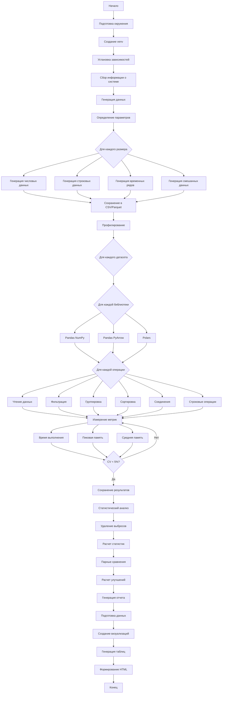

# Техническое задание: Воспроизводимый бенчмарк сравнения производительности Pandas и Polars

## 1. Описание проекта

Разработка автоматизированной системы бенчмаркинга для сравнения производительности и потребления памяти библиотек Pandas (с NumPy и PyArrow backends) и Polars при выполнении типовых операций обработки данных.

## 2. Описание последовательности действий

### 2.1. Подготовка окружения
**Входные данные:**
- Файл requirements.txt с версиями библиотек
- Конфигурационный файл config.yaml

**Цель:** Создание изолированного и воспроизводимого окружения для тестирования

**Как выполнять:**
1. Создать виртуальное окружение Python 3.11+
2. Установить последние стабильные версии библиотек
3. Зафиксировать точные версии в requirements.lock
4. Проверить доступность всех необходимых модулей

**Выходные артефакты:**
- Активированное виртуальное окружение
- requirements.lock с точными версиями
- environment_info.json с информацией о системе

### 2.2. Генерация синтетических данных
**Входные данные:**
- Параметры генерации из config.yaml:
  - Размеры датасетов (rows: [1e4, 1e5, 1e6, 1e7])
  - Типы данных (numeric, string, datetime, mixed)
  - Характеристики данных (cardinality, null_ratio, distribution)

**Цель:** Создание набора тестовых датасетов разной структуры и размера

**Как выполнять:**
1. Для каждого размера и типа данных:
   - Генерировать данные с заданным распределением
   - Добавлять контролируемое количество пропущенных значений
   - Создавать категориальные переменные с разной кардинальностью
   - Сохранять в форматах CSV и Parquet

**Выходные артефакты:**
- Директория ./data/ с датасетами
- metadata.json с описанием каждого датасета
- data_generation_report.json

### 2.3. Профилирование операций
**Входные данные:**
- Сгенерированные датасеты
- Список операций для тестирования
- Параметры профилирования

**Цель:** Измерение производительности и потребления памяти для каждой операции

**Как выполнять:**
1. Для каждой комбинации (датасет, библиотека, backend, операция):
   - Запускать операцию в изолированном процессе
   - Измерять время выполнения с помощью timeit
   - Отслеживать потребление памяти через memory_profiler
   - Повторять до достижения статистической значимости (CV < 5%)
   - Сохранять raw метрики

**Выходные артефакты:**
- raw_results/ с детальными метриками
- profiling_logs/ с логами выполнения

### 2.4. Статистический анализ
**Входные данные:**
- Raw метрики из профилирования
- Параметры статистического анализа

**Цель:** Расчет статистически значимых результатов и сравнений

**Как выполнять:**
1. Для каждой метрики:
   - Удалять выбросы (метод IQR)
   - Рассчитывать среднее, медиану, стандартное отклонение
   - Проводить тесты на нормальность распределения
   - Выполнять парные сравнения (t-test или Mann-Whitney U)
   - Рассчитывать относительные улучшения и доверительные интервалы

**Выходные артефакты:**
- statistical_analysis.json с агрегированными результатами
- comparison_matrix.csv с парными сравнениями

### 2.5. Генерация отчета
**Входные данные:**
- Результаты статистического анализа
- Шаблон HTML отчета
- Метаданные эксперимента

**Цель:** Создание интерактивного HTML отчета с результатами

**Как выполнять:**
1. Подготовить данные для визуализации
2. Создать интерактивные графики с Plotly:
   - Барчарты сравнения времени выполнения
   - Линейные графики масштабируемости
   - Heatmap для сравнения операций
   - Box plots для распределения метрик
3. Сгенерировать таблицы с детальными результатами
4. Добавить интерпретацию результатов
5. Включить информацию о воспроизводимости

**Выходные артефакты:**
- benchmark_report.html - полный интерактивный отчет
- figures/ - отдельные графики в формате PNG/SVG

## 3. Схема действий в формате Mermaid



## 4. Детальное описание операций

### 4.1. Операции чтения данных
**Тестируемые форматы:**
- CSV (с различными параметрами)
- Parquet
- Сравнение eager vs lazy loading (для Polars)

### 4.2. Операции фильтрации
- Простая фильтрация по одному условию
- Сложная фильтрация по нескольким условиям
- Фильтрация с использованием isin()
- Фильтрация по строковым паттернам

### 4.3. Операции группировки и агрегации
- GroupBy с одной колонкой
- GroupBy с несколькими колонками
- Различные агрегатные функции (sum, mean, count, std)
- Множественные агрегации
- Window functions

### 4.4. Операции сортировки
- Сортировка по одной колонке
- Сортировка по нескольким колонкам
- Сортировка с различными типами данных

### 4.5. Операции соединения
- Inner join
- Left join
- Outer join
- Соединение по нескольким ключам

### 4.6. Строковые операции
- Конкатенация
- Поиск подстроки
- Регулярные выражения
- Преобразование регистра

## 5. Структура конфигурационного файла

```yaml
benchmark:
  name: "Pandas vs Polars Performance Comparison"
  version: "1.0.0"
  
environment:
  python_version: "3.11+"
  libraries:
    pandas:
      version: "latest_stable"
      backends: ["numpy", "pyarrow"]
    polars:
      version: "latest_stable"
    
data_generation:
  sizes: [10000, 100000, 1000000, 10000000]
  types:
    numeric:
      columns: 10
      dtypes: ["int64", "float64"]
      null_ratio: 0.05
    string:
      columns: 5
      cardinality: [10, 100, 1000]
      null_ratio: 0.1
    datetime:
      columns: 3
      frequency: "1min"
    mixed:
      numeric_columns: 5
      string_columns: 3
      datetime_columns: 2
      
operations:
  io:
    - read_csv
    - read_parquet
    - write_csv
    - write_parquet
  filter:
    - simple_filter
    - complex_filter
    - isin_filter
    - string_pattern_filter
  groupby:
    - single_column_groupby
    - multi_column_groupby
    - multiple_aggregations
  sort:
    - single_column_sort
    - multi_column_sort
  join:
    - inner_join
    - left_join
    - merge_on_multiple_keys
  string:
    - concatenation
    - contains
    - regex_extract
    - case_conversion
    
profiling:
  min_runs: 3
  max_runs: 100
  target_cv: 0.05
  timeout_seconds: 300
  memory_sampling_interval: 0.1
  
reporting:
  output_format: "html"
  include_raw_data: true
  statistical_tests:
    - normality_test
    - paired_comparison
  confidence_level: 0.95
```

## 6. Структура проекта

```
pandas-polars-benchmark/
├── src/
│   ├── __init__.py
│   ├── data_generator.py
│   ├── profiler.py
│   ├── operations/
│   │   ├── __init__.py
│   │   ├── io_operations.py
│   │   ├── filter_operations.py
│   │   ├── groupby_operations.py
│   │   ├── sort_operations.py
│   │   ├── join_operations.py
│   │   └── string_operations.py
│   ├── statistical_analyzer.py
│   ├── report_generator.py
│   └── utils/
│       ├── __init__.py
│       ├── memory_tracker.py
│       ├── timer.py
│       └── system_info.py
├── templates/
│   ├── report_template.html
│   └── assets/
│       ├── style.css
│       └── script.js
├── tests/
│   ├── test_data_generator.py
│   ├── test_operations.py
│   └── test_profiler.py
├── data/
│   └── .gitkeep
├── results/
│   ├── raw_results/
│   ├── figures/
│   └── reports/
├── config.yaml
├── requirements.txt
├── run_benchmark.py
├── README.md
└── .gitignore
```

## 7. Чеклист выполнения

### Подготовка
- [ ] Создать структуру директорий проекта
- [ ] Написать requirements.txt с последними версиями библиотек
- [ ] Создать виртуальное окружение Python 3.11+
- [ ] Установить все зависимости
- [ ] Проверить совместимость версий
- [ ] Создать config.yaml с параметрами эксперимента

### Разработка
- [ ] Реализовать модуль сбора информации о системе
- [ ] Реализовать генератор синтетических данных
  - [ ] Числовые данные с различными распределениями
  - [ ] Строковые данные с разной кардинальностью
  - [ ] Временные ряды
  - [ ] Смешанные типы данных
- [ ] Реализовать профайлер с отслеживанием памяти
  - [ ] Обертка для изолированного выполнения
  - [ ] Трекер памяти с sampling
  - [ ] Таймер с автоматическим повтором
- [ ] Реализовать все операции для тестирования
  - [ ] IO операции
  - [ ] Фильтрация
  - [ ] Группировка и агрегация
  - [ ] Сортировка
  - [ ] Соединения
  - [ ] Строковые операции
- [ ] Реализовать статистический анализатор
  - [ ] Детекция и удаление выбросов
  - [ ] Расчет описательных статистик
  - [ ] Парные сравнения с тестами значимости
- [ ] Реализовать генератор HTML отчетов
  - [ ] Шаблон с интерактивными графиками
  - [ ] Таблицы с детальными результатами
  - [ ] Сводная информация и рекомендации

### Тестирование
- [ ] Написать unit тесты для всех модулей
- [ ] Провести тестовый запуск на малых данных
- [ ] Валидировать корректность измерений
- [ ] Проверить воспроизводимость результатов

### Выполнение эксперимента
- [ ] Запустить генерацию всех датасетов
- [ ] Выполнить профилирование всех операций
- [ ] Дождаться достижения статистической значимости
- [ ] Провести статистический анализ
- [ ] Сгенерировать финальный отчет

### Документация
- [ ] Написать README с инструкцией по запуску
- [ ] Документировать все параметры конфигурации
- [ ] Добавить примеры интерпретации результатов
- [ ] Создать CHANGELOG для версионирования

## 8. Требования к выходным артефактам

### 8.1. HTML отчет должен содержать:
- Сводную таблицу со всеми результатами
- Интерактивные графики для каждой метрики
- Детальное сравнение по каждой операции
- Рекомендации по выбору библиотеки
- Информацию о параметрах эксперимента
- Возможность фильтрации и сортировки результатов

### 8.2. Дополнительные артефакты:
- CSV файл с raw данными для дальнейшего анализа
- JSON файл с агрегированными результатами
- Логи выполнения для отладки
- Скриншоты ключевых графиков

## 9. Критерии успешности

1. Все тесты выполнены без ошибок
2. Достигнута статистическая значимость (CV < 5%)
3. Результаты воспроизводимы при повторных запусках
4. Отчет корректно отображается в браузере
5. Все метрики собраны для всех комбинаций параметров