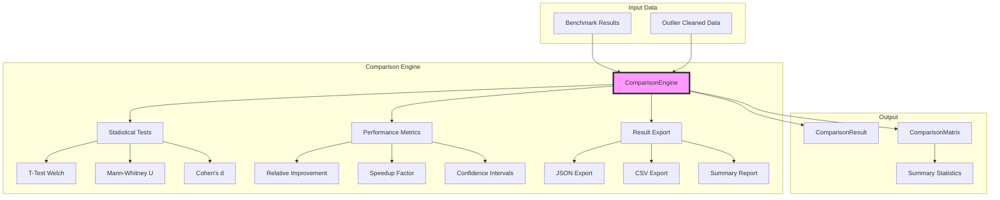
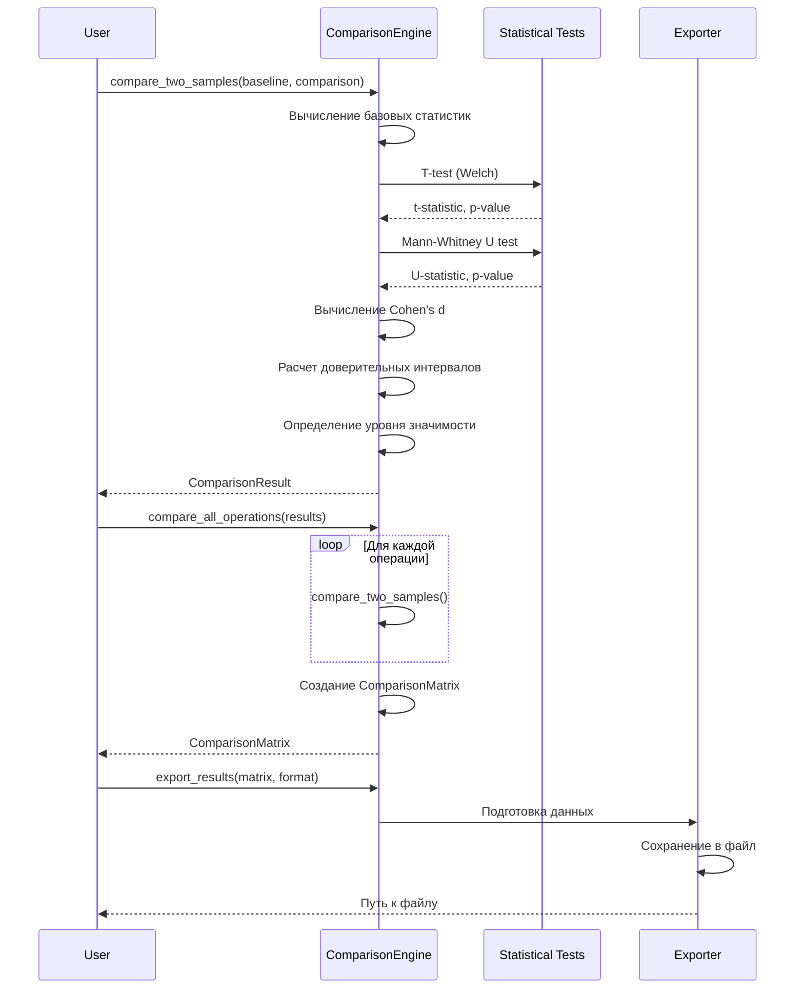
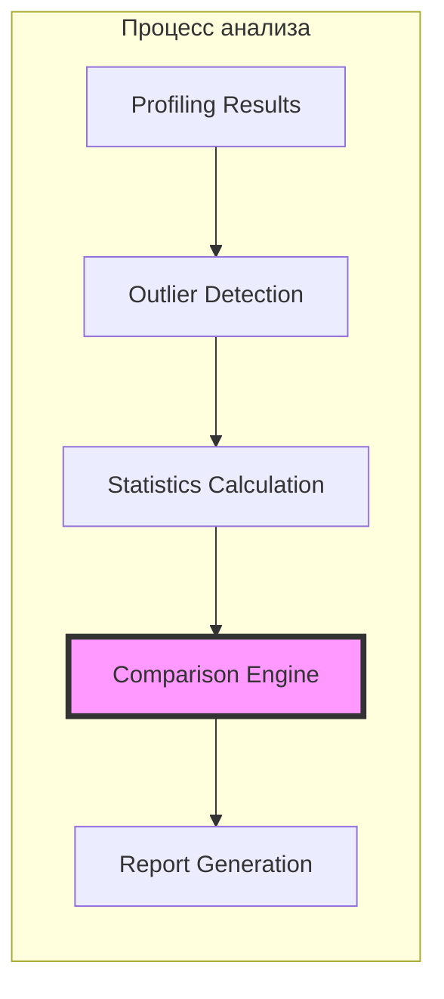

# ComparisonEngine - Движок сравнения результатов

## Обзор

ComparisonEngine - это модуль для статистического сравнения результатов бенчмарков между двумя библиотеками (Pandas и Polars). Он предоставляет комплексный анализ с использованием различных статистических методов.

## Архитектура



## Основные компоненты

### 1. ComparisonMetric
Перечисление метрик для сравнения:
- `EXECUTION_TIME` - время выполнения
- `MEMORY_PEAK` - пиковое использование памяти
- `MEMORY_MEAN` - среднее использование памяти
- `CPU_USAGE` - использование CPU

### 2. SignificanceLevel
Уровни статистической значимости:
- `NOT_SIGNIFICANT` - p > 0.1
- `WEAKLY_SIGNIFICANT` - 0.05 < p < 0.1
- `SIGNIFICANT` - 0.01 < p < 0.05
- `HIGHLY_SIGNIFICANT` - p < 0.01

### 3. ComparisonResult
Результат сравнения двух выборок, содержащий:
- Базовые статистики (среднее, медиана, стандартное отклонение)
- Метрики производительности (относительное улучшение, фактор ускорения)
- Результаты статистических тестов
- Автоматическое определение победителя

### 4. ComparisonMatrix
Матрица сравнений для всех операций с агрегированной статистикой:
- Количество значимых различий
- Распределение побед между библиотеками
- Среднее и медианное улучшение

## Процесс сравнения



## Статистические методы

### 1. T-тест Уэлча
- Используется для сравнения средних двух выборок
- Не требует равенства дисперсий
- Предполагает нормальность распределения

### 2. Тест Манна-Уитни
- Непараметрический тест
- Не требует нормальности распределения
- Более робастный к выбросам

### 3. Размер эффекта (Cohen's d)
- Измеряет практическую значимость различий
- Интерпретация:
  - |d| < 0.2: незначительный эффект
  - 0.2 ≤ |d| < 0.5: малый эффект
  - 0.5 ≤ |d| < 0.8: средний эффект
  - |d| ≥ 0.8: большой эффект

## Пример использования

```python
# Создание движка
engine = ComparisonEngine(confidence_level=0.95)

# Сравнение одной операции
result = engine.compare_two_samples(
    baseline=pandas_times,
    comparison=polars_times,
    name="read_csv",
    baseline_library="pandas",
    comparison_library="polars"
)

# Сравнение всех операций
matrix = engine.compare_all_operations(benchmark_results)

# Экспорт результатов
engine.export_results(matrix, Path("results.json"), format="json")
```

## Интерпретация результатов

### Относительное улучшение
```
Improvement = ((baseline_mean - comparison_mean) / baseline_mean) × 100%
```
- Положительное значение: comparison быстрее baseline
- Отрицательное значение: baseline быстрее comparison

### Фактор ускорения
```
Speedup = baseline_mean / comparison_mean
```
- > 1: comparison быстрее в X раз
- < 1: baseline быстрее

### Определение победителя
1. Если p-value > 0.05: "tie" (нет значимой разницы)
2. Если p-value ≤ 0.05:
   - comparison_mean < baseline_mean: comparison побеждает
   - baseline_mean < comparison_mean: baseline побеждает

## Интеграция с бенчмарком



ComparisonEngine является ключевым компонентом между статистическим анализом и генерацией отчетов:

1. **Входные данные**: Очищенные от выбросов результаты профилирования
2. **Обработка**: Статистическое сравнение и определение значимости
3. **Выходные данные**: Структурированные результаты для генерации отчетов

## Форматы экспорта

### JSON формат
```json
{
  "metadata": {
    "baseline_library": "pandas",
    "comparison_library": "polars",
    "metric": "execution_time"
  },
  "summary": {
    "total_operations": 10,
    "significant_differences": 7,
    "mean_improvement": 35.2
  },
  "detailed_results": {
    "operation_name": {
      "baseline_mean": 1.2,
      "comparison_mean": 0.3,
      "relative_improvement": 75.0,
      "p_value": 0.0001,
      "winner": "polars"
    }
  }
}
```

### CSV формат
```csv
operation,baseline_mean,comparison_mean,relative_improvement_%,speedup_factor,p_value,significance,winner
read_csv,1.2,0.3,75.0,4.0,0.0001,highly_significant,polars
```

## Файлы и изменения

### Созданные файлы:
- `src/analysis/comparison_engine.py` - реализация движка сравнения
- `scripts/demo/demo_comparison_engine.py` - демонстрация работы
- `docs/comparison_engine_doc.md` - эта документация

### Интеграция:
- Модуль готов к интеграции с существующими компонентами анализа
- Следующий шаг: создание модуля генерации отчетов

## Рекомендации по использованию

1. **Минимальный размер выборки**: Рекомендуется минимум 10-15 измерений для надежных результатов
2. **Очистка от выбросов**: Всегда применяйте детекцию выбросов перед сравнением
3. **Множественные сравнения**: При сравнении многих операций учитывайте коррекцию Бонферрони
4. **Практическая значимость**: Обращайте внимание не только на p-value, но и на размер эффекта