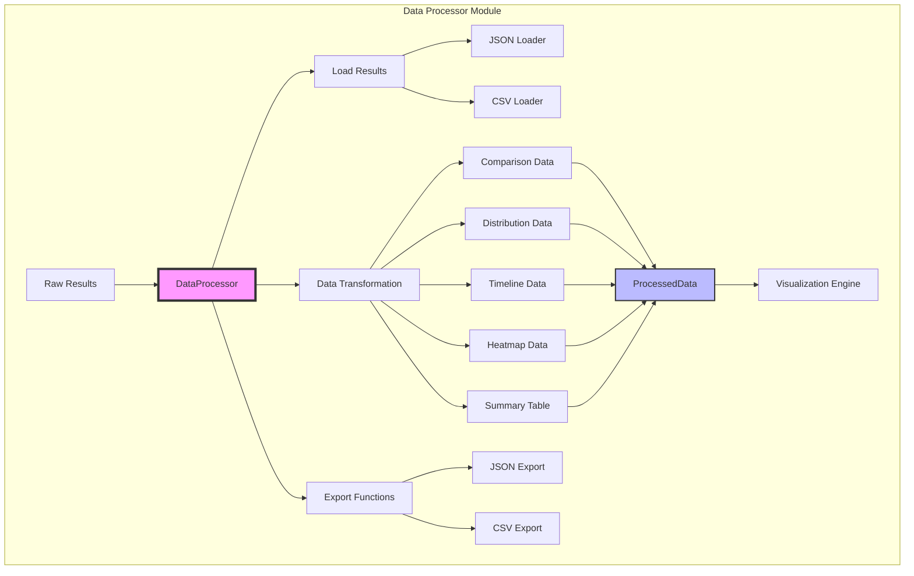
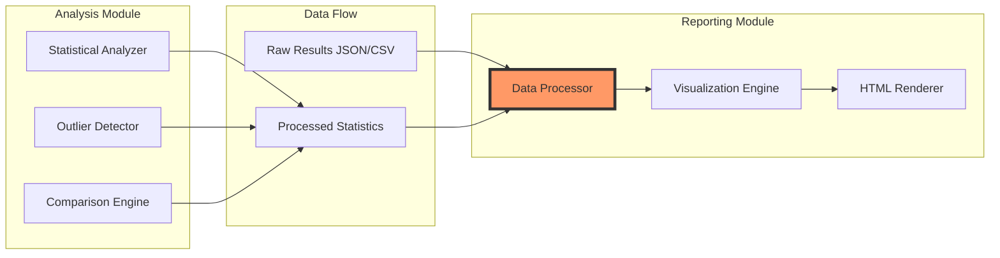

# Процессор данных (Data Processor) - Документация

## Обзор

Процессор данных является первым компонентом в модуле генерации отчетов. Его основная задача - преобразовать сырые результаты бенчмаркинга в форматы, оптимизированные для визуализации.

## Архитектура модуля



## Интеграция с другими модулями



## Основные классы и структуры

### 1. ProcessedData
Контейнер для обработанных данных, готовых к визуализации:
- **data**: DataFrame с подготовленными данными
- **metadata**: Метаинформация о данных
- **aggregation_level**: Уровень агрегации (операция, библиотека, датасет)
- **metric_type**: Тип метрики (время выполнения, память, ускорение)

### 2. AggregationLevel
Перечисление уровней агрегации:
- **OPERATION**: Группировка по операциям
- **LIBRARY**: Группировка по библиотекам
- **DATASET**: Группировка по размерам датасетов
- **OPERATION_TYPE**: Группировка по типам операций

### 3. MetricType
Перечисление типов метрик:
- **EXECUTION_TIME**: Время выполнения
- **MEMORY_USAGE**: Использование памяти
- **MEMORY_PEAK**: Пиковое использование памяти
- **RELATIVE_PERFORMANCE**: Относительная производительность
- **SPEEDUP**: Ускорение

## Основные методы

### 1. prepare_comparison_data()
Подготавливает данные для сравнительных графиков между библиотеками.

**Входные параметры:**
- `df`: DataFrame с результатами
- `metric`: Тип метрики для сравнения
- `groupby`: Список колонок для группировки
- `pivot_column`: Колонка для создания отдельных серий

**Выход:**
- ProcessedData с pivot-таблицей для визуализации

### 2. prepare_distribution_data()
Подготавливает данные для графиков распределения (гистограммы, box plots).

**Входные параметры:**
- `df`: DataFrame с результатами
- `metric`: Тип метрики
- `library`: Название библиотеки
- `operation`: Конкретная операция (опционально)

**Выход:**
- ProcessedData с данными распределения и статистиками

### 3. prepare_timeline_data()
Подготавливает данные для графиков зависимости от размера данных.

**Входные параметры:**
- `df`: DataFrame с результатами
- `metric`: Тип метрики
- `dataset_size_column`: Название колонки с размером датасета

**Выход:**
- ProcessedData с временными рядами для каждой комбинации библиотека/операция

### 4. prepare_heatmap_data()
Подготавливает данные для тепловых карт.

**Входные параметры:**
- `df`: DataFrame с результатами
- `metric`: Тип метрики
- `row_column`: Колонка для строк
- `col_column`: Колонка для столбцов

**Выход:**
- ProcessedData с pivot-таблицами для каждой библиотеки

### 5. create_summary_table()
Создает сводную таблицу с основными метриками.

**Входные параметры:**
- `df`: DataFrame с результатами

**Выход:**
- DataFrame со сводной статистикой по каждой комбинации библиотека/операция

## Примеры использования

### Пример 1: Подготовка данных для сравнения
```python
processor = DataProcessor()
df = processor.load_results("results/benchmark_results.json")

# Сравнение библиотек по операциям
comparison_data = processor.prepare_comparison_data(
    df=df,
    metric=MetricType.EXECUTION_TIME,
    groupby=['operation'],
    pivot_column='library'
)
```

### Пример 2: Подготовка данных для распределения
```python
# Распределение времени выполнения для Polars
dist_data = processor.prepare_distribution_data(
    df=df,
    metric=MetricType.EXECUTION_TIME,
    library='polars',
    operation='groupby'
)
```

### Пример 3: Экспорт для визуализации
```python
# Экспорт в JSON для Plotly
processor.export_for_visualization(
    processed_data,
    "results/comparison_data.json",
    format="json"
)
```

## Форматы данных

### Входной формат (JSON)
```json
{
  "results": [
    {
      "library": "pandas",
      "operation": "groupby",
      "dataset_size": 100000,
      "execution_time": 0.245,
      "memory_usage": 125.4,
      "memory_peak": 156.2
    }
  ]
}
```

### Выходной формат (ProcessedData в JSON)
```json
{
  "data": [
    {
      "operation": "groupby",
      "pandas_mean": 0.245,
      "pandas_std": 0.012,
      "polars_mean": 0.089,
      "polars_std": 0.005
    }
  ],
  "metadata": {
    "groupby_columns": ["operation"],
    "pivot_column": "library",
    "total_records": 500,
    "unique_values": {
      "operation": ["read_csv", "filter", "groupby", "sort", "join"],
      "library": ["pandas", "polars"]
    }
  },
  "aggregation_level": "operation",
  "metric_type": "execution_time"
}
```

## Следующие шаги

После обработки данных процессором, они передаются в:
1. **Visualization Engine** - для создания интерактивных графиков с Plotly
2. **HTML Renderer** - для встраивания в финальный отчет

## Преимущества архитектуры

1. **Модульность**: Четкое разделение обработки данных и визуализации
2. **Гибкость**: Легко добавлять новые типы агрегации и метрик
3. **Переиспользование**: Обработанные данные можно использовать для разных типов визуализаций
4. **Производительность**: Предварительная обработка ускоряет генерацию графиков
5. **Совместимость**: Поддержка разных форматов входных и выходных данных
