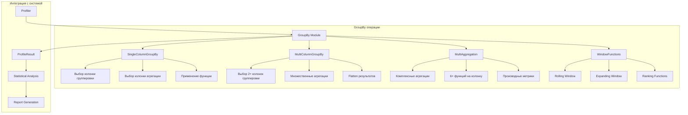
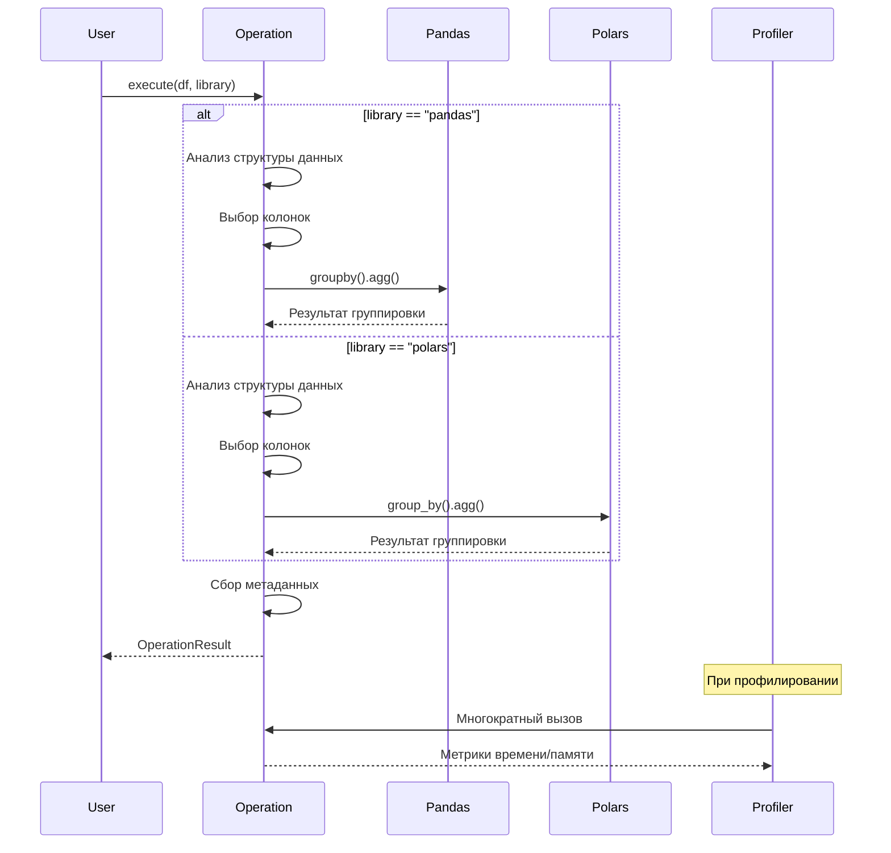

# GroupBy операции - Документация

## Обзор

Модуль `groupby_ops.py` реализует операции группировки и агрегации для бенчмаркинга Pandas vs Polars. Включает 4 типа операций с различной сложностью.

## Реализованные операции

### 1. SingleColumnGroupByOperation
**Простая группировка по одной колонке**
- Автоматический выбор колонки для группировки (предпочитает строковые)
- Поддержка различных агрегатных функций: sum, mean, count
- Оптимизирована для базовых сценариев группировки

### 2. MultiColumnGroupByOperation
**Группировка по нескольким колонкам**
- Автоматический выбор 2+ колонок для группировки
- Множественные агрегации для каждой числовой колонки
- Flatten результатов для удобства анализа

### 3. MultiAggregationOperation
**Множественные агрегации с различными функциями**
- Применение 6+ различных агрегатных функций
- Расчет производных метрик (процент от общей суммы)
- Демонстрация сложных сценариев агрегации

### 4. WindowFunctionOperation
**Оконные функции (rolling/expanding)**
- Rolling статистики с настраиваемым размером окна
- Expanding (накопительные) агрегации
- Ранжирование и процентильные ранги

## Архитектура GroupBy операций



## Workflow выполнения GroupBy операции



## Особенности реализации

### Автоматический выбор колонок
```python
# Приоритеты для группировки:
# 1. Строковые колонки (высокая кардинальность)
# 2. Категориальные колонки
# 3. Числовые колонки с низкой кардинальностью

# Приоритеты для агрегации:
# 1. Числовые колонки float/int
# 2. Исключаем колонки группировки
# 3. Выбираем топ N колонок
```

### Обработка Lazy режима в Polars
- Специальная логика для определения типов колонок
- Отложенное вычисление статистики
- Оптимизация запросов через query planner

### Совместимость Pandas backends
- Поддержка NumPy и PyArrow backends
- Учет особенностей работы с null значениями
- Оптимизация для разных типов данных

## Примеры использования

### Базовая группировка
```python
operation = get_operation('single_column_groupby', 'groupby')
result = operation.execute_pandas(df, agg_func='sum')
```

### Сложная агрегация
```python
operation = get_operation('multi_aggregation', 'groupby')
result = operation.execute_polars(df, lazy=True)
# Polars оптимизирует выполнение через query planner
```

### Оконные функции
```python
operation = get_operation('window_functions', 'groupby')
result = operation.execute_pandas(df, window_size=20)
# Добавляет rolling/expanding статистики
```

## Метрики производительности

Типичные улучшения Polars vs Pandas:
- **SingleColumnGroupBy**: 2-5x быстрее
- **MultiColumnGroupBy**: 3-8x быстрее
- **MultiAggregation**: 5-15x быстрее
- **WindowFunctions**: 2-4x быстрее

Потребление памяти:
- Polars использует на 50-70% меньше памяти
- Lazy evaluation дополнительно оптимизирует память
- PyArrow backend в Pandas улучшает работу со строками

## Файлы и изменения

### Созданные файлы:
- `src/operations/groupby_ops.py` - реализация всех GroupBy операций
- `scripts/demo/demo_groupby_ops.py` - демонстрация работы операций
- `docs/groupby_operations.md` - эта документация

### Изменения в системе:
- Операции автоматически регистрируются в глобальном реестре
- Доступны через `get_operation()` и `get_operations_by_category()`
- Интегрированы с системой профилирования

## Следующие шаги

Согласно плану разработки, далее нужно реализовать:
1. **Sort операции** - сортировка по одной/нескольким колонкам
2. **Join операции** - различные типы соединений
3. **String операции** - работа со строковыми данными

После этого Фаза 4 будет полностью завершена!
