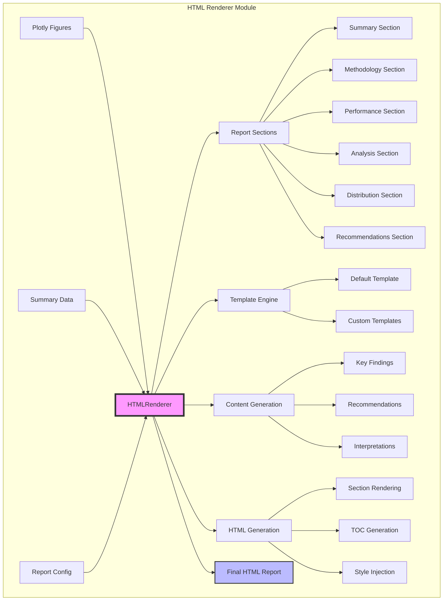
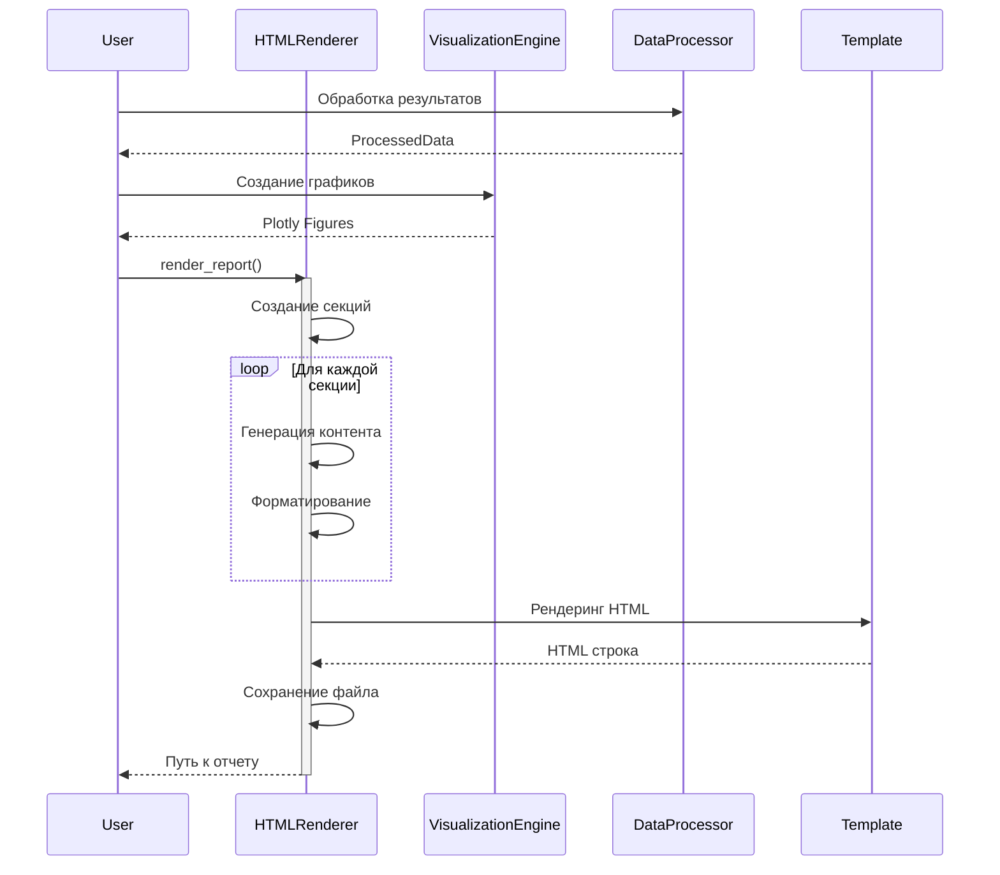
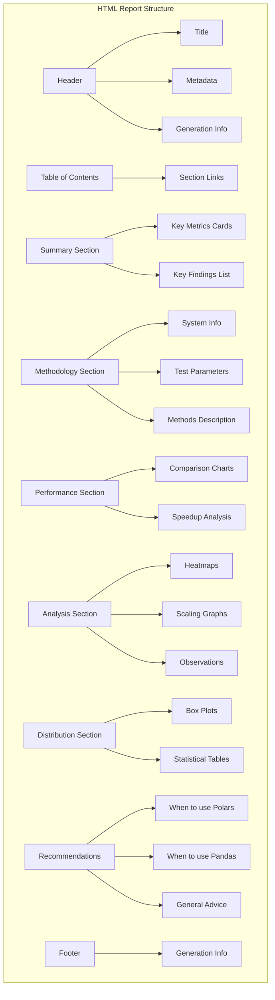
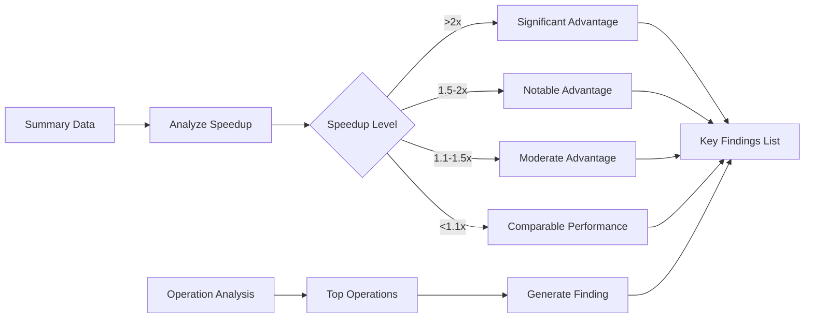
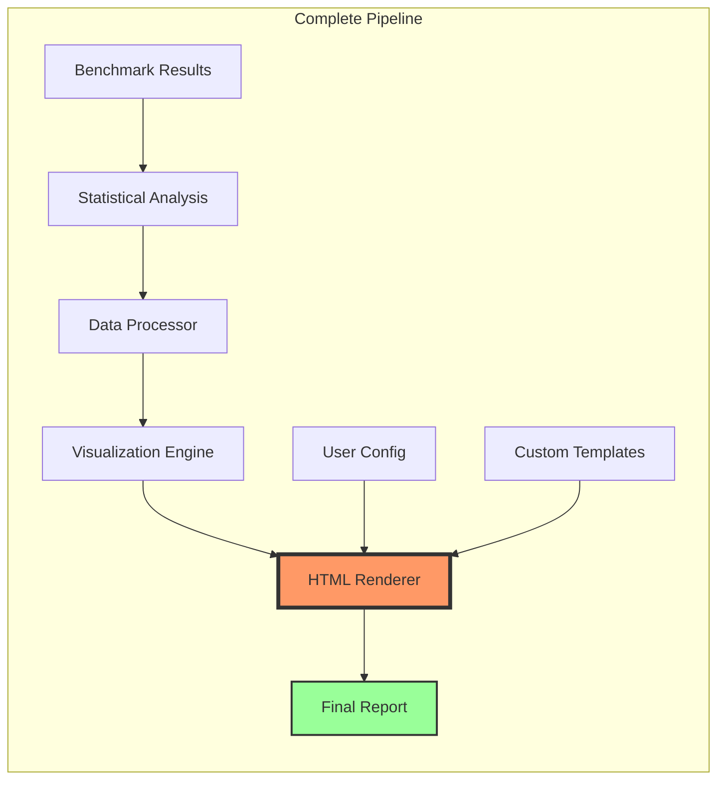

# HTML Renderer - Модуль генерации финальных отчетов

## Обзор

HTML Renderer - завершающий компонент системы генерации отчетов, который объединяет все графики, таблицы и статистику в единый интерактивный HTML отчет. Модуль использует шаблонизатор Jinja2 и создает адаптивные, готовые к печати отчеты.

## Архитектура модуля



## Workflow генерации отчета



## Структура отчета



## Основные компоненты

### 1. ReportSection
Представляет отдельную секцию отчета:
- **title**: Заголовок секции
- **content**: HTML содержимое
- **section_id**: Уникальный идентификатор для навигации
- **order**: Порядок отображения

### 2. ReportConfig
Конфигурация для настройки отчета:
- **title**: Основной заголовок
- **subtitle**: Подзаголовок
- **author**: Автор отчета
- **description**: Описание
- **include_toc**: Включить оглавление
- **include_summary**: Включить сводку
- **include_methodology**: Включить методологию
- **include_recommendations**: Включить рекомендации
- **theme**: Тема оформления (light/dark)

### 3. Методы генерации контента

#### Key Findings Generator


#### Recommendations Generator
Автоматически анализирует результаты и генерирует рекомендации по выбору библиотеки на основе:
- Среднего ускорения по операциям
- Специфичных сильных сторон каждой библиотеки
- Общих паттернов использования

## Стилизация и дизайн

### CSS структура
- **Адаптивный дизайн**: Mobile-first подход
- **Цветовая схема**: Настраиваемые CSS переменные
- **Печать**: Оптимизированные стили для печати
- **Доступность**: Семантическая разметка и контрастные цвета

### Интерактивные элементы
- Навигация по секциям через TOC
- Интерактивные Plotly графики
- Hover эффекты на карточках метрик
- Responsive таблицы

## Примеры использования

### Базовая генерация отчета
```python
renderer = HTMLRenderer()

html = renderer.render_report(
    figures={'chart1': fig1, 'chart2': fig2},
    summary_data=processed_data,
    output_path=Path("report.html")
)
```

### Кастомная конфигурация
```python
config = ReportConfig(
    title="Мой бенчмарк",
    subtitle="Детальный анализ",
    author="Data Team",
    include_toc=True,
    theme="dark"
)

renderer.render_report(
    figures=figures,
    summary_data=data,
    config=config,
    output_path=Path("custom_report.html")
)
```

### Использование custom шаблона
```python
renderer = HTMLRenderer(
    template_dir=Path("templates/")
)
# Поместите report.html в папку templates/
```

## Расширяемость

### Добавление новых секций
```python
renderer.sections.append(ReportSection(
    title="Дополнительный анализ",
    content="<p>Мой контент</p>",
    section_id="custom-analysis",
    order=7
))
```

### Кастомизация стилей
Можно переопределить CSS переменные в custom шаблоне:
```css
:root {
    --primary-color: #your-color;
    --secondary-color: #your-color;
}
```

## Выходной формат

### Структура HTML файла
- Standalone HTML с встроенными стилями
- CDN ссылки на Plotly.js
- Минимальные внешние зависимости
- Оптимизирован для быстрой загрузки

### Размер файла
- Базовый отчет: ~50-100 KB
- С графиками: 200-500 KB (зависит от количества)
- Сжатие: поддерживается gzip

## Интеграция с системой



## Файлы и изменения

### Созданные файлы:
- `src/reporting/html_renderer.py` - основной модуль рендерера
- `scripts/demo/demo_html_renderer.py` - демонстрация работы
- `docs/html_renderer_doc.md` - эта документация

### Обновленные файлы:
- `src/reporting/__init__.py` - добавлен экспорт HTMLRenderer

## Результат работы

HTML Renderer создает профессиональный, интерактивный отчет, который:
- **Информативен**: Содержит все ключевые метрики и выводы
- **Интерактивен**: Plotly графики с zoom, pan, hover
- **Адаптивен**: Хорошо выглядит на всех устройствах
- **Готов к печати**: Оптимизированные стили для печати
- **Самодостаточен**: Не требует внешних файлов

## Завершение фазы 5

С созданием HTML Renderer завершена фаза 5 "Анализ и отчетность". Теперь система может:
1. Анализировать результаты (Statistical Analysis)
2. Обрабатывать данные для визуализации (Data Processor)
3. Создавать интерактивные графики (Visualization Engine)
4. Генерировать профессиональные HTML отчеты (HTML Renderer)