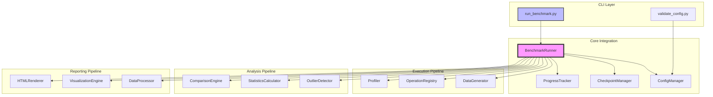
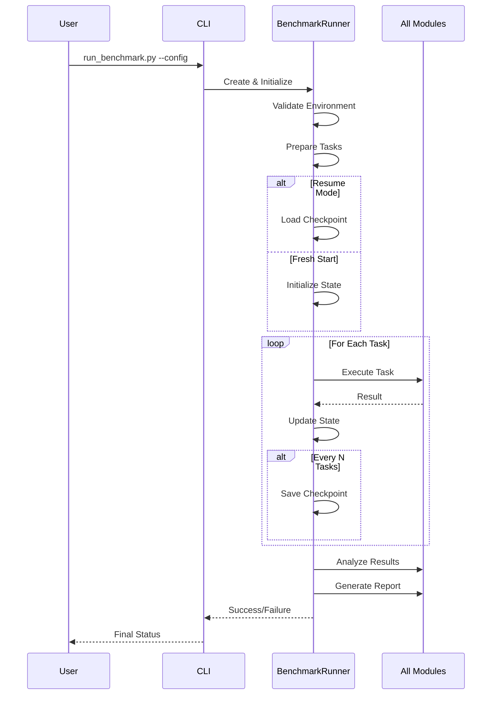
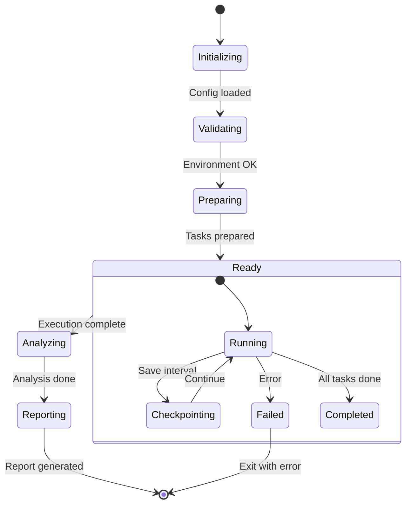

# Фаза 6: Интеграция и тестирование - Документация

## Обзор

Фаза 6 завершает разработку системы бенчмаркинга, объединяя все созданные модули в единую работающую систему. Основным компонентом интеграции является `BenchmarkRunner`, который координирует работу всех модулей.

## Архитектура интеграции



## Компоненты интеграции

### 1. BenchmarkRunner

Центральный класс, управляющий всем процессом бенчмаркинга.

**Основные методы:**

```python
class BenchmarkRunner:
    def __init__(self, config_path, resume, dry_run, output_dir)
    def run() -> bool
    def _validate_environment() -> bool
    def _prepare_tasks() -> List[BenchmarkTask]
    def _execute_benchmark(tasks) -> bool
    def _analyze_results() -> None
    def _generate_report() -> None
```

**Workflow выполнения:**



### 2. Система задач (BenchmarkTask)

Каждая задача представляет одну комбинацию:
- Библиотека (pandas/polars)
- Backend (numpy/pyarrow/None)
- Операция (filter, groupby, etc.)
- Датасет (размер и тип)

### 3. Управление состоянием



## Обработка ошибок и восстановление

### Уровни обработки ошибок:

1. **Task Level**: Ошибки отдельных операций не останавливают весь процесс
2. **Module Level**: Критические ошибки модулей логируются и могут остановить выполнение
3. **System Level**: Обработка сигналов ОС (SIGINT, SIGTERM) для корректного завершения

### Checkpoint система:

```python
# Автосохранение каждые N операций
if operations_completed % checkpoint_interval == 0:
    save_checkpoint()

# Структура чекпоинта
{
    "run_id": "uuid",
    "config_hash": "md5",
    "completed_tasks": ["task1", "task2"],
    "failed_tasks": {"task3": "error message"},
    "results": {...},
    "timestamp": "ISO format"
}
```

## CLI интерфейс

### Основные команды:

```bash
# Новый запуск
python run_benchmark.py --config configs/default.yaml

# Возобновление
python run_benchmark.py --resume --config configs/default.yaml

# Валидация
python run_benchmark.py --config configs/test.yaml --validate-only

# Dry run
python run_benchmark.py --config configs/test.yaml --dry-run

# С дополнительными опциями
python run_benchmark.py \
    --config configs/large.yaml \
    --output-dir results/experiment_1 \
    --verbose \
    --force
```

### Опции CLI:

| Опция | Описание |
|-------|----------|
| `--config, -c` | Путь к файлу конфигурации |
| `--resume, -r` | Возобновить с чекпоинта |
| `--output-dir, -o` | Директория для результатов |
| `--dry-run` | Только валидация |
| `--validate-only` | Проверить конфигурацию |
| `--verbose, -v` | Подробный вывод |
| `--quiet, -q` | Минимальный вывод |
| `--force` | Игнорировать предупреждения |

## Структура выходных данных

```
results/
├── data/                    # Сгенерированные датасеты
│   ├── numeric_1000.csv
│   └── mixed_10000.parquet
├── checkpoints/             # Чекпоинты для восстановления
│   └── checkpoint_*.json
├── logs/                    # Логи выполнения
│   └── benchmark_*.log
├── analysis/                # Результаты анализа
│   ├── raw_results_*.csv
│   └── analysis_*.json
└── reports/                 # Финальные отчеты
    ├── report_*.html
    └── figures/
```

## Интеграционное тестирование

### Уровни тестирования:

1. **Unit тесты**: Каждый модуль отдельно
2. **Integration тесты**: Взаимодействие модулей
3. **End-to-end тесты**: Полный цикл выполнения
4. **Performance тесты**: Валидация метрик

### Пример интеграционного теста:

```python
def test_full_benchmark_cycle():
    """Тест полного цикла бенчмарка."""
    # 1. Создание тестовой конфигурации
    config = create_test_config()
    
    # 2. Запуск бенчмарка
    runner = BenchmarkRunner(config)
    success = runner.run()
    
    # 3. Проверка результатов
    assert success
    assert runner.state.completed_operations > 0
    assert Path("results/reports").exists()
    
    # 4. Валидация отчета
    report_files = list(Path("results/reports").glob("*.html"))
    assert len(report_files) > 0
```

## Мониторинг и логирование

### Уровни логирования:

- **DEBUG**: Детальная информация о выполнении
- **INFO**: Основные этапы и прогресс
- **WARNING**: Некритичные проблемы
- **ERROR**: Ошибки выполнения
- **CRITICAL**: Критические сбои

### Progress tracking:

```
Benchmark Progress: 45%|████████████░░░░░░░░| 450/1000 [12:34<15:23, 0.60op/s]
  ✓: 425  ✗: 20  →: 5  ETA: 00:15:23
```

## Производительность и оптимизация

### Оптимизации:

1. **Параллельное выполнение**: Возможность запуска независимых задач параллельно
2. **Кеширование датасетов**: Повторное использование сгенерированных данных
3. **Инкрементальный анализ**: Анализ по мере поступления результатов
4. **Ленивая загрузка**: Модули загружаются только при необходимости

### Метрики производительности:

- Время выполнения полного бенчмарка
- Использование памяти системой
- Количество операций в секунду
- Overhead системы vs чистое время операций

## Расширяемость

### Добавление новых компонентов:

1. **Новая библиотека**: Добавить в конфигурацию и операции
2. **Новая операция**: Зарегистрировать в OperationRegistry
3. **Новый тип анализа**: Расширить analysis pipeline
4. **Новый формат отчета**: Добавить в reporting модуль

### Hooks и callbacks:

```python
# Пример добавления custom callback
runner.add_callback('on_task_complete', my_callback)
runner.add_callback('on_checkpoint_save', checkpoint_callback)
```

## Troubleshooting

### Частые проблемы:

1. **Out of Memory**: Уменьшить размер датасетов или включить очистку памяти
2. **Checkpoint corruption**: Удалить поврежденный файл и возобновить с предыдущего
3. **Несовместимость версий**: Проверить requirements.txt
4. **Timeout операций**: Увеличить timeout в конфигурации

### Debug mode:

```bash
# Максимальная отладочная информация
python run_benchmark.py --config test.yaml --verbose --dry-run

# Проверка конкретной операции
python -m src.operations.test_operation groupby
```

## Результаты фазы 6

### Созданные файлы:

1. `src/core/benchmark_runner.py` - основной класс интеграции
2. `scripts/run_benchmark.py` - CLI для запуска
3. `scripts/demo/demo_integration.py` - демонстрация workflow
4. `docs/integration_architecture_doc.md` - эта документация

### Достигнутые цели:

- ✅ Полная интеграция всех модулей
- ✅ End-to-end workflow
- ✅ CLI интерфейс
- ✅ Система восстановления
- ✅ Обработка ошибок
- ✅ Документация

## Заключение

Система бенчмаркинга полностью интегрирована и готова к использованию. Все модули работают согласованно, обеспечивая надежное и воспроизводимое сравнение производительности Pandas и Polars.

Следующие шаги:
1. Написание полного набора тестов
2. Оптимизация производительности
3. Добавление дополнительных операций
4. Расширение возможностей анализа