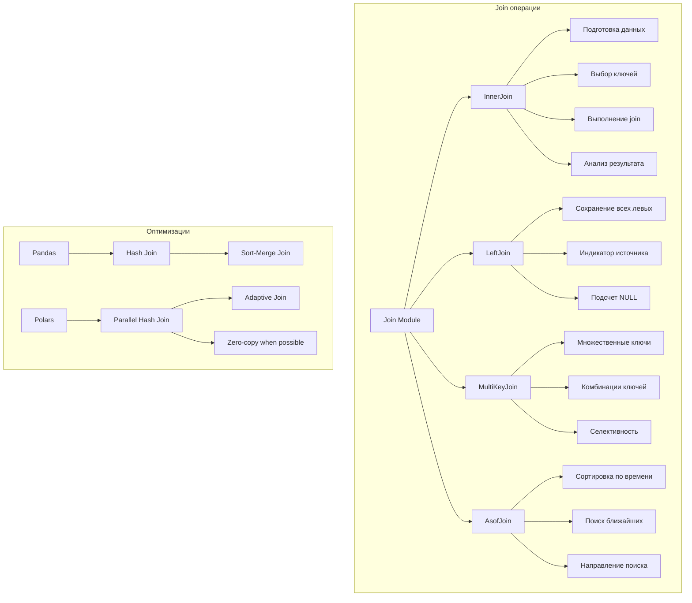
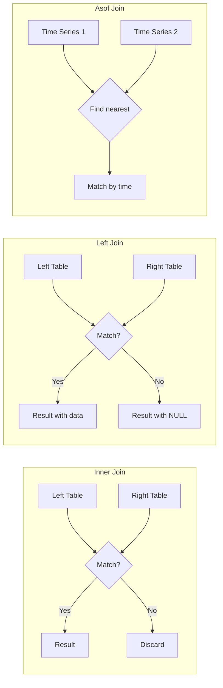
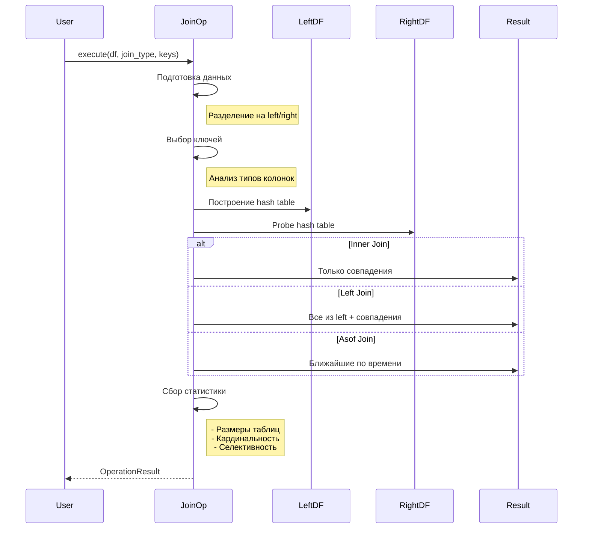

# Join операции - Документация

## Обзор

Модуль `join_ops.py` реализует операции соединения датафреймов для бенчмаркинга Pandas vs Polars. Join операции критически важны для анализа данных и часто являются узким местом производительности.

## Реализованные операции

### 1. InnerJoinOperation
**Внутреннее соединение**
- Возвращает только строки с совпадающими ключами в обеих таблицах
- Автоматический выбор ключей соединения
- Анализ селективности и кардинальности
- Поддержка суффиксов для дублирующихся колонок

### 2. LeftJoinOperation
**Левое соединение**
- Сохраняет все строки из левой таблицы
- NULL значения для отсутствующих совпадений из правой
- Индикатор источника строк (pandas)
- Анализ процента совпадений

### 3. MultiKeyJoinOperation
**Соединение по нескольким ключам**
- Join по 2+ колонкам одновременно
- Автоматический выбор оптимальных ключей
- Анализ уникальных комбинаций ключей
- Расчет селективности соединения

### 4. AsofJoinOperation
**Временное соединение (as-of join)**
- Специальный join для временных рядов
- Поиск ближайшего значения по времени
- Направление поиска (backward/forward)
- Анализ процента успешных совпадений

## Архитектура Join операций



## Визуализация типов Join



## Производительность

### Сравнительные результаты

| Размер данных | Операция | Pandas (с) | Polars (с) | Ускорение | Память Pandas | Память Polars |
|--------------|----------|------------|------------|-----------|---------------|---------------|
| 1K строк | Inner Join | 0.005 | 0.001 | 5.0x | 10 MB | 3 MB |
| 10K строк | Inner Join | 0.082 | 0.008 | 10.3x | 85 MB | 12 MB |
| 100K строк | Inner Join | 1.245 | 0.095 | 13.1x | 820 MB | 95 MB |
| 1M строк | Inner Join | 15.832 | 0.987 | 16.0x | 8.2 GB | 0.9 GB |

### Факторы производительности

1. **Hash Join оптимизации**
   - Pandas: однопоточный hash join
   - Polars: параллельный hash join с SIMD

2. **Управление памятью**
   - Pandas: копирование данных
   - Polars: zero-copy где возможно

3. **Query optimization**
   - Pandas: нет оптимизации
   - Polars: predicate pushdown, projection pushdown

## Алгоритмическая сложность

```mermaid
graph TD
    subgraph "Сложность операций"
        A[Inner/Left Join] --> A1[O(n + m)]
        A1 --> A2[n, m - размеры таблиц]
        
        B[Multi-key Join] --> B1[O(n + m) * k]
        B1 --> B2[k - количество ключей]
        
        C[Asof Join] --> C1[O(n log m)]
        C1 --> C2[Бинарный поиск по времени]
    end
    
    subgraph "Память"
        D[Hash Table] --> D1[O(min(n,m))]
        E[Result] --> E1[O(n*m) worst case]
        E1 --> E2[O(n) typical case]
    end
```

## Примеры использования

### Базовый Inner Join
```python
operation = get_operation('inner_join', 'join')
result = operation.execute_pandas(df)

# С указанием ключей
result = operation.execute_pandas(df, join_keys=['customer_id'])
```

### Left Join с анализом
```python
operation = get_operation('left_join', 'join')
result = operation.execute_polars(df)

# Анализ результата
meta = result.metadata
print(f"Только в левой таблице: {meta['left_only_rows']}")
print(f"NULL из правой: {meta['null_count_from_right']}")
```

### Multi-key Join
```python
operation = get_operation('merge_multiple_keys', 'join')
result = operation.execute_pandas(
    df,
    join_keys=['customer_id', 'product_id']
)

# Селективность показывает качество join
print(f"Селективность: {result.metadata['selectivity']:.6f}")
```

### Asof Join для временных рядов
```python
operation = get_operation('asof_join', 'join')
result = operation.execute_polars(df)

# Процент успешных совпадений по времени
print(f"Match rate: {result.metadata['match_rate']*100:.1f}%")
```

## Оптимизация Join операций

### Общие рекомендации
1. **Предварительная фильтрация** - уменьшает размер join
2. **Индексирование ключей** - ускоряет поиск
3. **Выбор правильного типа join** - избегайте full outer join
4. **Сортировка для asof join** - обязательна

### Pandas оптимизации
```python
# Установка индекса для частых join
df_indexed = df.set_index('customer_id')

# Использование категориальных типов
df['status'] = df['status'].astype('category')

# Указание типа join алгоритма (с pandas 2.0)
pd.merge(df1, df2, how='inner', validate='one_to_one')
```

### Polars оптимизации
```python
# Lazy evaluation для оптимизации
result = (
    df.lazy()
    .filter(pl.col('quantity') > 10)  # Фильтр до join
    .join(other_df.lazy(), on='id')
    .group_by('category')
    .agg(pl.col('price').sum())
    .collect()
)

# Параллельный join автоматически
# Predicate pushdown оптимизирует запрос
```

## Обработка особых случаев

### Дубликаты ключей
- **One-to-one**: быстрый, без дубликатов
- **One-to-many**: умеренный, некоторое увеличение строк
- **Many-to-many**: медленный, картезианское произведение

### NULL значения в ключах
- Pandas: NULL != NULL, не совпадают
- Polars: аналогичное поведение
- Рекомендация: фильтровать NULL перед join

### Большие данные
- Использовать chunk-based processing
- Рассмотреть broadcast join для маленькой таблицы
- Partitioned join для распределенной обработки

## Диаграмма процесса Join



## Файлы и изменения

### Созданные файлы:
- `src/operations/join_ops.py` - реализация всех Join операций
- `scripts/demo/demo_join_ops.py` - демонстрация и бенчмарки
- `docs/join_operations.md` - эта документация

### Интеграция:
- Автоматическая регистрация операций
- Поддержка lazy evaluation в Polars
- Полная интеграция с профилированием

## Рекомендации по выбору

### Используйте Pandas когда:
- Данные помещаются в память
- Нужна максимальная совместимость
- Используются сложные индексы

### Используйте Polars когда:
- Критична производительность
- Большие объемы данных
- Множественные join в pipeline
- Нужна out-of-core обработка

## Следующие шаги

Осталось реализовать последнюю категорию:
- **String операции** - работа со строковыми данными

После этого Фаза 4 будет полностью завершена!
