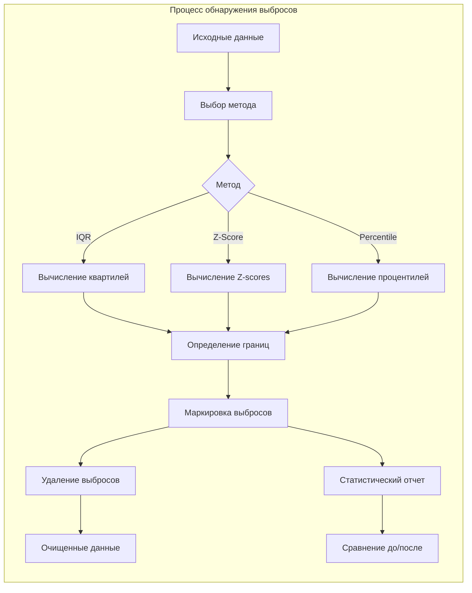

# Модуль обнаружения выбросов - Документация

## Обзор

Модуль `outlier_detector.py` предоставляет инструменты для обнаружения и удаления выбросов в результатах бенчмаркинга. Выбросы могут существенно искажать статистические показатели, поэтому их обнаружение критически важно для получения достоверных результатов.

## Архитектура модуля

```mermaid
graph TB
    subgraph "Outlier Detection Module"
        A[OutlierDetector] --> B[IQR Method]
        A --> C[Z-Score Method]
        A --> D[Percentile Method]
        
        B --> B1[Вычисление квартилей]
        B --> B2[IQR = Q3 - Q1]
        B --> B3[Границы: Q1-1.5*IQR, Q3+1.5*IQR]
        
        C --> C1[Вычисление mean и std]
        C --> C2[Z-score = |x - mean| / std]
        C --> C3[Выбросы: |Z| > threshold]
        
        D --> D1[Вычисление процентилей]
        D --> D2[Нижняя граница: 5%]
        D --> D3[Верхняя граница: 95%]
        
        A --> E[OutlierResult]
        E --> E1[Индексы выбросов]
        E --> E2[Значения выбросов]
        E --> E3[Границы]
        E --> E4[Статистики до/после]
        
        style A fill:#f9f,stroke:#333,stroke-width:4px
        style B fill:#bbf,stroke:#333,stroke-width:2px
        style C fill:#bbf,stroke:#333,stroke-width:2px
        style D fill:#bbf,stroke:#333,stroke-width:2px
    end
```

## Реализованные методы

### 1. IQR (Interquartile Range) Method
**Межквартильный размах**

- **Принцип**: Использует робастные статистики (квартили)
- **Формула**: 
  - `IQR = Q3 - Q1`
  - `Lower bound = Q1 - 1.5 * IQR`
  - `Upper bound = Q3 + 1.5 * IQR`
- **Преимущества**:
  - Робастен к экстремальным выбросам
  - Не предполагает нормальность распределения
  - Хорошо работает с асимметричными данными
- **Параметры**:
  - `multiplier`: множитель для IQR (по умолчанию 1.5)

### 2. Z-Score Method
**Метод стандартных отклонений**

- **Принцип**: Измеряет отклонение от среднего в единицах стандартного отклонения
- **Формула**: `Z = |x - mean| / std`
- **Выбросы**: Точки где `|Z| > threshold` (обычно 3)
- **Преимущества**:
  - Простой и интуитивный
  - Хорошо работает с нормальным распределением
- **Недостатки**:
  - Чувствителен к самим выбросам
  - Предполагает нормальность
- **Параметры**:
  - `threshold`: пороговое значение Z-score (по умолчанию 3.0)

### 3. Percentile Method
**Метод процентилей**

- **Принцип**: Отсекает фиксированный процент экстремальных значений
- **Границы**: Задаются процентилями (например, 5% и 95%)
- **Преимущества**:
  - Простой и предсказуемый
  - Всегда удаляет заданный процент
- **Недостатки**:
  - Может удалить нормальные значения
  - Не адаптивен к форме распределения
- **Параметры**:
  - `lower_percentile`: нижний процентиль (по умолчанию 5)
  - `upper_percentile`: верхний процентиль (по умолчанию 95)

## Структура данных

### OutlierResult
```python
@dataclass
class OutlierResult:
    method: str                    # Использованный метод
    outlier_indices: List[int]     # Индексы выбросов
    outlier_values: List[float]    # Значения выбросов
    lower_bound: Optional[float]   # Нижняя граница
    upper_bound: Optional[float]   # Верхняя граница
    removed_count: int             # Количество удаленных
    removed_percentage: float      # Процент удаленных
    stats_before: Dict[str, float] # Статистики до очистки
    stats_after: Dict[str, float]  # Статистики после очистки
```

### Статистики
Вычисляемые статистики включают:
- `count`: количество значений
- `mean`: среднее значение
- `std`: стандартное отклонение
- `min`, `max`: минимум и максимум
- `median`: медиана
- `q1`, `q3`: первый и третий квартили
- `cv`: коэффициент вариации (std/mean)

## Примеры использования

### Базовое использование
```python
from analysis.outlier_detector import OutlierDetector, OutlierMethod

# Создание детектора
detector = OutlierDetector()

# Данные с выбросами
data = [10, 12, 11, 13, 100, 11, 12, 1, 14, 13]

# Обнаружение выбросов методом IQR
result = detector.detect_outliers(data, OutlierMethod.IQR)
print(f"Найдено выбросов: {result.removed_count}")
print(f"Индексы выбросов: {result.outlier_indices}")
```

### Удаление выбросов
```python
# Получить очищенные данные
clean_data, result = detector.remove_outliers(data, OutlierMethod.IQR)
print(f"Данные после очистки: {clean_data}")
```

### Анализ нескольких серий
```python
# Результаты бенчмарка
benchmark_results = {
    "pandas_operation": [1.2, 1.3, 10.0, 1.4, 1.3, 1.5],
    "polars_operation": [0.5, 0.6, 0.5, 5.0, 0.6, 0.5]
}

# Анализ всех серий
results = detector.analyze_multiple_runs(
    benchmark_results, 
    OutlierMethod.IQR
)

for name, (clean_data, result) in results.items():
    print(f"{name}: удалено {result.removed_count} выбросов")
```

### Сравнение методов
```python
# Сравнить разные методы на одних данных
comparison = compare_outlier_methods(data)
print(comparison)
```

## Визуализация результатов



## Рекомендации по выбору метода

### Используйте IQR когда:
- Данные могут быть асимметричными
- Нужен робастный метод
- Есть экстремальные выбросы
- Распределение неизвестно

### Используйте Z-Score когда:
- Данные близки к нормальному распределению
- Нужен стандартный статистический подход
- Выбросы не слишком экстремальные

### Используйте Percentile когда:
- Нужно удалить фиксированный процент данных
- Форма распределения неважна
- Простота важнее точности

## Интеграция с бенчмарком

Модуль интегрируется в общий процесс анализа:

1. **После профилирования**: Собираются результаты измерений
2. **Обнаружение выбросов**: Применяется к каждой серии измерений
3. **Очистка данных**: Выбросы удаляются
4. **Статистический анализ**: Проводится на очищенных данных
5. **Отчеты**: Включают информацию об удаленных выбросах

## Файлы и изменения

### Созданные файлы:
- `src/analysis/__init__.py` - инициализация модуля анализа
- `src/analysis/outlier_detector.py` - реализация детектора выбросов
- `scripts/demo/demo_outlier_detection.py` - демонстрация работы
- `docs/outlier_detection_doc.md` - эта документация

### Следующие шаги:
1. Реализация `StatisticsCalculator` для расчета описательных статистик
2. Создание `ComparisonEngine` для парных сравнений
3. Интеграция с системой профилирования