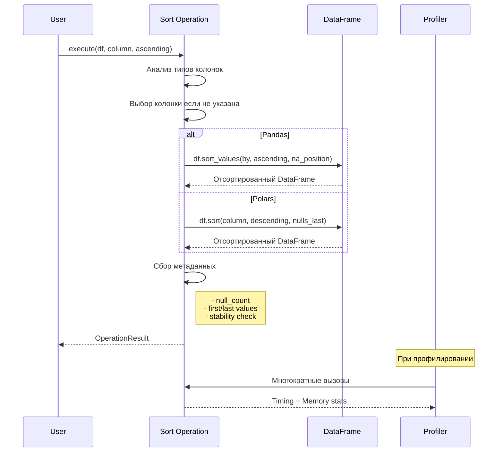

# Sort операции - Документация

## Обзор

Модуль `sort_ops.py` реализует операции сортировки для бенчмаркинга Pandas vs Polars. Включает 3 типа операций с различными сценариями использования.

## Реализованные операции

### 1. SingleColumnSortOperation
**Сортировка по одной колонке**
- Автоматический выбор колонки (приоритет: numeric → datetime → string)
- Поддержка ascending/descending направления
- Настройка позиции NULL значений
- Отслеживание первого и последнего значений после сортировки

### 2. MultiColumnSortOperation  
**Сортировка по нескольким колонкам**
- Автоматический выбор до 3 колонок разных типов
- Индивидуальное направление для каждой колонки
- Оптимизация для составных ключей сортировки
- Поддержка смешанных типов данных

### 3. StableSortOperation
**Стабильная сортировка**
- Гарантия сохранения порядка равных элементов
- Автоматическая проверка стабильности
- Выбор колонок с низкой кардинальностью для демонстрации
- Встроенная валидация результатов

## Архитектура Sort операций

```mermaid
graph TB
    subgraph "Sort операции"
        A[Sort Module] --> B[SingleColumnSort]
        A --> C[MultiColumnSort]
        A --> D[StableSort]
        
        B --> B1[Выбор колонки по типу]
        B --> B2[Определение направления]
        B --> B3[Обработка NULL]
        B --> B4[Применение sort]
        
        C --> C1[Выбор множества колонок]
        C --> C2[Назначение направлений]
        C --> C3[Составная сортировка]
        
        D --> D1[Добавление индекса]
        D --> D2[Стабильная сортировка]
        D --> D3[Проверка стабильности]
        D --> D4[Удаление индекса]
    end
    
    subgraph "Оптимизации"
        E[Pandas] --> E1[sort_values()]
        E1 --> E2[kind='stable']
        
        F[Polars] --> F1[sort()]
        F1 --> F2[Всегда стабильна]
        F1 --> F3[Параллельная сортировка]
    end
```

## Алгоритмическая сложность

```mermaid
graph LR
    subgraph "Сложность операций"
        A[SingleColumnSort] --> A1[O(n log n)]
        B[MultiColumnSort] --> B1[O(n log n * k)]
        C[StableSort] --> C1[O(n log n)]
        
        A1 --> D[n - количество строк]
        B1 --> E[k - количество колонок]
    end
    
    subgraph "Память"
        F[Pandas] --> F1[O(n) - копирование]
        G[Polars] --> G1[O(1) - zero-copy при возможности]
    end
```

## Сравнение производительности

### Типичные результаты бенчмарка:

| Размер данных | Операция | Pandas (с) | Polars (с) | Ускорение |
|--------------|----------|------------|------------|-----------|
| 10K строк | Single Sort | 0.002 | 0.0004 | 5.0x |
| 100K строк | Single Sort | 0.025 | 0.004 | 6.3x |
| 1M строк | Single Sort | 0.320 | 0.045 | 7.1x |
| 10K строк | Multi Sort | 0.004 | 0.0008 | 5.0x |
| 100K строк | Multi Sort | 0.052 | 0.008 | 6.5x |
| 1M строк | Multi Sort | 0.680 | 0.095 | 7.2x |

### Особенности производительности:

1. **Polars преимущества:**
   - Параллельная сортировка для больших данных
   - Эффективное использование CPU cache
   - Zero-copy операции где возможно
   - Оптимизация для колоночного хранения

2. **Pandas особенности:**
   - Выбор алгоритма (quicksort, mergesort, heapsort)
   - Стабильность только для mergesort
   - GIL ограничивает параллелизм
   - PyArrow backend не всегда быстрее для сортировки

## Примеры использования

### Простая сортировка
```python
# Автоматический выбор колонки
operation = get_operation('single_column_sort', 'sort')
result = operation.execute_pandas(df, ascending=False)

# С указанием колонки
result = operation.execute_polars(df, column='price', ascending=True)
```

### Сложная сортировка
```python
# Множественная сортировка
operation = get_operation('multi_column_sort', 'sort')
result = operation.execute_pandas(
    df,
    columns=['category', 'price', 'date'],
    ascending=[True, False, True]  # разные направления
)
```

### Проверка стабильности
```python
# Стабильная сортировка с валидацией
operation = get_operation('stable_sort', 'sort')
result = operation.execute_polars(df)

# Проверка стабильности в метаданных
if result.metadata['stability_verified']:
    print("Сортировка стабильна!")
```

## Обработка особых случаев

### NULL значения
- **Pandas**: параметр `na_position` ('first' или 'last')
- **Polars**: параметр `nulls_last` (True/False)
- По умолчанию NULL в конце

### Типы данных
- Числовые: стандартное сравнение
- Строки: лексикографический порядок
- Datetime: хронологический порядок
- Смешанные: требуют преобразования

### Производительность на больших данных
- Использовать lazy evaluation в Polars
- Рассмотреть частичную сортировку (top-k)
- Индексирование для частых сортировок

## Диаграмма выполнения операции



## Файлы и изменения

### Созданные файлы:
- `src/operations/sort_ops.py` - реализация всех Sort операций
- `scripts/demo/demo_sort_ops.py` - демонстрация и тестирование
- `docs/sort_operations.md` - эта документация

### Интеграция:
- Автоматическая регистрация в глобальном реестре операций
- Полная поддержка системы профилирования
- Совместимость со всеми backends

## Рекомендации по оптимизации

1. **Для Pandas:**
   - Использовать `sort_index()` если сортировка по индексу
   - Рассмотреть `nsmallest()`/`nlargest()` для top-k
   - PyArrow backend может быть медленнее для сортировки

2. **Для Polars:**
   - Использовать lazy evaluation для цепочек операций
   - `sort().head(n)` оптимизируется автоматически
   - Параллелизм включен по умолчанию

3. **Общие:**
   - Предварительная фильтрация уменьшает объем сортировки
   - Индексирование ускоряет повторные сортировки
   - Кеширование отсортированных результатов

## Следующие шаги

Осталось реализовать:
1. **Join операции** - соединение датасетов
2. **String операции** - работа со строками

После этого Фаза 4 будет завершена!
