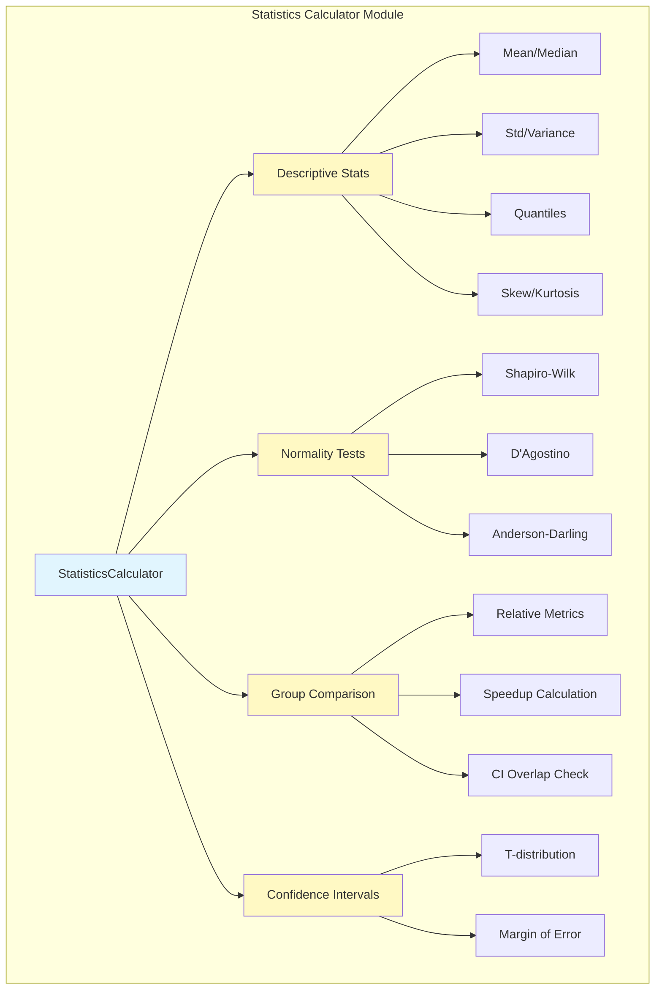
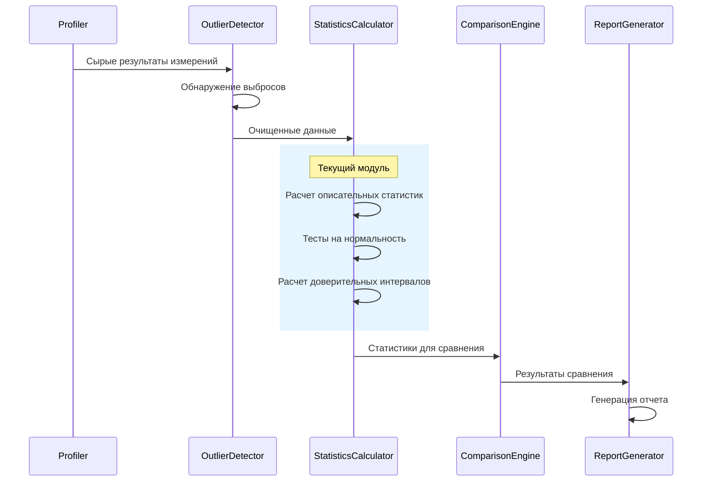

# Statistics Calculator - Калькулятор статистик

## Обзор

Модуль `StatisticsCalculator` предоставляет функциональность для расчета описательных статистик, тестов на нормальность и сравнительного анализа результатов бенчмаркинга.

## Архитектура модуля



## Интеграция с системой бенчмаркинга



## Основные компоненты

### 1. DescriptiveStats
**Структура данных для хранения описательных статистик**

```python
@dataclass
class DescriptiveStats:
    count: int              # Количество измерений
    mean: float            # Среднее значение
    std: float             # Стандартное отклонение
    min: float             # Минимум
    max: float             # Максимум
    median: float          # Медиана
    q1: float              # 25-й процентиль
    q3: float              # 75-й процентиль
    iqr: float             # Межквартильный размах
    cv: float              # Коэффициент вариации (%)
    skew: float            # Асимметрия
    kurtosis: float        # Эксцесс
    confidence_interval: Tuple[float, float]  # 95% ДИ
```

### 2. NormalityTest
**Результаты тестов на нормальность распределения**

- **Shapiro-Wilk**: Классический тест, хорошо работает для малых выборок
- **D'Agostino-Pearson**: Основан на асимметрии и эксцессе
- **Anderson-Darling**: Более чувствителен к отклонениям в хвостах

### 3. Основные методы

#### calculate_descriptive_stats()
- Вычисляет все основные статистики
- Использует несмещенные оценки (ddof=1)
- Рассчитывает 95% доверительный интервал

#### test_normality()
- Проводит три теста на нормальность
- Возвращает консервативную оценку (все тесты должны пройти)
- Обрабатывает малые выборки

#### calculate_relative_metrics()
- Сравнивает две группы измерений
- Рассчитывает ускорение (speedup)
- Проверяет пересечение доверительных интервалов

## Примеры использования

### Базовый расчет статистик
```python
from analysis.statistics_calculator import StatisticsCalculator

# Создание калькулятора
calculator = StatisticsCalculator(confidence_level=0.95)

# Данные измерений
timings = [1.2, 1.3, 1.1, 1.4, 1.3, 1.2, 1.5, 1.3, 1.4, 1.2]

# Расчет статистик
stats = calculator.calculate_descriptive_stats(timings)
print(f"Среднее: {stats.mean:.3f} ± {stats.std:.3f}")
print(f"95% ДИ: [{stats.confidence_interval[0]:.3f}, {stats.confidence_interval[1]:.3f}]")
```

### Тест на нормальность
```python
# Проверка нормальности распределения
normality = calculator.test_normality(timings)

if normality.is_normal:
    print("Распределение можно считать нормальным")
else:
    print("Распределение отличается от нормального")
```

### Сравнение библиотек
```python
# Результаты для разных библиотек
results = {
    "pandas": [2.1, 2.3, 2.2, 2.4, 2.3],
    "polars": [0.8, 0.9, 0.85, 0.87, 0.88]
}

# Расчет статистик для групп
group_stats = calculator.calculate_stats_for_groups(results)

# Сравнение
metrics = calculator.calculate_relative_metrics(
    group_stats["pandas"],
    group_stats["polars"]
)

print(f"Polars быстрее в {metrics['speedup']:.1f} раз")
```

### Создание сводной таблицы
```python
# Создание таблицы для отчета
summary_df = calculator.create_summary_table(group_stats)
print(summary_df)
```

## Особенности реализации

### Обработка малых выборок
- Используется t-распределение вместо нормального для ДИ
- Некоторые тесты отключаются при n < 8
- Предупреждения при недостаточном количестве данных

### Робастность
- Использование медианы и IQR для устойчивых оценок
- Коэффициент вариации для сравнения разброса
- Проверка деления на ноль

### Форматирование результатов
- Автоматическое округление до 4 знаков
- Удобный текстовый формат отчетов
- Экспорт в pandas DataFrame

## Рекомендации по использованию

### Размер выборки
- Минимум 30 измерений для надежных статистик
- 100+ измерений для точных доверительных интервалов
- Для тестов на нормальность нужно минимум 8 точек

### Интерпретация результатов
- **CV < 5%**: Очень стабильные измерения
- **CV 5-15%**: Нормальная вариабельность
- **CV > 15%**: Высокая вариабельность, нужно больше измерений

### Доверительные интервалы
- Если интервалы не пересекаются - различие статистически значимо
- Ширина интервала зависит от размера выборки и вариабельности
- 95% ДИ означает 95% уверенность, что истинное среднее в этом диапазоне

## Файлы модуля

### Созданные файлы:
- `src/analysis/statistics_calculator.py` - основной модуль калькулятора
- `scripts/demo/demo_statistics_calculator.py` - демонстрация работы
- `docs/statistics_calculator_doc.md` - эта документация

### Обновленные файлы:
- `src/analysis/__init__.py` - добавлен экспорт новых классов

## Следующие шаги

1. **Comparison Engine** - механизм парных сравнений с статистическими тестами
2. **Distribution Tests** - расширенные тесты распределений
3. **Интеграция с профайлером** - автоматический расчет статистик после профилирования