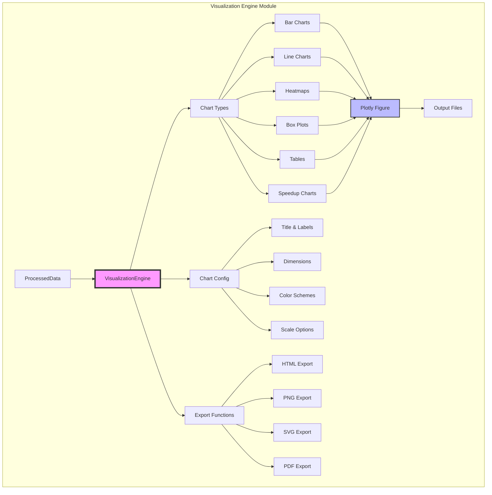
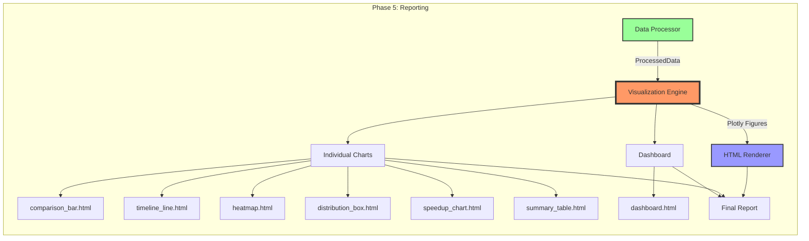

# Visualization Engine - Документация

## Обзор

Visualization Engine - это модуль для создания интерактивных визуализаций результатов бенчмаркинга с использованием библиотеки Plotly. Модуль принимает обработанные данные от Data Processor и генерирует различные типы графиков.

## Архитектура модуля



## Интеграция с системой бенчмаркинга



## Основные компоненты

### 1. ChartType (Enum)
Перечисление доступных типов графиков:
- **BAR**: Столбчатые диаграммы
- **LINE**: Линейные графики
- **HEATMAP**: Тепловые карты
- **BOX**: Box plots для распределений
- **SCATTER**: Точечные диаграммы
- **VIOLIN**: Violin plots
- **TABLE**: Интерактивные таблицы

### 2. ChartConfig
Конфигурация для настройки внешнего вида графиков:
- **title**: Заголовок графика
- **x_label**: Подпись оси X
- **y_label**: Подпись оси Y
- **height**: Высота графика в пикселях
- **width**: Ширина графика (опционально)
- **show_legend**: Показывать легенду
- **color_scheme**: Цветовая схема
- **log_scale**: Использовать логарифмическую шкалу

### 3. ColorPalette
Предопределенные цветовые схемы:
- **PANDAS**: #1f77b4 (синий)
- **POLARS**: #ff7f0e (оранжевый)
- **HEATMAP_SCALE**: RdYlGn_r (от зеленого к красному)
- **OPERATIONS**: Set2 палитра для операций

## Основные методы

### 1. create_comparison_bar_chart()
Создает столбчатую диаграмму для сравнения производительности библиотек.

**Особенности:**
- Группированные столбцы для каждой библиотеки
- Error bars для отображения стандартного отклонения
- Текстовые метки со значениями
- Поддержка логарифмической шкалы

### 2. create_line_chart()
Создает линейный график для отображения зависимостей (например, от размера данных).

**Особенности:**
- Разные стили линий для операций
- Маркеры для точек данных
- Error bars для вариабельности
- Автоматическая группировка по операциям и библиотекам

### 3. create_heatmap()
Создает тепловую карту для двумерного представления данных.

**Особенности:**
- Отдельные карты для каждой библиотеки
- Текстовые аннотации на ячейках
- Настраиваемая цветовая шкала
- Hover информация с деталями

### 4. create_box_plot()
Создает box plot для анализа распределения данных.

**Особенности:**
- Отображение выбросов
- Jitter для лучшей видимости точек
- Альтернатива violin plot для агрегированных данных
- Группировка по операциям

### 5. create_performance_table()
Создает интерактивную таблицу с результатами.

**Особенности:**
- Форматирование числовых значений
- Сортировка по колонкам
- Настраиваемые стили
- Автоматическая высота

### 6. create_speedup_chart()
Создает специализированный график для отображения ускорения.

**Особенности:**
- Цветовое кодирование (зеленый/синий)
- Базовая линия на уровне 1
- Аннотации с пояснениями
- Текстовые метки с кратностью ускорения

### 7. create_dashboard()
Создает комплексный дашборд с несколькими графиками.

**Особенности:**
- 2x2 сетка графиков
- Общая легенда
- Синхронизированные оси
- Адаптивный размер

## Примеры использования

### Пример 1: Базовое сравнение
```python
viz_engine = VisualizationEngine()

# Создание графика сравнения
config = ChartConfig(
    title="Pandas vs Polars: Время выполнения",
    x_label="Операция",
    y_label="Время (сек)"
)

fig = viz_engine.create_comparison_bar_chart(processed_data, config)
viz_engine.export_figure(fig, "comparison.html")
```

### Пример 2: График с логарифмической шкалой
```python
config = ChartConfig(
    title="Зависимость от размера данных",
    x_label="Размер датасета",
    y_label="Время (сек)",
    log_scale=True
)

fig = viz_engine.create_line_chart(timeline_data, config)
```

### Пример 3: Экспорт в разные форматы
```python
# HTML с интерактивностью
viz_engine.export_figure(fig, "chart.html", format="html")

# Статичное изображение (требует kaleido)
viz_engine.export_figure(fig, "chart.png", format="png", width=1200, height=800)
```

## Визуальные элементы

### Интерактивность
- **Hover**: Детальная информация при наведении
- **Zoom**: Масштабирование областей
- **Pan**: Перемещение по графику
- **Legend**: Переключение видимости серий
- **Export**: Сохранение как изображение

### Стилизация
- Чистый белый фон
- Сетка с низкой прозрачностью
- Консистентные цвета для библиотек
- Читаемые шрифты и размеры

## Преимущества архитектуры

1. **Модульность**: Каждый тип графика - отдельный метод
2. **Конфигурируемость**: Гибкая настройка через ChartConfig
3. **Переиспользование**: Общие элементы стиля и layout
4. **Расширяемость**: Легко добавлять новые типы графиков
5. **Производительность**: Эффективная работа с Plotly
6. **Интерактивность**: Полная поддержка возможностей Plotly

## Зависимости

- **plotly**: >= 5.0.0 (основная библиотека визуализации)
- **pandas**: для работы с данными
- **numpy**: для математических операций
- **kaleido**: (опционально) для экспорта в статичные форматы

## Следующие шаги

После создания визуализаций с помощью Visualization Engine, графики передаются в:
1. **HTML Renderer** - для встраивания в финальный отчет
2. **Asset Manager** - для управления статичными ресурсами
3. **Report Generator** - для создания полного отчета