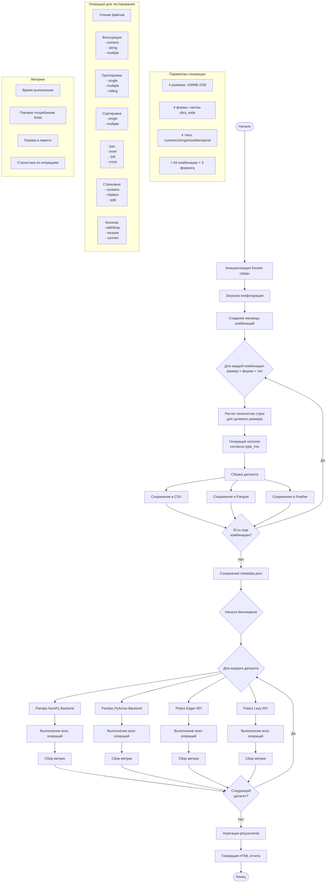

# Техническое задание: Эксперимент по сравнению производительности Pandas и Polars

## 1. Описание проекта

Проведение комплексного эксперимента по сравнению производительности библиотек Pandas и Polars с фокусом на потреблении памяти и скорости выполнения операций. Эксперимент проводится в изолированной Docker-среде с использованием синтетических данных различных размеров и форм.

## 2. Архитектура решения

### 2.1. Структура проекта
```
pandas-polars-benchmark/
├── docker/
│   ├── Dockerfile
│   └── requirements.txt
├── src/
│   ├── data_generator/
│   │   ├── __init__.py
│   │   ├── generator.py
│   │   ├── config.py
│   │   └── dataset_spec.py
│   ├── benchmarks/
│   │   ├── __init__.py
│   │   ├── base_benchmark.py
│   │   ├── pandas_benchmark.py
│   │   ├── polars_benchmark.py
│   │   └── operations.py
│   ├── monitoring/
│   │   ├── __init__.py
│   │   └── memory_tracker.py
│   └── reporting/
│       ├── __init__.py
│       ├── html_reporter.py
│       └── templates/
├── data/
│   ├── synthetic/
│   │   ├── small_narrow_long_numeric_heavy.csv
│   │   ├── small_narrow_long_numeric_heavy.parquet
│   │   ├── small_narrow_long_numeric_heavy.feather
│   │   ├── medium_wide_short_string_heavy.csv
│   │   ├── ... (всего ~192 файла: 4 размера × 4 формы × 4 типа × 3 формата)
│   │   └── metadata.json
│   └── results/
│       ├── benchmarks_2024-01-15_123456.json
│       ├── memory_profiles/
│       └── benchmark_report.html
├── config/
│   └── benchmark_config.yaml
├── run_benchmark.py
├── docker-compose.yml
└── README.md
```

### Именование файлов данных
Формат: `{size}_{shape}_{type_mix}.{format}`
- size: small, medium, large, xlarge
- shape: narrow_long, wide_short, balanced, ultra_wide  
- type_mix: numeric_heavy, string_heavy, mixed_balanced, temporal_focus
- format: csv, parquet, feather

## 3. Описание последовательности действий

### 3.1. Инициализация окружения

**Входные данные:**
- Dockerfile с описанием среды
- requirements.txt с версиями библиотек
- Конфигурационный файл benchmark_config.yaml

**Цель:** Создание изолированной воспроизводимой среды для экспериментов

**Выполнение:**
1. Создать Dockerfile на базе python:3.11-slim
2. Установить системные зависимости для мониторинга памяти
3. Установить Python библиотеки с фиксированными версиями
4. Настроить рабочие директории

**Выходные артефакты:**
- Docker образ `pandas-polars-benchmark:latest`
- Лог сборки образа

### 3.2. Генерация синтетических данных

**Входные данные:**
- Конфигурация параметров генерации (размеры, формы датасетов, типы данных, распределения)
- Матрица комбинаций: размер × форма × типы данных

**Цель:** Создание тестовых датасетов с контролируемыми характеристиками для комплексного тестирования

**Выполнение:**
1. Считать конфигурацию из benchmark_config.yaml
2. Для каждой комбинации параметров:
   
   **По размеру файла:**
   - Small: ~100MB
   - Medium: ~500MB
   - Large: ~1GB
   - XLarge: ~2GB
   
   **По форме датасета:**
   - Узкий и длинный: 10-20 колонок, много строк
   - Широкий и короткий: 100-500 колонок, меньше строк
   - Сбалансированный: 50-100 колонок, среднее количество строк
   - Сверхширокий: 1000+ колонок (для тестирования предельных случаев)
   
   **По преобладающему типу данных:**
   - Числовой датасет: 80% numeric (int/float), 20% остальные
   - Строковый датасет: 60% string/categorical, 40% остальные
   - Смешанный датасет: равномерное распределение всех типов
   - Временной датасет: с timestamp колонками и временными метками

3. Для каждого датасета генерировать:
   - **Числовые колонки:**
     - Целые числа (int8, int16, int32, int64)
     - Вещественные числа (float32, float64)
     - Различные распределения (normal, uniform, exponential)
     - С пропущенными значениями (5-15% NaN)
   
   - **Строковые колонки:**
     - Короткие строки (5-10 символов)
     - Средние строки (20-50 символов)
     - Длинные строки (100-500 символов)
     - UUID/хэши фиксированной длины
   
   - **Категориальные колонки:**
     - Низкая кардинальность (2-10 уникальных значений)
     - Средняя кардинальность (100-1000 уникальных)
     - Высокая кардинальность (10000+ уникальных)
   
   - **Временные колонки:**
     - Datetime с разной частотой
     - Date без времени
     - Time без даты
   
   - **Булевы колонки:**
     - С разным соотношением True/False
     - С пропущенными значениями

4. Рассчитать точное количество строк для достижения целевого размера файла
5. Сохранить в форматы: CSV, Parquet, Feather
6. Создать метафайл с описанием каждого датасета

**Выходные артефакты:**
- Датасеты в директории data/synthetic/ с именованием: `{size}_{shape}_{type_mix}_{format}`
- metadata.json с детальным описанием каждого файла:
  - Точный размер в байтах
  - Количество строк и колонок
  - Типы данных каждой колонки
  - Статистика по пропущенным значениям
  - Параметры генерации

### 3.3. Выполнение бенчмарков Pandas (NumPy backend)

**Входные данные:**
- Синтетические датасеты
- Список операций для тестирования

**Цель:** Измерение производительности Pandas с NumPy backend

**Выполнение:**
1. Для каждого датасета и формата:
   - Измерить время и память при чтении файла
   - Выполнить операции фильтрации
   - Выполнить группировку и агрегацию
   - Выполнить сортировку
   - Выполнить join операции
   - Выполнить строковые операции
2. Записать метрики в структурированном виде

**Выходные артефакты:**
- JSON файл с результатами измерений
- Профили использования памяти

### 3.4. Выполнение бенчмарков Pandas (PyArrow backend)

**Входные данные:**
- Те же синтетические датасеты
- Список операций для тестирования

**Цель:** Измерение производительности Pandas с PyArrow backend

**Выполнение:**
1. Конвертировать датасеты в PyArrow типы при чтении
2. Повторить все операции из п. 3.3
3. Отследить особенности работы с PyArrow типами

**Выходные артефакты:**
- JSON файл с результатами измерений
- Профили использования памяти

### 3.5. Выполнение бенчмарков Polars (Eager API)

**Входные данные:**
- Синтетические датасеты
- Список операций для тестирования

**Цель:** Измерение производительности Polars Eager API

**Выполнение:**
1. Для каждого датасета:
   - Использовать pl.read_* функции
   - Выполнить аналогичные операции
   - Измерить время и память
2. Учесть особенности Polars API

**Выходные артефакты:**
- JSON файл с результатами измерений
- Профили использования памяти

### 3.6. Выполнение бенчмарков Polars (Lazy API)

**Входные данные:**
- Синтетические датасеты
- Список операций для тестирования

**Цель:** Измерение производительности Polars Lazy API с оптимизацией запросов

**Выполнение:**
1. Использовать pl.scan_* функции для ленивого чтения
2. Построить цепочки операций без материализации
3. Выполнить collect() и измерить общее время/память
4. Сравнить с eager выполнением

**Выходные артефакты:**
- JSON файл с результатами измерений
- Профили использования памяти
- Планы выполнения запросов

### 3.7. Генерация HTML отчета

**Входные данные:**
- Все JSON файлы с результатами бенчмарков
- Шаблоны HTML

**Цель:** Создание наглядного интерактивного отчета

**Выполнение:**
1. Агрегировать результаты всех тестов
2. Построить сравнительные таблицы
3. Создать графики производительности
4. Добавить выводы и рекомендации
5. Сгенерировать HTML с встроенными стилями и JS

**Выходные артефакты:**
- benchmark_report.html с полными результатами
- Директория с графиками (если используются внешние файлы)

## 4. Схема процесса



## 5. Детальное описание компонентов

### 5.1. Модуль генерации данных (data_generator)

**generator.py**
- Класс DataGenerator с методами генерации различных типов данных
- Класс DatasetBuilder для построения датасетов по спецификации
- Методы для каждого типа колонок:
  - generate_numeric_column() - с поддержкой разных распределений и типов
  - generate_string_column() - с контролем длины и charset
  - generate_categorical_column() - с контролем кардинальности
  - generate_temporal_column() - для дат, времени и datetime
  - generate_boolean_column() - с контролем соотношения значений
- Автоматический расчет количества строк для достижения целевого размера файла
- Поддержка воспроизводимости через seed

**config.py**
- Dataclass для SizeConfig (размеры файлов)
- Dataclass для ShapeConfig (формы датасетов)
- Dataclass для TypeMixConfig (комбинации типов)
- Dataclass для ColumnTypeConfig (параметры генерации)
- Валидация параметров генерации
- Парсер YAML конфигурации

**dataset_spec.py**
- Класс DatasetSpecification для описания датасета
- Метод calculate_column_distribution() для расчета количества колонок каждого типа
- Метод estimate_row_count() для оценки необходимого количества строк
- Метод generate_column_names() для создания осмысленных имен колонок

**Пример реализации:**
```python
@dataclass
class DatasetSpecification:
    size_name: str  # "small", "medium", etc.
    shape_name: str  # "narrow_long", "wide_short", etc.
    type_mix_name: str  # "numeric_heavy", "string_heavy", etc.
    target_size_mb: int
    
    def calculate_column_distribution(self, config: Dict) -> Dict[str, int]:
        """Рассчитывает количество колонок каждого типа"""
        total_columns = config['shapes'][self.shape_name]['columns']
        type_mix = config['type_mixes'][self.type_mix_name]['composition']
        
        distribution = {}
        for dtype, percentage in type_mix.items():
            count = int(total_columns * percentage)
            distribution[dtype] = count
        
        return distribution
    
    def estimate_row_count(self, column_distribution: Dict[str, int]) -> int:
        """Оценивает количество строк для достижения целевого размера"""
        avg_bytes_per_cell = {
            'int8': 1, 'int16': 2, 'int32': 4, 'int64': 8,
            'float32': 4, 'float64': 8,
            'string_short': 8, 'string_medium': 35, 'string_long': 250,
            'categorical_low': 4, 'categorical_high': 8,
            'datetime': 8, 'date': 4, 'time': 4,
            'bool': 1
        }
        
        total_bytes_per_row = sum(
            count * avg_bytes_per_cell.get(dtype, 8)
            for dtype, count in column_distribution.items()
        )
        
        target_bytes = self.target_size_mb * 1024 * 1024
        return int(target_bytes / total_bytes_per_row)
```

### 5.2. Модуль бенчмарков (benchmarks)

**base_benchmark.py**
- Абстрактный базовый класс для всех бенчмарков
- Общие методы измерения времени и памяти
- Интерфейс для операций

**operations.py**
- Определение всех тестируемых операций:
  - read_file: чтение из различных форматов
  - filter_data: фильтрация по условиям
  - group_aggregate: группировка и агрегация
  - sort_data: сортировка по колонкам
  - join_data: объединение датафреймов
  - string_operations: работа со строками

### 5.3. Модуль мониторинга (monitoring)

**memory_tracker.py**
- Использование memory_profiler для отслеживания RAM
- Контекстный менеджер для измерений
- Запись пиковых значений

### 5.4. Модуль отчетности (reporting)

**html_reporter.py**
- Генерация HTML отчета с использованием Jinja2
- Встраивание графиков с Plotly
- Создание интерактивных таблиц

## 6. Конфигурация эксперимента

```yaml
# benchmark_config.yaml
experiment:
  name: "Pandas vs Polars Benchmark"
  date: "auto"
  
data_generation:
  seed: 42
  
  # Определение размеров файлов
  sizes:
    - name: "small"
      target_size_mb: 100
    - name: "medium"
      target_size_mb: 500
    - name: "large"
      target_size_mb: 1000
    - name: "xlarge"
      target_size_mb: 2000
  
  # Определение форм датасетов
  shapes:
    - name: "narrow_long"
      columns: 15
      description: "Мало колонок, много строк"
    - name: "wide_short"
      columns: 200
      description: "Много колонок, меньше строк"
    - name: "balanced"
      columns: 50
      description: "Сбалансированное соотношение"
    - name: "ultra_wide"
      columns: 1000
      description: "Экстремально широкий датасет"
  
  # Определение комбинаций типов данных
  type_mixes:
    - name: "numeric_heavy"
      description: "Преимущественно числовые данные"
      composition:
        int32: 20%
        int64: 20%
        float32: 20%
        float64: 20%
        string: 10%
        categorical: 5%
        datetime: 5%
    
    - name: "string_heavy"
      description: "Преимущественно строковые данные"
      composition:
        string_short: 20%
        string_medium: 20%
        string_long: 20%
        categorical_low: 10%
        categorical_high: 10%
        int64: 10%
        float64: 10%
    
    - name: "mixed_balanced"
      description: "Равномерное распределение типов"
      composition:
        int8: 5%
        int16: 5%
        int32: 10%
        int64: 10%
        float32: 10%
        float64: 10%
        string_short: 10%
        string_medium: 10%
        categorical_low: 10%
        categorical_high: 5%
        datetime: 10%
        bool: 5%
    
    - name: "temporal_focus"
      description: "Датасет с временными рядами"
      composition:
        datetime: 20%
        date: 10%
        time: 5%
        int64: 20%
        float64: 25%
        categorical_low: 10%
        string_short: 10%
  
  # Детальные параметры типов колонок
  column_types:
    numeric:
      int8:
        min: -128
        max: 127
      int16:
        min: -32768
        max: 32767
      int32:
        distribution: "uniform"
      int64:
        distribution: "normal"
      float32:
        distribution: "normal"
        null_percentage: 5
      float64:
        distribution: "exponential"
        null_percentage: 10
    
    string:
      string_short:
        min_length: 5
        max_length: 10
        charset: "alphanumeric"
      string_medium:
        min_length: 20
        max_length: 50
        charset: "ascii"
      string_long:
        min_length: 100
        max_length: 500
        charset: "unicode"
    
    categorical:
      categorical_low:
        cardinality: 10
      categorical_high:
        cardinality: 1000
    
    temporal:
      datetime:
        start: "2020-01-01"
        end: "2024-12-31"
        freq: "variable"  # mix of different frequencies
      date:
        start: "2020-01-01"
        end: "2024-12-31"
      time:
        format: "HH:MM:SS"
    
    boolean:
      bool:
        true_ratio: 0.7
        null_percentage: 5

benchmarks:
  iterations: 3
  warmup_iterations: 1
  
  operations:
    read_operations:
      - "read_csv"
      - "read_parquet"
      - "read_feather"
    
    transform_operations:
      - "filter_numeric"
      - "filter_string"
      - "filter_multiple_conditions"
    
    aggregation_operations:
      - "group_by_single"
      - "group_by_multiple"
      - "rolling_window"
    
    join_operations:
      - "inner_join"
      - "left_join"
      - "cross_join"
    
    sort_operations:
      - "sort_single_column"
      - "sort_multiple_columns"
    
    string_operations:
      - "string_contains"
      - "string_replace"
      - "string_split"
    
    column_operations:
      - "add_columns"
      - "drop_columns"
      - "rename_columns"
      - "type_conversion"
  
  frameworks:
    pandas:
      - name: "pandas_numpy"
        backend: "numpy"
        dtype_backend: null
      - name: "pandas_pyarrow"
        backend: "pyarrow"
        dtype_backend: "pyarrow"
    
    polars:
      - name: "polars_eager"
        api: "eager"
        streaming: false
      - name: "polars_lazy"
        api: "lazy"
        streaming: false
      - name: "polars_lazy_streaming"
        api: "lazy"
        streaming: true

output:
  results_dir: "data/results"
  report_name: "benchmark_report.html"
  save_intermediate: true
  include_memory_profiles: true
```

## 7. Dockerfile

```dockerfile
# docker/Dockerfile
FROM python:3.11-slim

# Установка системных зависимостей
RUN apt-get update && apt-get install -y \
    gcc \
    g++ \
    && rm -rf /var/lib/apt/lists/*

# Создание рабочей директории
WORKDIR /benchmark

# Копирование requirements
COPY requirements.txt .

# Установка Python зависимостей
RUN pip install --no-cache-dir -r requirements.txt

# Копирование исходного кода
COPY . .

# Создание директорий для данных
RUN mkdir -p data/synthetic data/results

# Команда по умолчанию
CMD ["python", "run_benchmark.py"]
```

## 8. Requirements.txt

```txt
# docker/requirements.txt
pandas==2.2.0
polars==0.20.3
pyarrow==14.0.2
numpy==1.26.3
memory-profiler==0.61.0
plotly==5.18.0
jinja2==3.1.3
pyyaml==6.0.1
tqdm==4.66.1
psutil==5.9.8
```

## 9. Чеклист выполнения

### Подготовка окружения
- [ ] Создать структуру директорий проекта
- [ ] Написать Dockerfile
- [ ] Подготовить requirements.txt с фиксированными версиями
- [ ] Создать docker-compose.yml для удобного запуска
- [ ] Настроить монтирование volume для результатов

### Разработка модуля генерации данных
- [ ] Реализовать класс DataGenerator
- [ ] Реализовать класс DatasetBuilder
- [ ] Реализовать класс DatasetSpecification
- [ ] Добавить генерацию числовых данных:
  - [ ] Поддержка int8, int16, int32, int64
  - [ ] Поддержка float32, float64
  - [ ] Различные распределения (normal, uniform, exponential)
  - [ ] Контролируемые пропущенные значения
- [ ] Добавить генерацию строковых данных:
  - [ ] Короткие строки (5-10 символов)
  - [ ] Средние строки (20-50 символов)
  - [ ] Длинные строки (100-500 символов)
  - [ ] Различные наборы символов (alphanumeric, ascii, unicode)
- [ ] Добавить генерацию категориальных данных:
  - [ ] Низкая кардинальность (2-10 значений)
  - [ ] Средняя кардинальность (100-1000 значений)
  - [ ] Высокая кардинальность (10000+ значений)
- [ ] Добавить генерацию временных данных:
  - [ ] Datetime с переменной частотой
  - [ ] Date без времени
  - [ ] Time без даты
- [ ] Добавить генерацию булевых данных с контролем соотношения
- [ ] Реализовать автоматический расчет количества строк для целевого размера
- [ ] Реализовать генерацию всех комбинаций: размер × форма × тип
- [ ] Реализовать сохранение в CSV
- [ ] Реализовать сохранение в Parquet
- [ ] Реализовать сохранение в Feather
- [ ] Добавить генерацию metadata.json с описанием датасетов
- [ ] Добавить валидацию сгенерированных файлов
- [ ] Добавить прогресс-бар для длительной генерации
- [ ] Добавить логирование процесса генерации

### Разработка модуля бенчмарков
- [ ] Создать базовый класс BaseBenchmark
- [ ] Реализовать PandasBenchmark с поддержкой NumPy backend
- [ ] Реализовать PandasBenchmark с поддержкой PyArrow backend
- [ ] Реализовать PolarsBenchmark для Eager API
- [ ] Реализовать PolarsBenchmark для Lazy API
- [ ] Добавить все операции из списка
- [ ] Реализовать сбор метрик времени выполнения
- [ ] Реализовать сбор метрик потребления памяти

### Разработка модуля мониторинга
- [ ] Реализовать MemoryTracker с использованием memory_profiler
- [ ] Добавить контекстный менеджер для измерений
- [ ] Реализовать запись пиковых значений памяти
- [ ] Добавить обработку ошибок измерений

### Разработка модуля отчетности
- [ ] Создать HTML шаблоны с использованием Jinja2
- [ ] Реализовать генерацию сравнительных таблиц
- [ ] Добавить построение графиков с Plotly
- [ ] Реализовать агрегацию результатов
- [ ] Добавить сохранение отчета в HTML

### Интеграция и тестирование
- [ ] Написать главный скрипт run_benchmark.py
- [ ] Протестировать генерацию данных
- [ ] Протестировать каждый бенчмарк отдельно
- [ ] Проверить корректность измерений памяти
- [ ] Валидировать HTML отчет
- [ ] Провести полный прогон эксперимента

### Финализация
- [ ] Написать README.md с инструкциями
- [ ] Добавить примеры запуска
- [ ] Документировать формат выходных данных
- [ ] Проверить воспроизводимость в Docker
- [ ] Оптимизировать производительность самих бенчмарков

## 10. Ожидаемые результаты

### Примеры генерации датасетов

```python
# Пример использования генератора
generator = DataGenerator(seed=42)
builder = DatasetBuilder(generator)

# Генерация узкого длинного датасета с числовыми данными
spec = DatasetSpecification(
    size="medium",  # 500MB
    shape="narrow_long",  # 15 колонок
    type_mix="numeric_heavy",  # 80% числовых колонок
    target_size_mb=500
)

dataset = builder.build(spec)
# Результат: ~33M строк × 15 колонок, ~500MB

# Генерация широкого датасета со строками
spec = DatasetSpecification(
    size="large",  # 1GB
    shape="ultra_wide",  # 1000 колонок
    type_mix="string_heavy",  # 60% строковых колонок
    target_size_mb=1000
)

dataset = builder.build(spec)
# Результат: ~10K строк × 1000 колонок, ~1GB
```

### Структура metadata.json

```json
{
  "datasets": [
    {
      "filename": "small_narrow_long_numeric_heavy.csv",
      "size_bytes": 104857600,
      "size_mb": 100.0,
      "rows": 6666667,
      "columns": 15,
      "shape": "narrow_long",
      "type_mix": "numeric_heavy",
      "column_info": {
        "id": {"dtype": "int64", "null_count": 0},
        "value_1": {"dtype": "float64", "null_count": 333333},
        "category": {"dtype": "string", "cardinality": 100},
        "timestamp": {"dtype": "datetime64[ns]", "min": "2020-01-01", "max": "2024-12-31"}
      },
      "generation_params": {
        "seed": 42,
        "generation_time_seconds": 12.5
      }
    }
  ],
  "total_datasets": 48,  // 4 sizes × 4 shapes × 3 formats
  "total_size_gb": 28.8
}
```

### Структура выходных данных бенчмарков

```json
{
  "experiment_info": {
    "name": "Pandas vs Polars Benchmark",
    "date": "2024-01-15",
    "environment": {
      "python_version": "3.11",
      "pandas_version": "2.2.0",
      "polars_version": "0.20.3",
      "system": {
        "cpu": "Intel Core i7-9700K",
        "ram": "32GB",
        "os": "Linux 5.15.0"
      }
    }
  },
  "results": {
    "small_narrow_long_numeric_heavy": {
      "dataset_info": {
        "size_mb": 100,
        "rows": 6666667,
        "columns": 15,
        "memory_size_loaded_mb": {
          "pandas_numpy": 245.6,
          "pandas_pyarrow": 220.3,
          "polars_eager": 180.2,
          "polars_lazy": "not_loaded"
        }
      },
      "operations": {
        "read_csv": {
          "pandas_numpy": {
            "time_seconds": 1.23,
            "peak_memory_mb": 245.6,
            "iterations": 3,
            "std_dev": 0.05
          },
          "pandas_pyarrow": {
            "time_seconds": 2.1,
            "peak_memory_mb": 220.3,
            "iterations": 3,
            "std_dev": 0.08
          },
          "polars_eager": {
            "time_seconds": 0.45,
            "peak_memory_mb": 180.2,
            "iterations": 3,
            "std_dev": 0.02
          },
          "polars_lazy": {
            "time_seconds": 0.01,  // только построение плана
            "peak_memory_mb": 5.2,
            "iterations": 3,
            "std_dev": 0.001
          }
        },
        "filter_numeric": {
          // аналогичная структура для каждой операции
        }
      }
    },
    "large_ultra_wide_string_heavy": {
      // результаты для другой комбинации
    }
  },
  "summary": {
    "memory_efficiency": {
      "best_overall": "polars_lazy",
      "pandas_pyarrow_vs_numpy": "5-10% improvement",
      "polars_vs_pandas": "2-8x improvement"
    },
    "speed_performance": {
      "best_overall": "polars_lazy",
      "operation_winners": {
        "read_operations": "polars",
        "string_operations": "polars/pandas_pyarrow",
        "aggregations": "polars"
      }
    }
  }
}
```

## 11. Оценка масштаба эксперимента

### Количество генерируемых датасетов

| Параметр | Варианты | Количество |
|----------|----------|------------|
| Размеры | small (100MB), medium (500MB), large (1GB), xlarge (2GB) | 4 |
| Формы | narrow_long, wide_short, balanced, ultra_wide | 4 |
| Типы данных | numeric_heavy, string_heavy, mixed_balanced, temporal_focus | 4 |
| Форматы | CSV, Parquet, Feather | 3 |
| **Итого файлов** | 4 × 4 × 4 × 3 | **192** |

### Оценка дискового пространства

| Размер | Файлов | Объем на размер | 
|--------|---------|-----------------|
| Small (100MB) | 48 | ~4.8 GB |
| Medium (500MB) | 48 | ~24 GB |
| Large (1GB) | 48 | ~48 GB |
| XLarge (2GB) | 48 | ~96 GB |
| **Общий объем** | **192** | **~173 GB** |

*Примечание: Parquet и Feather форматы обычно занимают меньше места благодаря сжатию, реальный объем может быть 100-150 GB*

### Оценка времени выполнения

| Этап | Примерное время |
|------|-----------------|
| Генерация данных | 2-4 часа |
| Бенчмарки (4 конфигурации × 192 датасета × ~20 операций) | 6-10 часов |
| Генерация отчета | 10-15 минут |
| **Общее время** | **8-14 часов** |

### Рекомендации по ресурсам

- **Минимальные требования:**
  - CPU: 4 ядра
  - RAM: 16 GB
  - Диск: 200 GB свободного места
  
- **Рекомендуемые требования:**
  - CPU: 8+ ядер (для параллельной генерации и Polars)
  - RAM: 32 GB
  - Диск: 250 GB SSD
  - Docker: 20.10+