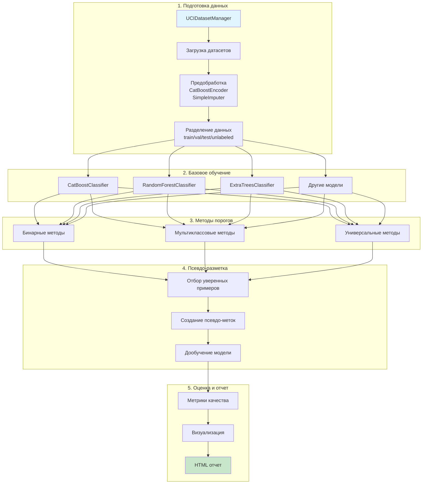
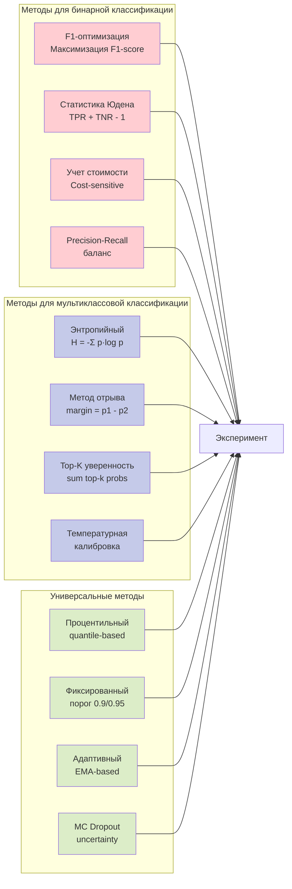
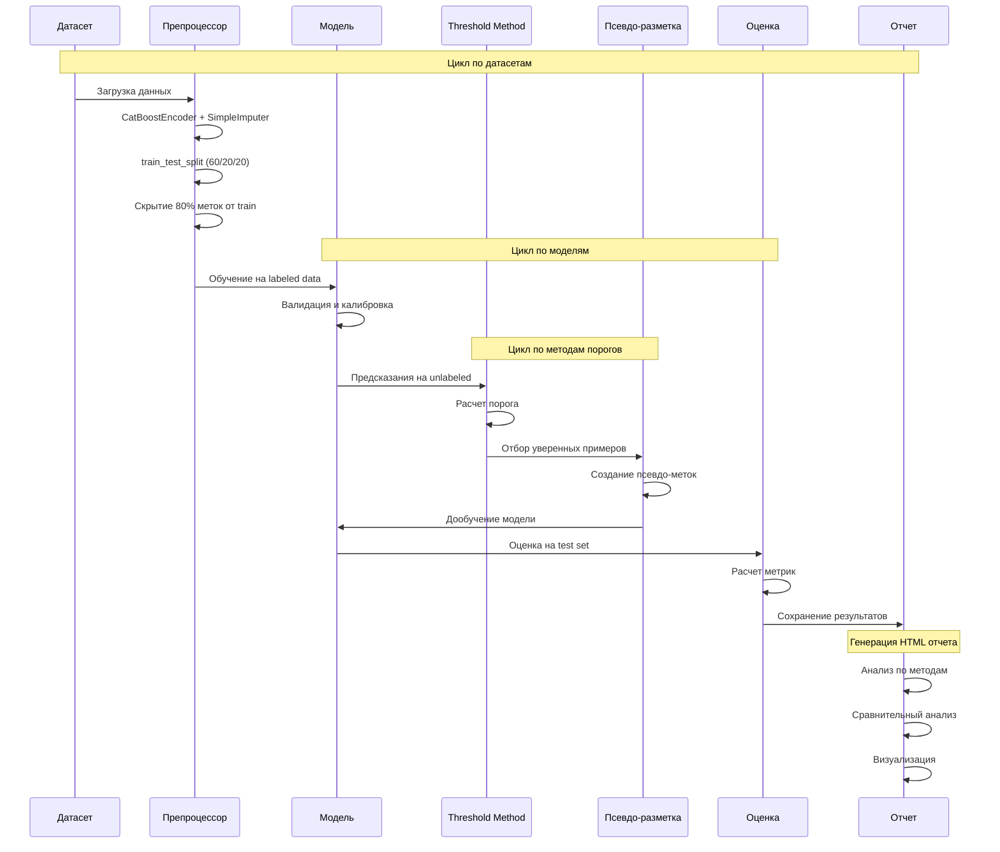
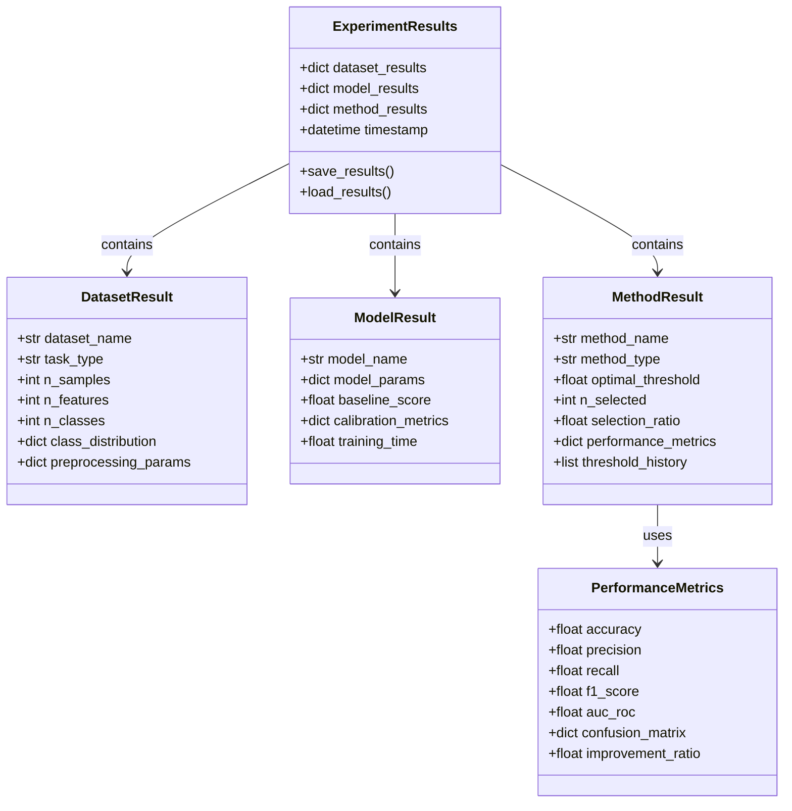

# Структура эксперимента по сравнению методов выбора порогов для псевдо-разметки

## Оглавление
1. [Обзор эксперимента](#обзор-эксперимента)
2. [Общая архитектура](#общая-архитектура)
3. [Методы выбора порогов](#методы-выбора-порогов)
4. [Pipeline эксперимента](#pipeline-эксперимента)
5. [Структура данных](#структура-данных)
6. [Детальное описание модулей](#детальное-описание-модулей)
7. [План реализации](#план-реализации)

## Обзор эксперимента

### Цель
Сравнить эффективность различных методов выбора порогов вероятности для псевдо-разметки в задачах полуконтролируемого обучения на разных типах данных и моделях.

### Ключевые задачи
- Реализовать 12+ методов выбора порогов из руководства
- Протестировать на 3+ датасетах для каждого типа задач (бинарная/мультиклассовая)
- Использовать минимум 5 различных моделей классификации
- Создать comprehensive HTML отчет с анализом результатов

## Общая архитектура



## Методы выбора порогов



### Детализация методов

#### Бинарная классификация
1. **F1-оптимизация**: Находит порог, максимизирующий F1-score на валидационной выборке
2. **Статистика Юдена**: Максимизирует сумму чувствительности и специфичности
3. **Учет стоимости**: Минимизирует взвешенную стоимость ошибок (FP × Cost_FP + FN × Cost_FN)
4. **Precision-Recall баланс**: Оптимизирует баланс между точностью и полнотой

#### Мультиклассовая классификация
1. **Энтропийный**: Отбирает примеры с низкой энтропией распределения вероятностей
2. **Метод отрыва**: Использует разность между top-2 вероятностями
3. **Top-K уверенность**: Суммирует вероятности K наиболее вероятных классов
4. **Температурная калибровка**: Применяет temperature scaling для улучшения калибровки

#### Универсальные методы
1. **Процентильный**: Выбирает порог на заданном процентиле распределения
2. **Фиксированный**: Использует предопределенные пороги (0.9, 0.95)
3. **Адаптивный**: Динамически корректирует порог через EMA
4. **MC Dropout**: Оценивает неопределенность через множественные прогоны

## Pipeline эксперимента



## Структура данных



## Детальное описание модулей

### 1. Модуль подготовки данных (`data_preparation.py`)

#### Функциональность
- Загрузка датасетов через UCIDatasetManager
- Автоматическая предобработка данных
- Создание сценария полуконтролируемого обучения

#### Датасеты
**Для бинарной классификации:**
- Breast Cancer Wisconsin
- Heart Disease
- Bank Marketing
- Adult Income
- Credit Card Default

**Для мультиклассовой классификации:**
- Iris
- Wine Quality
- Cover Type
- Letter Recognition
- Satellite Image

#### Предобработка
```python
# Псевдокод pipeline предобработки
pipeline = Pipeline([
    ('imputer', SimpleImputer(strategy='mean')),
    ('encoder', CatBoostEncoder()),
    ('scaler', StandardScaler())  # опционально
])
```

### 2. Модуль базовых моделей (`base_models.py`)

#### Модели
1. **CatBoostClassifier**
   - Автоматическая обработка категориальных признаков
   - Встроенная регуляризация
   - GPU поддержка

2. **RandomForestClassifier**
   - Ансамблевый метод
   - Устойчивость к переобучению
   - Feature importance

3. **ExtraTreesClassifier**
   - Более случайный, чем RF
   - Быстрее в обучении
   - Хорошо для больших датасетов

4. **LightGBM**
   - Быстрое обучение
   - Эффективная работа с памятью
   - Хорошо для больших датасетов

5. **LogisticRegression**
   - Baseline модель
   - Интерпретируемость
   - Быстрое обучение

#### Калибровка вероятностей
- Platt Scaling для малых выборок
- Isotonic Regression для больших выборок
- Оценка калибровки через ECE (Expected Calibration Error)

### 3. Модуль методов выбора порогов (`threshold_methods.py`)

#### Базовая архитектура
```python
class ThresholdSelector(ABC):
    @abstractmethod
    def find_threshold(self, y_true, y_proba):
        pass
    
    @abstractmethod
    def select_samples(self, y_proba, threshold):
        pass
```

#### Реализации методов
Каждый метод имеет:
- Параметры инициализации
- Метод поиска оптимального порога
- Метод отбора примеров
- Визуализацию процесса выбора

### 4. Модуль псевдо-разметки (`pseudo_labeling.py`)

#### Стратегии
1. **Hard Pseudo-Labeling**
   - Присваивание жестких меток
   - Простая реализация
   - Может вносить шум

2. **Soft Pseudo-Labeling**
   - Использование вероятностей как весов
   - Более устойчиво к ошибкам
   - Требует поддержки от модели

3. **Iterative Pseudo-Labeling**
   - Постепенное добавление примеров
   - Адаптация порогов
   - Контроль качества на каждой итерации

### 5. Модуль оценки (`evaluation.py`)

#### Метрики
**Базовые метрики классификации:**
- Accuracy, Precision, Recall, F1
- AUC-ROC, AUC-PR
- Confusion Matrix
- Classification Report

**Метрики псевдо-разметки:**
- Coverage (процент отобранных примеров)
- Pseudo-label accuracy
- Confidence distribution
- Threshold stability

**Метрики улучшения:**
- Absolute improvement
- Relative improvement
- Statistical significance (paired t-test)

### 6. Модуль генерации отчетов (`report_generator.py`)

#### Структура HTML отчета

1. **Executive Summary**
   - Ключевые находки
   - Лучшие методы для каждого типа задач
   - Рекомендации

2. **Детальный анализ по датасетам**
   - Характеристики датасета
   - Результаты всех методов
   - Визуализации

3. **Анализ по моделям**
   - Сравнение baseline производительности
   - Влияние калибровки
   - Вычислительная эффективность

4. **Анализ методов выбора порогов**
   - Детальный анализ каждого метода
   - Сильные и слабые стороны
   - Рекомендации по применению

5. **Сравнительный анализ**
   - Heatmap результатов
   - Ranking методов
   - Statistical tests

6. **Интерактивные элементы**
   - Plotly графики
   - Фильтруемые таблицы
   - Drill-down возможности

### 7. Главный скрипт (`run_experiment.py`)

#### Конфигурация
```yaml
experiment_config:
  datasets:
    binary: [breast_cancer, heart_disease, bank_marketing]
    multiclass: [iris, wine, covertype]
  
  models:
    - name: CatBoost
      params: {iterations: 1000, early_stopping_rounds: 50}
    - name: RandomForest
      params: {n_estimators: 100, max_depth: 10}
  
  threshold_methods:
    binary: [f1_optimization, youden, cost_sensitive]
    multiclass: [entropy, margin, top_k]
    universal: [percentile, fixed, adaptive]
  
  pseudo_labeling:
    strategy: iterative
    max_iterations: 5
    
  output:
    save_intermediate: true
    report_format: html
    visualization_backend: plotly
```

## План реализации

### Этап 1: Базовая инфраструктура (текущий)
- [x] Проектирование архитектуры
- [x] Создание схем и документации
- [ ] Настройка окружения и зависимостей

### Этап 2: Подготовка данных
- [ ] Реализация data_preparation.py
- [ ] Загрузка и проверка датасетов
- [ ] Создание pipeline предобработки

### Этап 3: Основной функционал
- [ ] Реализация базовых моделей
- [ ] Реализация методов выбора порогов
- [ ] Модуль псевдо-разметки

### Этап 4: Анализ и отчетность
- [ ] Модуль оценки результатов
- [ ] Генератор HTML отчетов
- [ ] Финальный запуск эксперимента

## Ожидаемые результаты

1. **Сравнительная таблица** эффективности методов
2. **Рекомендации** по выбору метода для конкретных задач
3. **Визуализации** процесса отбора примеров
4. **Статистический анализ** значимости различий
5. **Практическое руководство** по применению методов

## Технологический стек

- **Python 3.8+**
- **Библиотеки ML**: scikit-learn, CatBoost, LightGBM
- **Обработка данных**: pandas, numpy
- **Визуализация**: matplotlib, seaborn, plotly
- **Отчеты**: Jinja2, HTML/CSS
- **Утилиты**: tqdm, joblib, pickle
